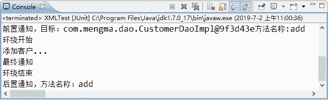
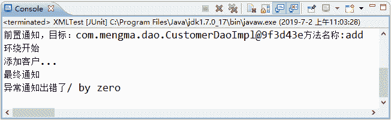
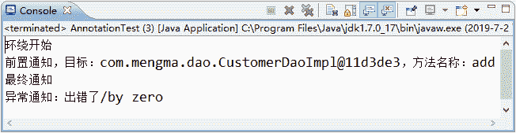
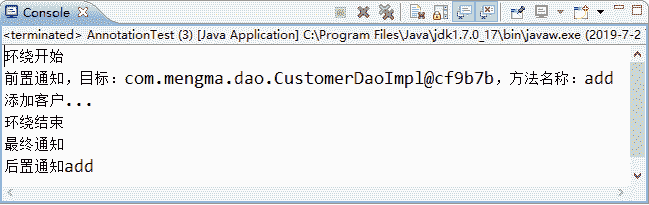

# Spring 使用 AspectJ 开发 AOP：基于 XML 和基于 Annotation

> 原文：[`c.biancheng.net/view/4275.html`](http://c.biancheng.net/view/4275.html)

AspectJ 是一个基于 Java 语言的 AOP 框架，它扩展了 Java 语言。Spring 2.0 以后，新增了对 AspectJ 方式的支持，新版本的 Spring 框架，建议使用 AspectJ 方式开发 AOP。

使用 AspectJ 开发 AOP 通常有两种方式：

*   基于 XML 的声明式。
*   基于 Annotation 的声明式。

接下来将对这两种 AOP 的开发方式进行讲解。

## 基于 XML 的声明式

基于 XML 的声明式是指通过 Spring 配置文件的方式定义切面、切入点及声明通知，而所有的切面和通知都必须定义在 <aop:config> 元素中。

下面通过案例演示 Spring 中如何使用基于 XML 的声明式实现 AOP 的开发。

#### 1\. 导入 JAR 包

使用 AspectJ 除了需要导入 Spring AOP 的 JAR 包以外，还需要导入与 AspectJ 相关的 JAR 包，具体如下。

*   spring-aspects-3.2.13.RELEASE.jar：Spring 为 AspectJ 提供的实现，在 Spring 的包中已经提供。
*   com.springsource.org.aspectj.weaver-1.6.8.RELEASE.jar：是 AspectJ 提供的规范，可以在官方网址 [`repo.spring.io/webapp/#/search/quick/`](https://repo.spring.io/webapp/#/search/quick/) 中搜索并下载。

#### 2\. 创建切面类 MyAspect

在 src 目录下创建一个名为 com.mengma.aspectj.xml 的包，在该包下创建切面类 MyAspect，编辑后如下所示。

```

package com.mengma.aspectj.xml;

import org.aspectj.lang.JoinPoint;
import org.aspectj.lang.ProceedingJoinPoint;

//切面类
public class MyAspect {
    // 前置通知
    public void myBefore(JoinPoint joinPoint) {
        System.out.print("前置通知，目标：");
        System.out.print(joinPoint.getTarget() + "方法名称:");
        System.out.println(joinPoint.getSignature().getName());
    }

    // 后置通知
    public void myAfterReturning(JoinPoint joinPoint) {
        System.out.print("后置通知，方法名称：" + joinPoint.getSignature().getName());
    }

    // 环绕通知
    public Object myAround(ProceedingJoinPoint proceedingJoinPoint)
            throws Throwable {
        System.out.println("环绕开始"); // 开始
        Object obj = proceedingJoinPoint.proceed(); // 执行当前目标方法
        System.out.println("环绕结束"); // 结束
        return obj;
    }

    // 异常通知
    public void myAfterThrowing(JoinPoint joinPoint, Throwable e) {
        System.out.println("异常通知" + "出错了" + e.getMessage());
    }

    // 最终通知
    public void myAfter() {
        System.out.println("最终通知");
    }
}
```

上述代码中，分别定义了几种不同的通知类型方法，在这些方法中，通过 JoinPoint 参数可以获得目标对象的类名、目标方法名和目标方法参数等。需要注意的是，环绕通知必须接收一个类型为 ProceedingJoinPoint 的参数，返回值必须是 Object 类型，且必须抛出异常。异常通知中可以传入 Throwable 类型的参数，用于输出异常信息。

#### 3\. 创建 Spring 配置文件

在 com.mengma.aspectj.xml 包下创建 applicationContext.xml 的配置文件，如下所示。

```

<?xml version="1.0" encoding="UTF-8"?>
<beans xmlns="http://www.springframework.org/schema/beans"
    xmlns:xsi="http://www.w3.org/2001/XMLSchema-instance" xmlns:aop="http://www.springframework.org/schema/aop"
    xsi:schemaLocation="  
            http://www.springframework.org/schema/beans
            http://www.springframework.org/schema/beans/spring-beans-2.5.xsd  
            http://www.springframework.org/schema/aop
            http://www.springframework.org/schema/aop/spring-aop-2.5.xsd">
    <!--目标类 -->
    <bean id="customerDao" class="com.mengma.dao.CustomerDaoImpl" />
    <!--切面类 -->
    <bean id="myAspect" class="com.mengma.aspectj.xml.MyAspect"></bean>
    <!--AOP 编程 -->
    <aop:config>
        <aop:aspect ref="myAspect">
            <!-- 配置切入点，通知最后增强哪些方法 -->
            <aop:pointcut expression="execution ( * com.mengma.dao.*.* (..))"
                id="myPointCut" />
            <!--前置通知，关联通知 Advice 和切入点 PointCut -->
            <aop:before method="myBefore" pointeut-ref="myPointCut" />
            <!--后置通知，在方法返回之后执行，就可以获得返回值 returning 属性 -->
            <aop:after-returning method="myAfterReturning"
                pointcut-ref="myPointCut" returning="returnVal" />
            <!--环绕通知 -->
            <aop:around method="myAround" pointcut-ref="myPointCut" />
            <!--抛出通知：用于处理程序发生异常，可以接收当前方法产生的异常 -->
            <!-- *注意：如果程序没有异常，则不会执行增强 -->
            <!-- * throwing 属性：用于设置通知第二个参数的名称，类型 Throwable -->
            <aop:after-throwing method="myAfterThrowing"
                pointcut-ref="myPointCut" throwing="e" />
            <!--最终通知：无论程序发生任何事情，都将执行 -->
            <aop:after method="myAfter" pointcut-ref="myPointCut" />
        </aop:aspect>
    </aop:config>
</beans>
```

上述代码中，首先在第 4、7、8 行代码中分别导入了 AOP 的命名空间。第 12 行代码指定了切面类。

第 17、18 行代码配置了切入点，通知需要增强哪些方法，expression="execution（*com.mengma.dao.*.*（..））的意思是增强 com.mengma.dao 包下所有的方法。

第 20～32 行代码用于关联通知（Advice）和切入点（PointCut）。以第 20 行代码前置通知为例，<aop:before> 标签的 method 属性用于指定通知，pointcut-ref 属性用于指定切入点，也就是要增强的方法，其他几种通知的配置可以参考代码注释。

#### 4\. 创建测试类

在 com.mengma.aspectj.xml 包下创建测试类 XMLTest，如下所示。

```

package com.mengma.aspectj.xml;

import org.junit.Test;
import org.springframework.context.ApplicationContext;
import org.springframework.context.support.ClassPathXmlApplicationContext;
import com.mengma.dao.CustomerDao;

public class XMLTest {
    @Test
    public void test() {
        String xmlPath = "com/mengma/aspectj/xml/applicationContext.xml";
        ApplicationContext applicationContext = new ClassPathXmlApplicationContext(
                xmlPath);
        // 从 spring 容器获取实例
        CustomerDao customerDao = (CustomerDao) applicationContext
                .getBean("customerDao");
        // 执行方法
        customerDao.add();
    }
}
```

#### 5\. 运行项目并查看结果

使用 JUnit 测试运行 test() 方法，运行成功后，控制台的输出结果如图 1 所示。


图 1  运行结果
为了更好地演示异常通知，接下来在 CustomerDaoImpl 类的 add() 方法中添加一行会抛出异常的代码，如“int i=1/0；”，重新运行 XMLTest 测试类，可以看到异常通知执行了，此时控制台的输出结果如图 2 所示。


图 2  运行结果
从图 1 和图 2 的输出结果中可以看出，基于 XML 声明式的 AOP 开发已经成功实现。

## 基于 Annotation 的声明式

在 Spring 中，尽管使用 XML 配置文件可以实现 AOP 开发，但是如果所有的相关的配置都集中在配置文件中，势必会导致 XML 配置文件过于臃肿，从而给维护和升级带来一定的困难。

为此，AspectJ 框架为 AOP 开发提供了另一种开发方式——基于 Annotation 的声明式。AspectJ 允许使用注解定义切面、切入点和增强处理，而 Spring 框架则可以识别并根据这些注解生成 AOP 代理。

关于 Annotation 注解的介绍如表 1 所示。

表 1 Annotation 注解介绍

| 名称 | 说明 |
| --- | --- |
| @Aspect | 用于定义一个切面。 |
| @Before | 用于定义前置通知，相当于 BeforeAdvice。 |
| @AfterReturning | 用于定义后置通知，相当于 AfterReturningAdvice。 |
| @Around | 用于定义环绕通知，相当于 MethodInterceptor。 |
| @AfterThrowing | 用于定义抛出通知，相当于 ThrowAdvice。 |
| @After | 用于定义最终 final 通知，不管是否异常，该通知都会执行。 |
| @DeclareParents | 用于定义引介通知，相当于 IntroductionInterceptor（不要求掌握）。 |

下面使用注解的方式重新实现《基于 XML 的声明式》部分的功能。

#### 1\. 创建切面类 MyAspect

在 src 目录下创建一个名为 com.mengma.aspectj.annotation 的包，在该包下创建一个切面类 MyAspect，如下所示。

```

package com.mengma.aspectj.annotation;

import org.aspectj.lang.JoinPoint;
import org.aspectj.lang.ProceedingJoinPoint;
import org.aspectj.lang.annotation.After;
import org.aspectj.lang.annotation.AfterReturning;
import org.aspectj.lang.annotation.AfterThrowing;
import org.aspectj.lang.annotation.Around;
import org.aspectj.lang.annotation.Aspect;
import org.aspectj.lang.annotation.Before;
import org.aspectj.lang.annotation.Pointcut;
import org.springframework.stereotype.Component;

//切面类
@Aspect
@Component
public class MyAspect {
    // 用于取代：<aop:pointcut
    // expression="execution(*com.mengma.dao..*.*(..))" id="myPointCut"/>
    // 要求：方法必须是 private，没有值，名称自定义，没有参数
    @Pointcut("execution(*com.mengma.dao..*.*(..))")
    private void myPointCut() {
    }

    // 前置通知
    @Before("myPointCut()")
    public void myBefore(JoinPoint joinPoint) {
        System.out.print("前置通知，目标：");
        System.out.print(joinPoint.getTarget() + "方法名称:");
        System.out.println(joinPoint.getSignature().getName());
    }

    // 后置通知
    @AfterReturning(value = "myPointCut()")
    public void myAfterReturning(JoinPoint joinPoint) {
        System.out.print("后置通知，方法名称：" + joinPoint.getSignature().getName());
    }

    // 环绕通知
    @Around("myPointCut()")
    public Object myAround(ProceedingJoinPoint proceedingJoinPoint)
            throws Throwable {
        System.out.println("环绕开始"); // 开始
        Object obj = proceedingJoinPoint.proceed(); // 执行当前目标方法
        System.out.println("环绕结束"); // 结束
        return obj;
    }

    // 异常通知
    @AfterThrowing(value = "myPointCut()", throwing = "e")
    public void myAfterThrowing(JoinPoint joinPoint, Throwable e) {
        System.out.println("异常通知" + "出错了" + e.getMessage());
    }

    // 最终通知
    @After("myPointCut()")
    public void myAfter() {
        System.out.println("最终通知");
    }
}
```

上述代码中，第 13 行 @Aspect 注解用于声明这是一个切面类，该类作为组件使用，所以要添加 @Component 注解才能生效。第 19 行中 @Poincut 注解用于配置切入点，取代 XML 文件中配置切入点的代码。

在每个通知相应的方法上都添加了注解声明，并且将切入点方法名“myPointCut”作为参数传递给要执行的方法，如需其他参数（如异常通知的异常参数），可以根据代码提示传递相应的属性值。

#### 2\. 为目标类添加注解

在 com.mengma.dao.CustomerDaoImpl 目标类中添加注解 @Repository（"customerDao"）。

#### 3\. 创建 Spring 配置文件

在 com.mengma.aspectj.annotation 包下创建 applicationContext.xml 配置文件，如下所示。

```

<?xml version="1.0" encoding="UTF-8"?>
<beans xmlns="http://www.springframework.org/schema/beans"
    xmlns:xsi="http://www.w3.org/2001/XMLSchema-instance"
    xmlns:aop="http://www.springframework.org/schema/aop"
    xmlns:context="http://www.springframework.org/schema/context"
    xsi:schemaLocation="http://www.springframework.org/schema/beans
            http://www.springframework.org/schema/beans/spring-beans-2.5.xsd
            http://www.springframework.org/schema/aop
            http://www.springframework.org/schema/aop/spring-aop-2.5.xsd
            http://www.springframework.org/schema/context
            http://www.springframework.org/schema/context/spring-context.xsd">
    <!--扫描含 com.mengma 包下的所有注解-->
    <context:component-scan base-package="com.mengma"/>
    <!-- 使切面开启自动代理 -->
    <aop:aspectj-autoproxy></aop:aspectj-autoproxy>
</beans>
```

上述代码中，首先导入了 AOP 命名空间及其配套的约束，使切面类中的 @AspectJ 注解能够正常工作；第 13 行代码添加了扫描包，使注解生效。需要注意的是，这里还包括目标类 com.mengma.dao.CustomerDaoImpl 的注解，所以 base-package 的值为 com.mengma；第 15 行代码的作用是切面开启自动代理。

#### 4\. 创建测试类

在 com.mengma.aspectj.annotation 包下创建一个名为 AnnotationTest 的测试类，如下所示。

```

package com.mengma.aspectj.annotation;

import org.junit.Test;
import org.springframework.context.ApplicationContext;
import org.springframework.context.support.ClassPathXmlApplicationContext;

import com.mengma.dao.CustomerDao;

public class AnnotationTest {
    @Test
    public void test() {
        String xmlPath = "com/mengma/aspectj/xml/applicationContext.xml";
        ApplicationContext applicationContext = new ClassPathXmlApplicationContext(
                xmlPath);
        // 从 spring 容器获取实例
        CustomerDao customerDao = (CustomerDao) applicationContext
                .getBean("customerDao");
        // 执行方法
        customerDao.add();
    }
}
```

#### 5\. 运行项目并查看结果

使用 JUnit 测试运行 test() 方法，运行成功后，控制台的输出结果如图 3 所示。


图 3  运行结果
删除 add() 方法中的“int i=1/0；”，重新运行 test() 方法，此时控制台的输出结果如图 4 所示。


图 4  运行结果
从图 3 和图 4 的输出结果中可以看出，已成功使用 Annotation 的方式实现了 AOP 开发。与其他方式相比，基于 Annotation 方式实现 AOP 的效果是最方便的方式，所以实际开发中推荐使用注解的方式。