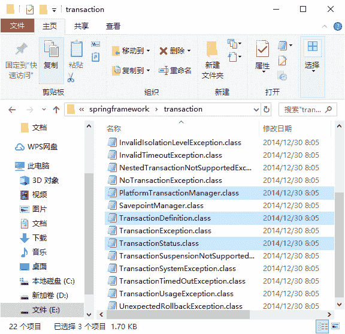

# Spring 事务管理接口：PlatformTransactionManager、TransactionDefinition 和 TransactionStatus

> 原文：[`c.biancheng.net/view/4282.html`](http://c.biancheng.net/view/4282.html)

Spring 的事务管理是基于 AOP 实现的，而 AOP 是以方法为单位的。Spring 的事务属性分别为传播行为、隔离级别、只读和超时属性，这些属性提供了事务应用的方法和描述策略。

在 Java EE 开发经常采用的分层模式中，Spring 的事务处理位于业务逻辑层，它提供了针对事务的解决方案。

在 Spring 解压包的 libs 目录中，包含一个名称为 spring-tx-3.2.13.RELEASE.jar 的文件，该文件是 Spring 提供的用于事务管理的 JAR 包，其中包括事务管理的三个核心接口：PlatformTransactionManager、TransactionDefinition 和 TransactionStatus。

将该 JAR 包的后缀名 jar 改成 zip 的形式后，解压压缩包，进入解压文件夹中的 \org\springframework\transaction 目录后，该目录中的文件如图 1 所示。

图 1  事务管理核心接口
在图 1 中，方框所标注的三个文件就是本节将要讲解的核心接口。这三个核心接口的作用及其提供的方法如下。

#### 1\. PlatformTransactionManager

PlatformTransactionManager 接口是 Spring 提供的平台事务管理器，用于管理事务。该接口中提供了三个事务操作方法，具体如下。

*   TransactionStatus getTransaction（TransactionDefinition definition）：用于获取事务状态信息。
*   void commit（TransactionStatus status）：用于提交事务。
*   void rollback（TransactionStatus status）：用于回滚事务。

在项目中，Spring 将 xml 中配置的事务详细信息封装到对象 TransactionDefinition 中，然后通过事务管理器的 getTransaction() 方法获得事务的状态（TransactionStatus），并对事务进行下一步的操作。

#### 2\. TransactionDefinition

TransactionDefinition 接口是事务定义（描述）的对象，它提供了事务相关信息获取的方法，其中包括五个操作，具体如下。

*   String getName()：获取事务对象名称。
*   int getIsolationLevel()：获取事务的隔离级别。
*   int getPropagationBehavior()：获取事务的传播行为。
*   int getTimeout()：获取事务的超时时间。
*   boolean isReadOnly()：获取事务是否只读。

在上述五个方法的描述中，事务的传播行为是指在同一个方法中，不同操作前后所使用的事务。传播行为的种类如表 1 所示。

表 1 传播行为的种类

| 属性名称 | 值 | 描  述 |
| --- | --- | --- |
| PROPAGATION_REQUIRED | required | 支持当前事务。如果 A 方法已经在事务中，则 B 事务将直接使用。否则将创建新事务 |
| PROPAGATION_SUPPORTS | supports | 支持当前事务。如果 A 方法已经在事务中，则 B 事务将直接使用。否则将以非事务状态执行 |
| PROPAGATION_MANDATORY | mandatory | 支持当前事务。如果 A 方法没有事务，则抛出异常 |
| PROPAGATION_REQUIRES_NEW | requires_new | 将创建新的事务，如果 A 方法已经在事务中，则将 A 事务挂起 |
| PROPAGATION_NOT_SUPPORTED | not_supported | 不支持当前事务，总是以非事务状态执行。如果 A 方法已经在事务中，则将其挂起 |
| PROPAGATION_NEVER | never | 不支持当前事务，如果 A 方法在事务中，则抛出异常 |
| PROPAGATION.NESTED | nested | 嵌套事务，底层将使用 Savepoint 形成嵌套事务 |

在事务管理过程中，传播行为可以控制是否需要创建事务以及如何创建事务。

通常情况下，数据的查询不会改变原数据，所以不需要进行事务管理，而对于数据的增加、修改和删除等操作，必须进行事务管理。如果没有指定事务的传播行为，则 Spring3 默认的传播行为是 required。

#### 3\. TransactionStatus

TransactionStatus 接口是事务的状态，它描述了某一时间点上事务的状态信息。其中包含六个操作，具体如表 2 所示。

表 2  事务的操作

| 名称 | 说明 |
| --- | --- |
| void flush() | 刷新事务 |
| boolean hasSavepoint() | 获取是否存在保存点 |
| boolean isCompleted() | 获取事务是否完成 |
| boolean isNewTransaction() | 获取是否是新事务 |
| boolean isRollbackOnly() | 获取是否回滚 |
| void setRollbackOnly() | 设置事务回滚 |