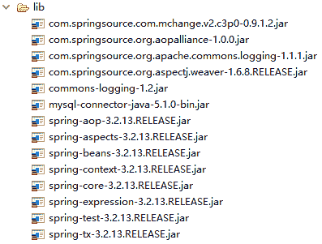
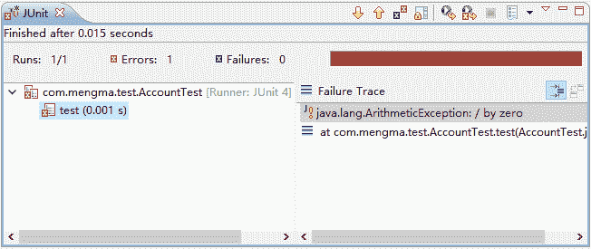

# Spring 声明式事务管理（基于 XML 方式实现）

> 原文：[`c.biancheng.net/view/4287.html`](http://c.biancheng.net/view/4287.html)

Spring 的事务管理有两种方式：一种是传统的编程式事务管理，即通过编写代码实现的事务管理；另一种是基于 AOP 技术实现的声明式事务管理。由于在实际开发中，编程式事务管理很少使用，所以我们只对 Spring 的声明式事务管理进行详细讲解。

Spring 声明式事务管理在底层采用了 AOP 技术，其最大的优点在于无须通过编程的方式管理事务，只需要在配置文件中进行相关的规则声明，就可以将事务规则应用到业务逻辑中。

Spring 实现声明式事务管理主要有两种方式：

*   基于 XML 方式的声明式事务管理。
*   通过 Annotation 注解方式的事务管理。

本节通过银行转账的案例讲解如何使用 XML 的方式实现 Spring 的声明式事务处理。

#### 1\. 创建项目

在 MyEclipse 中创建一个名为 springDemo03 的 Web 项目，将 Spring 支持和依赖的 JAR 包复制到 Web 项目的 lib 目录中，并添加到类路径下。所添加的 JAR 包如图 1 所示。


图 1  需要导入的 JAR 包
从图 1 中可以看出，这里增加导入了 spring-tx-3.2.13.RELEASE.jar（事务管理），以及 MySQL 驱动、JDBC 和 C3P0 的 JAR 包。

#### 2\. 创建数据库、表以及插入数据

在 MySQL 中创建一个名为 spring 的数据库，然后在该数据库中创建一个 account 表，并向表中插入两条数据，其 SQL 执行语句如下所示：

```

CREATE DATABASE spring;
USE spring;
CREATE TABLE account (
    id INT (11) PRIMARY KEY AUTO_INCREMENT,
    username VARCHAR(20) NOT NULL,
    money INT DEFAULT NULL
);
INSERT INTO account VALUES (1,'zhangsan',1000);
INSERT INTO account VALUES (2,'lisi',1000);
```

执行后的 account 表中的数据如图 2 所示。
图 2  执行结果

#### 3\. 创建 c3p0-db.properties

在项目的 src 下创建一个名为 c3p0-db.properties 的配置文件，这里使用 C3P0 数据源，需要在该文件中添加如下配置：

jdbc.driverClass = com.mysql.jdbc.Driver
jdbc.jdbcUrl = jdbc:mysql://localhost:3306/spring
jdbc.user = root
jdbc.password = root

#### 4\. 实现 DAO

#### 1）创建 AccountDao 接口

在项目的 src 目录下创建一个名为 com.mengma.dao 的包，在该包下创建一个接口 AccountDao，并在接口中创建汇款和收款的方法，如下所示。

```

package com.mengma.dao;

public interface AccountDao {
    // 汇款
    public void out(String outUser, int money);

    // 收款
    public void in(String inUser, int money);
}
```

上述代码中，定义了 out() 和 in() 两个方法，分别用于表示汇款和收款。

#### 2）创建 DAO 层接口实现类

在项目的 src 目录下创建一个名为 com.mengma.dao.impl 的包，在该包下创建实现类 AccountDaoImpl，如下所示。

```

package com.mengma.dao.impl;

import org.springframework.jdbc.core.JdbcTemplate;
import com.mengma.dao.AccountDao;

public class AccountDaoImpl implements AccountDao {
    private JdbcTemplate jdbcTemplate;

    public void setJdbcTemplate(JdbcTemplate jdbcTemplate) {
        this.jdbcTemplate = jdbcTemplate;
    }

    // 汇款的实现方法
    public void out(String outUser, int money) {
        this.jdbcTemplate.update("update account set money =money-?"
                + "where username =?", money, outUser);
    }

    // 收款的实现方法
    public void in(String inUser, int money) {
        this.jdbcTemplate.update("update account set money =money+?"
                + "where username =?", money, inUser);
    }
}
```

上述代码中，使用 JdbcTemplate 类的 update() 方法实现了更新操作。

#### 5\. 实现 Service

#### 1）创建 Service 层接口

在项目的 src 目录下创建一个名为 com.mengma.service 的包，在该包下创建接口 AccountService，如下所示。

```

package com.mengma.service;

public interface AccountService {
    // 转账
    public void transfer(String outUser, String inUser, int money);
}
```

#### 2）创建 Service 层接口实现类

在项目的 src 目录下创建一个名为 com.mengma.service.impl 的包，在该包下创建实现类 AccountServiceImpl，如下所示。

```

package com.mengma.service.impl;

import com.mengma.dao.AccountDao;

public class AccountServiceImpl {
    private AccountDao accountDao;

    public void setAccountDao(AccountDao accountDao) {
        this.accountDao = accountDao;
    }

    public void transfer(String outUser, String inUser, int money) {
        this.accountDao.out(outUser, money);
        this.accountDao.in(inUser, money);
    }
}
```

上述代码中可以看出，该类实现了 AccountService 接口，并对转账的方法进行了实现，根据参数的不同调用 DAO 层相应的方法。

#### 6\. 创建 Spring 配置文件

在项目的 src 目录下创建 Spirng 配置文件 applicationContext.xml，编辑后如下所示。

```

<?xml version="1.0" encoding="UTF-8"?>
<beans xmlns="http://www.springframework.org/schema/beans"
    xmlns:xsi="http://www.w3.org/2001/XMLSchema-instance"
    xmlns:context="http://www.springframework.org/schema/context"
    xmlns:tx="http://www.springframework.org/schema/tx"
    xmlns:aop="http://www.springframework.org/schema/aop"
    xsi:schemaLocation="http://www.springframework.org/schema/beans
            http://www.springframework.org/schema/beans/spring-beans-2.5.xsd  
            http://www.springframework.org/schema/context
            http://www.springframework.org/schema/context/spring-context.xsd
            http://www.springframework.org/schema/tx
            http://www.springframework.org/schema/tx/spring-tx-2.5.xsd
            http://www.springframework.org/schema/aop
            http://www.springframework.org/schema/aop/spring-aop-2.5.xsd">
    <!-- 加载 properties 文件 -->
    <context:property-placeholder location="classpath:c3p0-db.properties" />
    <!-- 配置数据源，读取 properties 文件信息 -->
    <bean id="dataSource" class="com.mchange.v2.c3p0.ComboPooledDataSource">
        <property name="driverClass" value="${jdbc.driverClass}" />
        <property name="jdbcUrl" value="${jdbc.jdbcUrl}" />
        <property name="user" value="${jdbc.user}" />
        <property name="password" value="${jdbc.password}" />
    </bean>
    <!-- 配置 jdbc 模板 -->
    <bean id="jdbcTemplate" class="org.springframework.jdbc.core.JdbcTemplate">
        <property name="dataSource" ref="dataSource" />
    </bean>
    <!-- 配置 dao -->
    <bean id="accountDao" class="com.mengma.dao.impl.AccountDaoImpl">
        <property name="jdbcTemplate" ref="jdbcTemplate" />
    </bean>
    <!-- 配置 service -->
    <bean id="accountService" class="com.mengma.service.impl.AccountServiceImpl">
        <property name="accountDao" ref="accountDao" />
    </bean>
    <!-- 事务管理器，依赖于数据源 -->
    <bean id="txManager"
        class="org.springframework.jdbc.datasource.DataSourceTransactionManager">
        <property name="dataSource" ref="dataSource" />
    </bean>
    <!-- 编写通知：对事务进行增强（通知），需要编写切入点和具体执行事务的细节 -->
    <tx:advice id="txAdvice" transaction-manager="txManager">
        <tx:attributes>
            <!-- 给切入点方法添加事务详情，name 表示方法名称，*表示任意方法名称，propagation 用于设置传播行为，read-only 表示隔离级别，是否只读 -->
            <tx:method name="find*" propagation="SUPPORTS"
                rollback-for="Exception" />
            <tx:method name="*" propagation="REQUIRED" isolation="DEFAULT"
                read-only="false" />
        </tx:attributes>
    </tx:advice>
    <!-- aop 编写，让 Spring 自动对目标生成代理，需要使用 AspectJ 的表达式 -->
    <aop:config>
        <!-- 切入点 -->
        <aop:pointcut expression="execution(* com.mengma.service.*.*(..))"
            id="txPointCut" />
        <!-- 切面：将切入点与通知整合 -->
        <aop:advisor pointcut-ref="txPointCut" advice-ref="txAdvice" />
    </aop:config>
</beans>
```

上述代码中，首先在 <beans> 标记的第 6、13 和 14 行代码分别添加了 AOP 所需的命名空间声明。第 42～50 行代码使用 <tx:advice> 标记配置事务通知内容。

第 52～58 行代码使用 <aop:config> 标记定义切面，其中第 54 行代码应用了 AspectJ 表达式，代表 com.mengma.service 包下所有类的所有方法都应用事务规则，第 57 行代码使用 <aop:advistor> 标记将切入点与事务通知整合，基于 AOP 的声明式事务配置完成。

#### 7\. 创建测试类

在项目的 src 目录下创建 com.mengma.test 的包，在该包下创建测试类 AccountTest，如下所示。

```

package com.mengma.test;
import org.junit.Test;
import org.springframework.context.ApplicationContext;
import org.springframework.context.support.ClassPathXmlApplicationContext;
import com.mengma.service.AccountService;
public class AccountTest {
    @Test
    public void test() {
        // 获得 Spring 容器，并操作
        String xmlPath = "applicationContext.xml";
        ApplicationContext applicationContext = new ClassPathXmlApplicationContext(
                xmlPath);
        AccountService accountService = (AccountService) applicationContext
                .getBean("accountService");
        accountService.transfer("zhangsan", "lisi", 100);
    }
}
```

上述代码中模拟了银行转账业务，从 zhangsan 的账户向 lisi 的账户中转入 100 元。使用 JUnit 测试运行 test() 方法，运行成功后，查询 account 表，如图 3 所示。

从图 3 的查询结果中可以看出，zhangsan 成功向 lisi 转账 100 元。


图 3  查询结果
下面通过修改案例模拟转账失败的情况，在的 transfer() 方法中添加一行代码“int i=1/0；”模拟系统断电的情况，具体代码如下所示：

```

public void transfer(String outUser, String inUser, int money) {
    this.accountDao.out(outUser, money);
    //模拟断电
    int i = 1/0;
    this.accountDao.in(inUser, money);
}
```

重新测试运行 test() 方法，JUnit 控制台输出的信息如图 4 所示。


图 4  控制台输出结果
从图 4 中可以看出，在执行测试方法时，出现了除以 0 的异常信息。此时再次查询 account 表，其查询结果如图 5 所示。

从图 5 的查询结果中可以看出，表中的数据并没有发生变化。由于程序在执行过程中抛出了异常，事务不能正常被提交，所以转账失败。由此可知，Spring 的事务管理生效了。


图 5  查询结果