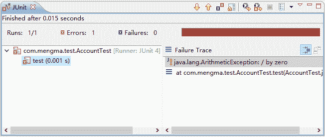

# Spring 声明式事务管理（基于 Annotation 注解方式实现）

> 原文：[`c.biancheng.net/view/4292.html`](http://c.biancheng.net/view/4292.html)

在 Spring 中，除了使用基于 XML 的方式可以实现声明式事务管理以外，还可以通过 Annotation 注解的方式实现声明式事务管理。

使用 Annotation 的方式非常简单，只需要在项目中做两件事，具体如下。

#### 1）在 Spring 容器中注册驱动，代码如下所示：

<tx:annotation-driven transaction-manager="txManager"/>

#### 2）在需要使用事务的业务类或者方法中添加注解 @Transactional，并配置 @Transactional 的参数。关于 @Transactional 的参数如图 1 所示。


图 1  @Transactional 参数列表
下面通过修改《Spring 基于 XML 实现事务管理》教程中银行转账的案例讲解如何使用 Annotation 注解的方式实现 Spring 声明式事务管理。

#### 1\. 注册驱动

修改 Spring 配置文件 applicationContext.xml，修改后如下所示。

```

<?xml version="1.0" encoding="UTF-8"?>
<beans xmlns="http://www.springframework.org/schema/beans"
    xmlns:xsi="http://www.w3.org/2001/XMLSchema-instance"
    xmlns:context="http://www.springframework.org/schema/context"
    xmlns:tx="http://www.springframework.org/schema/tx"
    xmlns:aop="http://www.springframework.org/schema/aop"
    xsi:schemaLocation="http://www.springframework.org/schema/beans
            http://www.springframework.org/schema/beans/spring-beans-2.5.xsd  
            http://www.springframework.org/schema/context
            http://www.springframework.org/schema/context/spring-context.xsd
            http://www.springframework.org/schema/tx
            http://www.springframework.org/schema/tx/spring-tx-2.5.xsd
            http://www.springframework.org/schema/aop
            http://www.springframework.org/schema/aop/spring-aop-2.5.xsd">
    <!-- 加载 properties 文件 -->
    <context:property-placeholder location="classpath:c3p0-db.properties" />
    <!-- 配置数据源，读取 properties 文件信息 -->
    <bean id="dataSource" class="com.mchange.v2.c3p0.ComboPooledDataSource">
        <property name="driverClass" value="${jdbc.driverClass}" />
        <property name="jdbcUrl" value="${jdbc.jdbcUrl}" />
        <property name="user" value="${jdbc.user}" />
        <property name="password" value="${jdbc.password}" />
    </bean>
    <!-- 配置 jdbc 模板 -->
    <bean id="jdbcTemplate" class="org.springframework.jdbc.core.JdbcTemplate">
        <property name="dataSource" ref="dataSource" />
    </bean>
    <!-- 配置 dao -->
    <bean id="accountDao" class="com.mengma.dao.impl.AccountDaoImpl">
        <property name="jdbcTemplate" ref="jdbcTemplate" />
    </bean>
    <!-- 配置 service -->
    <bean id="accountService" class="com.mengma.service.impl.AccountServiceImpl">
        <property name="accountDao" ref="accountDao" />
    </bean>
    <!-- 事务管理器，依赖于数据源 -->
    <bean id="txManager"
        class="org.springframework.jdbc.datasource.DataSourceTransactionManager">
        <property name="dataSource" ref="dataSource" />
    </bean>
    <!-- 注册事务管理驱动 -->
    <tx:annotation-driven transaction-manager="txManager"/>
</beans>
```

上述代码中可以看出，与原来的配置文件相比，这里只修改了事务管理器部分，新添加并注册了事务管理器的驱动。

需要注意的是，在学习 AOP 注解方式开发时，需要在配置文件中开启注解处理器，指定扫描哪些包下的注解，这里没有开启注解处理器是因为在第 33～35 行手动配置了 AccountServiceImpl，而 @Transactional 注解就配置在该类中，所以会直接生效。

#### 2\. 添加 @Transactional 注解

修改 AccountServiceImpl，在文件中添加 @Transactional 注解及参数，添加后如下所示。

```

package com.mengma.service.impl;

import org.springframework.transaction.annotation.Isolation;
import org.springframework.transaction.annotation.Propagation;
import org.springframework.transaction.annotation.Transactional;

import com.mengma.dao.AccountDao;

@Transactional(propagation = Propagation.REQUIRED, isolation = Isolation.DEFAULT, readOnly = false)
public class AccountServiceImpl {
    private AccountDao accountDao;

    public void setAccountDao(AccountDao accountDao) {
        this.accountDao = accountDao;
    }

    public void transfer(String outUser, String inUser, int money) {
        this.accountDao.out(outUser, money);
        // 模拟断电
        int i = 1 / 0;
        this.accountDao.in(inUser, money);
    }
}
```

需要注意的是，在使用 @Transactional 注解时，参数之间用“，”进行分隔。

使用 JUnit 测试再次运行 test() 方法时，控制台同样会输出如图 2 所示的异常信息，这说明使用基于 Annotation 注解的方式同样实现了 Spring 的声明式事务管理。如果注释掉模拟断电的代码进行测试，则转账操作可以正常完成。


图 2  运行结果