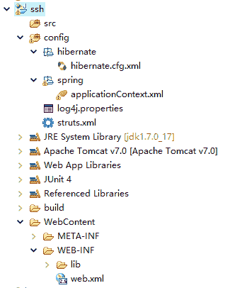
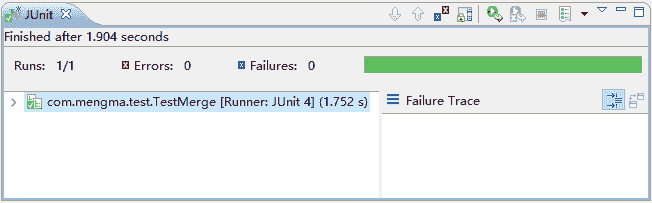
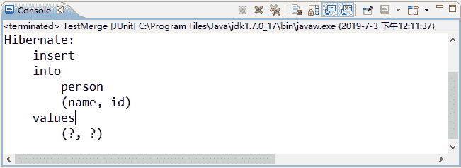
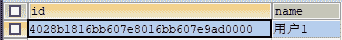
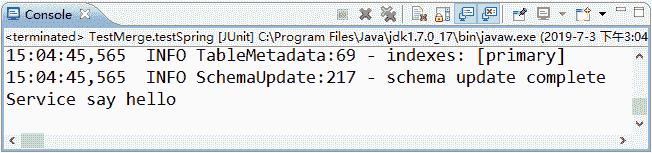
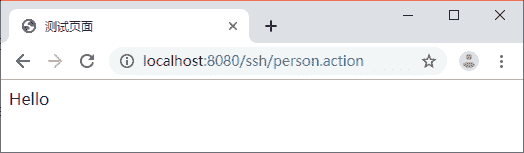
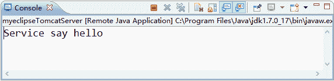

# SSH 框架（Struts2+Spring+Hibernate）搭建整合详细步骤

> 原文：[`c.biancheng.net/view/4294.html`](http://c.biancheng.net/view/4294.html)

在实际项目的开发中，为了充分利用各个框架的优点，我们通常都会把 Spring 与其他框架整合在一起使用。本节将针对 SSH（Struts2、Hibernate 和 Spring）框架的整合内容进行详细讲解。

## 准备整合环境

整合就是将不同的框架放在一个项目中，共同使用它们的技术，发挥它们的优点，并形成互补。一般而言，在进行整合之前都要准备整合环境。下面对 SSH 框架的整合环境配置进行详细讲解。

#### 1\. 数据库环境

由于整合 SSH 框架时，需要连接数据库进行测试，因此需要准备数据库环境。在 MySQL 数据库中创建一个名称为 ssh 的数据库，并在数据库中创建一个名称为 person 的表，该表中包含 2 个字段，分别是 id 和 name，其中 id 是表的主键，name 表示名称。创建数据库和表的 SQL 语句如下所示：

```

CREATE DATABASE ssh;
USE ssh;
CREATE TABLE person(
    id VARCHAR(32) NOT NULL,
    NAME VARCHAR(50) NOT NULL,
    PRIMARY KEY(id)
);
```

#### 2\. 配置 Struts2 环境

#### 1）创建项目并导入 Struts2 框架所需的 JAR 包

在 MyEclipse 中创建一个名称为 ssh 的 Web 项目，在项目的 lib 目录中添加 Struts2 框架所需的 JAR 包，并发布到类路径下。本教程中使用的 struts-2.3.37 版本需要导入 13 个 JAR 包，具体如下。

*   asm-3.3.jar
*   asm-commons-3.3.jar
*   asm-tree-3.3.jar
*   commons-fileupload-1.4.jar
*   commons-io-2.2.jar
*   commons-lang3-3.2.jar
*   freemarker-2.3.28.jar
*   javassist-3.11.0.GA.jar
*   log4j-api-2.3.jar
*   log4j-core-2.3.jar
*   ognl-3.0.21.jar
*   struts2-core-2.3.37.jar
*   xwork-core-2.3.37.jar

#### 2）添加 log4j.properties 文件

在实际项目开发时，通常需要记录项目日志信息。这时可以在项目中添加一个名称为 log4j.properties 的文件，用于打印日志信息。

在添加 log4j.properties 文件之前，首先在项目中创建一个名为 config 的源文件夹（Source Folder），该文件夹专门用于存放各种配置文件。然后在 Hibernate 解压包中的 project\etc 路径下找到 log4j.properties 的文件，并复制到 config 源文件夹中。打开并编辑后，如下所示。

### direct log messages to stdout ###
log4j.appender.stdout=org.apache.log4j.ConsoleAppender
log4j.appender.stdout.Target=System.out
log4j.appender.stdout.layout=org.apache.log4j.PatternLayout
log4j.appender.stdout.layout.ConversionPattern=%d{ABSOLUTE} %5p %c{1}:%L - %m%n

### direct messages to file mylog.log ###
log4j.appender.file=org.apache.log4j.FileAppender
log4j.appender.file.File=c:/mylog.log
log4j.appender.file.layout=org.apache.log4j.PatternLayout
log4j.appender.file.layout.ConversionPattern=%d{ABSOLUTE} %5p %c{1}:%L - %m%n

### set log levels - for more verbose logging change 'info' to 'debug' ###

log4j.rootLogger=info, stdout

在上述配置代码中，两个 ### 之间的内容是文件的注释信息，第 2～5 行内容表示输出信息到控制台，第 7～10 行内容表示输出日志文件 mylog.log 到 D 盘，第 12 行内容表示设置日志级别为 info，并输出到控制台显示。

关于 log4j 配置文件更详细的讲解，读者可查找相应的资料进行学习，由于本教程篇幅有限，此处就不再赘述，望读者见谅。

#### 3）配置 Struts2 的核心过滤器

在项目的 web.xml 文件中配置 Struts2 的核心过滤器，如下所示。

```

<?xml version="1.0" encoding="UTF-8"?>
<web-app xmlns:xsi="http://www.w3.org/2001/XMLSchema-instance" xmlns="http://java.sun.com/xml/ns/javaee" xmlns:web="http://java.sun.com/xml/ns/javaee/web-app_2_5.xsd" xsi:schemaLocation="http://java.sun.com/xml/ns/javaee http://java.sun.com/xml/ns/javaee/web-app_2_5.xsd" version="2.5">
    <!-- 配置 Struts2 核心过滤器 -->
    <filter>
        <filter-name>struts2</filter-name>
        <filter-class>
            org.apache.struts2.dispatcher.ng.filter.StrutsPrepareAndExecuteFilter
        </filter-class>
    </filter>
    <filter-mapping>
        <filter-name>struts2</filter-name>
        <url-pattern>/*</url-pattern>
    </filter-mapping>
</web-app>
```

#### 4）添加 struts.xml 配置文件

在 config 文件夹下添加 Struts2 的配置文件 struts.xml，并在文件中将 Struts2 框架配置为开发模式和 simple 主题，如下所示。

```

<?xml version="1.0" encoding="UTF-8"?>
<!DOCTYPE struts PUBLIC
    "-//Apache Software Foundation//DTD Struts Configuration 2.3//EN"
    "http://struts.apache.org/dtds/struts-2.3.dtd">
<struts>
    <!-- 开发模式 -->
    <constant name="struts.decMode" value="true" />
    <!-- 把主题配置成 simple -->
    <constant name="struts.ui.theme" value="simple" />
    <package name="common" namespace="/" extends="struts-default">
    </package>
</struts>
```

#### 3. 配置 Spring 环境

#### 1）导入 Spring 依赖的 JAR 包

从 Spring 文件的 libs 目录和第三方依赖包中选取所需的 JAR 包，添加到项目的 lib 目录中，并发布到类路径下。本教程中使用的 Spring 3.2.13 版本依赖的基础 JAR 包共有 15 个，具体如下。

*   spring-aop-3.2.13.RELEASE.jar
*   spring-aspects-3.2.13.RELEASE.jar
*   spring-beans-3.2.13.RELEASE.jar
*   spring-context-3.2.13.RELEASE.jar
*   spring-core-3.2.13.RELEASE.jar
*   spring-expression-3.2.13.RELEASE.jar
*   spring-jdbc-3.2.13.RELEASE.jar
*   spring-test-3.2.13.RELEASE.jar
*   spring-tx-3.2.13.RELEASE.jar
*   spring-web-3.2.13.RELEASE.jar
*   spring-orm-3.2.13.RELEASE.jar

第三方依赖包：

*   com.springsource.org.aopalliance-1.0.0.jar
*   com.springsource.org.apache.commons.logging-1.1.1.jar
*   com.springsource.org.aspectj.weaver-1.6.8.RELEASE.jar
*   commons-logging-1.2.jar

在上述 15 个 JAR 包中，Spring 自带的 JAR 包可以在下载的 Spring 文件的 libs 目录中查找到，而 4 个第三方依赖包可以在网址 [`repo.spring.io/webapp/#/search/quick/`](https://repo.spring.io/webapp/#/search/quick/) 中搜索并下载。

#### 2）添加 Spring 的核心配置文件

在项目的 config 文件夹中创建一个名称为 spring 的包，并在包中创建 Spring 的核心配置文件 applicationContext.xml，如下所示。

```

<?xml version="1.0" encoding="UTF-8"?>
<beans xmlns="http://www.springframework.org/schema/beans"
    xmlns:xsi="http://www.w3.org/2001/XMLSchema-instance"
    xmlns:context="http://www.springframework.org/schema/context"
    xmlns:tx="http://www.springframework.org/schema/tx"
    xmlns:aop="http://www.springframework.org/schema/aop"
    xsi:schemaLocation="http://www.springframework.org/schema/beans
            http://www.springframework.org/schema/beans/spring-beans-2.5.xsd  
            http://www.springframework.org/schema/context
            http://www.springframework.org/schema/context/spring-context.xsd
            http://www.springframework.org/schema/tx
            http://www.springframework.org/schema/tx/spring-tx-2.5.xsd
            http://www.springframework.org/schema/aop
            http://www.springframework.org/schema/aop/spring-aop-2.5.xsd">
</beans>
```

#### 3）配置 Spring 的监听器和过滤器

在 web.xml 文件中配置 Spring 的监听器信息，其代码如下所示：

```

<!-- 监听器 -->
<context-param>
    <param-name>contextConfigLocation</param-name>
    <param-value>classpath:spring/applicationContext.xml</param-value>
</context-param>
<listener>
    <listener-class>
        org.springframework.web.context.ContextLoaderListener
    </listener-class>
</listener>
<!-- 添加过滤器，延迟 session 关闭 -->
<filter>
    <filter-name>OpenSessionInViewFilter</filter-name>
    <filter-class>
        org.springframework.orm.hibernate3.support.OpenSessionInViewFilter
    </filter-class>
</filter>
<filter-mapping>
    <filter-name>OpenSessionInViewFilter</filter-name>
    <url-pattern>/*</url-pattern>
</filter-mapping>
```

在上述配置信息代码中，ContextLoaderListener 是由 Spring 提供的一个监听器类，它在创建时会自动查找名为 contextConfigLocation 的初始化参数，并使用该参数所指定的配置文件，此处表示类路径下 spring 目录中的 applicationContext.xml 文件。

OpenSessionInViewFilter 过滤器的主要功能是延迟 Session 的关闭时间，从而保证延迟加载操作的顺利进行。

#### 4\. 配置 Hibernate 环境

#### 1）导入 Hibernate 所需的 JAR 包

本教程所使用的是 Hibernate 3.6.10 版本，此版本的 Hibernate 所依赖的 JAR 包共 12 个，具体如下。

*   antlr-2.7.6.jar
*   c3p0-0.9.1.jar
*   commons-collections-3.1.jar
*   dom4j-1.6.1.jar
*   hibernate-jpa-2.0-api-1.0.1.Final.jar
*   hibernate3.jar
*   javassist-3.12.0.GA.jar（不需要添加）
*   jta-1.1.jar
*   log4j-1.2.17.jar
*   mysql-connector-java-5.1.0-bin.jar
*   slf4j-api-1.6.1.jar
*   slf4j-log4j12-1.6.1.jar

选取上述 JAR 包，添加到 ssh 项目的 WEB-INF/lib 目录中，并发布到类路径下。需要注意的是，在上述 JAR 包中，javassist-3.12.0.GA.jar 在配置 Struts 2 环境时已经添加过，所以这里不需要重复添加。

#### 2）添加核心配置文件 hibernate.cfg.xml

在项目的 config 文件夹中创建一个名称为 hibernate 的包，并在该包中添加配置文件 hibernate.cfg.xml，如下所示。

```

<?xml version="1.0" encoding="UTF-8"?>
<!DOCTYPE hibernate-configuration PUBLIC
          "-//Hibernate/Hibernate Configuration DTD 3.0//EN"
          "http://hibernate.sourceforge.net/hibernate-configuration-3.0.dtd">
<hibernate-configuration>
    <session-factory>
        <!-- 1\. 基本 4 项 -->
        <property name="hibernate.connection.driver_class">
            com.mysql.jdbc.Driver
        </property>
        <property name="hibernate.connection.url">
              <![CDATA[jdbc:mysql://localhost:3306/ssh?useUnicode=true&characterEncoding=utf-8]]>
        </property>
        <property name="hibernate.connection.username">root</property>
        <property name="hibernate.connection.password">1128</property>
        <!-- 2.指定方言 -->
        <property name="hibernate.dialect">
            org.hibernate.dialect.MySQL5Dialect
        </property>
        <!-- 3.sql 语句 -->
        <property name="hibernate.show_sql">true</property>
        <property name="hibernate.format_sql">true</property>
        <property name="hibernate.hbm2ddl.auto">update</property>
        <!-- 4.取消验证 -->
        <property name="javax.persistence.validation.mode">none</property>
        <!-- 5.本地线程绑定 -->
        <property name="hibernate.current_session_context_class">thread</property>
        <!-- 6.整合 C3P0 -->
        <property name="hibernate.connection.provider_class">
            org.hibernate.connection.C3P0ConnectionProvider
        </property>
        <!--在连接池中可用的数据库连接的最少数目 -->
        <property name="c3p0.min_size">5 </property>
        <!--在连接池中所有数据库连接的最大数目 -->
        <property name="c3p0.max_sizen">20 </property>
        <!--设定数据库连接的过期时间，以 ms 为单位，如果连接池中的某个数据库连接空闲状态的时间 超过 timeout 时间，则会从连接池中清除 -->
        <property name="c3p0.timeout">120 </property>
        <!--每 3000s 检查所有连接池中的空闲连接以 s 为单位 -->
        <property name="c3p0.idle_test_period">3000 </property>
        <!-- 配置所有的 hbm.xml，交予 Spring 管理映射文件 -->
    </session-factory>
</hibernate-configuration>
```

在上述配置中，分别配置了连接数据库的四项基本信息、方言等内容。至此，Strut2、Spring 和 Hibernate 的环境均准备完成，完成后的项目环境结构如图 1 所示。


图 1  项目环境结构
从图 1 中可以看出，三大框架的配置文件和日志文件都在 config 源文件夹中统一管理，此时如果查看 lib 目录，会发现该目录中共有 39 个 JAR 包。

## Spring 与 Hibernate 整合

Spring 对 Hibernate 提供的支持主要包括：将 Hibernate 需要用到的数据源 DataSource（如 BasicDataSource 数据源或 C3P0 数据源）、Hibernate 的 SessionFactory 实例（如 LocalSessionFactoryBean）及其事务管理器 HibernateTransactionManager 移交给 Spring 容器管理，同时，Spring 框架还对 Hibernate 进行了封装，提供了统一的模板化操作。接下来将讲解 Spring 如何整合 Hibernate。

Spring 整合 Hibernate 时，需要添加一个支持整合的 JAR 包 spring-orm-3.2.13.RELEASE.jar，该 JAR 包可以在 Spring 解压目录的 libs 目录中找到。添加后，即可进行整合工作。

下面通过案例演示整合过程。

#### 1\. 创建实体类

在项目的 src 下创建一个名称为 com.mengma.ssh.domain 的包，在该包中创建一个名称为 Person 的类，编辑后如下所示。

```

package com.mengma.ssh.domain;

import java.io.Serializable;

public class Person implements Serializable {
    private static final long serialVersionUID = -3541561917509006050L;
    private String id;
    private String name;

    public Person() {
    }

    public Person(String name) {
        super();
        this.name = name;
    }

    public String getId() {
        return id;
    }

    public void setId(String id) {
        this.id = id;
    }

    public String getName() {
        return name;
    }

    public void setName(String name) {
        this.name = name;
    }
}
```

#### 2\. 创建映射文件

在 com.mengma.ssh.domain 包中编写 Person 类的映射文件 Person.hbm.xml，编辑后如下所示。

```

<?xml version="1.0" encoding="UTF-8"?>
<!DOCTYPE hibernate-mapping PUBLIC "-//Hibernate/Hibernate Mapping DTD 3.0//EN"
"http://hibernate.sourceforge.net/hibernate-mapping-3.0.dtd">
<hibernate-mapping>
    <class name="com.mengma.ssh.domain.Person" table="person">
        <id name="id" type="java.lang.String">
            <column name="id" length="32" />
            <!-- 采用 uuid.hex 作为主键生成机制 -->
            <generator class="uuid.hex" />
        </id>
        <property name="name" type="java.lang.String">
            <column name="name" length="50" not-null="true" />
        </property>
    </class>
</hibernate-mapping>
```

#### 3\. 编写 Spring 的配置信息

在 applicationContext.xml 中添加 Spring 加载 Hibernate 配置文件的信息，其代码如下所示：

```

<bean id="sessionFactory" class="org.springframework.orm.hibernate3.LocalSessionFactoryBean">
    <!-- 1.1 确定文件位置 -->
    <property name="configLocation" value="classpath:hibernate/hibernate.cfg.xml"/>
    <!-- 1.2 配置 hbm.xml 映射文件，mappingDirectoryLocationd 表示本地映射文件的目录 -->
    <property name="mappingDirectoryLocations" value="classpath:com/mengma/*/domain"/>
</bean>
```

#### 4\. 编写测试类

在 src 下创建一个名称为 com.mengma.test 的包，并在包中创建测试类文件 TestMerge.java，编辑后如下所示。

```

package com.mengma.test;

import org.hibernate.Session;
import org.hibernate.SessionFactory;
import org.hibernate.Transaction;
import org.junit.Before;
import org.junit.Test;
import org.springframework.context.support.ClassPathXmlApplicationContext;
import com.mengma.ssh.domain.Person;

/**
* 整合测试类
*
*/
public class TestMerge {
    ClassPathXmlApplicationContext ctx;

    @Before
    public void loadCtx() {
        // 加载配置文件
        ctx = new ClassPathXmlApplicationContext(
                "spring/applicationContext.xml");
    }

    @Test
    public void testHibernate() {
        SessionFactory sf = (SessionFactory) ctx.getBean("sessionFactory");
        Session session = sf.openSession();
        Transaction transaction = session.beginTransaction();
        session.save(new Person("用户 1"));
        transaction.commit();
        session.close();
        sf.close();
    }
}
```

在上述代码中，创建了两个方法，即 loadCtx() 和 testHibernate()。loadCtx() 方法的主要作用是加载 Spring 的配置文件信息，由于在该方法上使用了 JUnit 注解 @Before，所以该方法会在运行其他方法之前运行。

testHibernate() 方法的主要作用是使用 Hibernate 向数据库的 person 表中插入一条用户名为“用户 1”的信息。使用 JUnit 运行 testHibernate() 方法后，JUnit 控制台的显示如图 2 所示。


图 2  JUnit 控制台信息
从图 2 中可以看出，其进度条为绿色，表示程序运行成功。查看 MyEclipse 控制台，其显示如图 2 所示。

从图 3 中可以看出，执行 testHibernate() 方法后，Hibernate 向数据库中插入了一条 SQL 语句。此时查询数据表 person，其表数据如图 4 所示。


图 3  MyEclipse 控制台信息
从图 4 中可以看出，testHibernate() 方法已经成功向数据库中插入了一条数据，这说明 Spring 框架和 Hibernate 框架整合成功。


图 4  Person 表中的数据

## Spring 与 Struts2 整合

在 Struts2 与 Spring 整合时，需要导入一个名称为 struts2-spring-plugin-2.3.37 的 JAR 包，该 JAR 包可以在 Struts2 解压包的 lib 目录中找到。

如果可以在 Action 中正确调用 Service 中的执行方法并返回到一个页面中，那么就可以认定 Struts2 和 Spring 的整合是成功的。接下来将对 Struts2 和 Spring 的整合过程进行讲解。

#### 1\. 实现 Service 的配置

#### 1）创建接口

在 src 下创建一个名称为 com.mengma.ssh.service 的包，在包中创建一个名称为 PersonService 的接口，该接口中声明了一个 say() 方法，其代码如下所示。

```

package com.mengma.ssh.service;

public interface PersonService {
    public void say();
}
```

#### 2）创建接口实现类

在 src 下创建一个名称为 com.mengma.ssh.service.impl 的包，在该包中创建 PersonService 接口的实现类 PersonServiceImpl，编辑后如下所示。

```

package com.mengma.ssh.service.impl;

import com.mengma.ssh.service.PersonService;
public class PersonServiceImpl implements PersonService {

    @Override
    public void say() {
        System.out.println("Service say hello");
    }
}
```

在上述代码中，实现了 PersonService 接口中的 say() 方法，并使用输出语句输出一行信息。

#### 3）配置 Spring

在 spring 包中创建一个名称为 applicationContext_person.xml 的 Spring 配置文件，在文件中添加 PersonServiceImpl 类的 Bean 信息，添加代码如下所示：

<bean id="personService" class="com.mengma.ssh.service.impl.PersonServiceImpl"/>

创建并编写完配置文件后，还需要在 applicationContext.xml 中引入 applicationContext_person.xml。其引入方式非常简单，只需在 applicationContext.xml 中添加如下代码即可：

<import resource="classpath:spring/applicationContext_person.xml"/>

#### 4）验证配置

为了验证 Spring 的加载是否正确，可以在测试类 TestMerge.java 中创建一个名称为 testSpring 的方法进行测试。该方法代码如下所示：

```

/**
  * 测试 Spring 加载是否正确
  */
@Test
public void testSpring(){
    PersonService ts = (PersonService)ctx.getBean("personService");
    ts.say();
}
```

使用 JUnit 运行该方法后，控制台的输出结果如图 5 所示。

图 5  输出结果
从图 5 的输出结果中可以看出，控制台已经成功输出了 PersonServiceImpl 类中的输出语句。

#### 2\. 实现 Action 的配置

#### 1）创建 Action

在 src 下创建一个名称为 com.mengma.ssh.action 的包，在该包下创建一个名称为 PersonAction 的类，并在类中使用 execute() 方法调用 PersonService 对象的 say() 方法，其代码如下所示。

```

package com.mengma.ssh.action;

import com.mengma.ssh.service.PersonService;
import com.opensymphony.xwork2.ActionSupport;

public class PersonAction extends ActionSupport {
    private static final long serialVersionUID = 1L;
    private PersonService personService;

    public PersonService getPersonService() {
        return personService;
    }

    public void setPersonService(PersonService personService) {
        this.personService = personService;
    }

    public String execute() {
        personService.say();
        return SUCCESS;
    }
}
```

#### 2）创建和引入 Struts2 的配置文件

在 config 源文件夹下创建一个名称为 struts 的包，在该包中创建一个名为 struts-person.xml 的配置文件，编辑后如下所示。

```

<?xml version="1.0" encoding="UTF-8"?>
<!DOCTYPE struts PUBLIC
    "-//Apache Software Foundation//DTD Struts Configuration 2.3//EN"
    "http://struts.apache.org/dtds/struts-2.3.dtd">
<struts>
    <package name="test-package" namespace="/" extends="struts-default">
        <action name="person_*" class="com.mengma.ssh.action.PersonAction"
            method="{1}">
            <result name="success">test.jsp</result>
        </action>
    </package>
</struts>
```

将 struts-person.xml 导入到 struts.xml 文件中，其导入代码如下所示：

<include file="struts/struts-*.xml"/>

在上述代码中，使用了通配符`*`将所有以 struts -开头的文件都引入到 struts.xml 中，这样，以后在增加配置文件时，就不再需要在 struts.xml 中增加 include 语句。

#### 3）配置 Action 的 Bean 信息

在 applicationContext_person.xml 中添加 PersonAction 的 Bean 信息，添加后的主要代码如下所示：

```

<?xml version="1.0" encoding="UTF-8"?>
<!DOCTYPE struts PUBLIC
    "-//Apache Software Foundation//DTD Struts Configuration 2.3//EN"
    "http://struts.apache.org/dtds/struts-2.3.dtd">
<struts>
    <package name="test-package" namespace="/" extends="struts-default">
        <action name="person_*" class="com.mengma.ssh.action.PersonAction"
            method="{1}">
            <result name="success">test.jsp</result>
        </action>
    </package>
</struts>
```

#### 3\. 创建测试页面，查看测试结果

在 WebContent 目录下创建一个名称为 test.jsp 的页面文件，在页面的 <body> 元素中编写一个“Hello”。启动项目后，在浏览器的地址栏中输入地址 http://localhost:8080/ssh/person.action 后，浏览器的显示结果如图 6 所示。


图 6  添加页面
此时，再次查看 MyEclipse 控制台，控制台中已经输出了 Service 层中 say() 方法的内容，如图 7 所示。


图 7  添加成功页面
从图 6 和图 7 中可以看出，在访问 person.action 后已经正确调用了 PersonService 中的 say() 方法，并返回到了 test.jsp 页面，这说明 Struts2 与 Spring 整合成功。

现在，SSH 框架已经搭建成功了，细心的小伙伴可能已经发现了虽然三大框架已经整合成功，但就项目的三层结构来说，缺少了 Service 和 DAO 之间的整合调用。并且，在实际开发过程中，为了保证项目能够正常运行，还需要对 Spring 的事务管理进行测试。

由于本节篇幅有限，小伙伴们可以阅读《测试 SSH 框架分层整合及验证事务是否有效》教程学习。