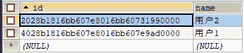

# 测试 SSH 框架分层整合及验证事务是否有效

> 原文：[`c.biancheng.net/view/4297.html`](http://c.biancheng.net/view/4297.html)

在《SSH 框架整合》教程中，分别对 Spring 与 Hibernate 的整合、Spring 与 Struts2 的整合进行了详细讲解，本节我们来测试框架分层的整合和验证 Spring 的事务管理是否有效。

## 测试框架分层的整合

细心的读者一定会发现，虽然在《SSH 框架整合》教程项目中的三大框架已经整合成功，但就项目的三层结构来说，却缺少了 Service 和 DAO 之间的整合调用，接下来将对 Service 和 DAO 的整合进行讲解。

在讲解 Service 和 DAO 的整合之前，先来了解两个类：HibernateTemplate 和 HibernateDaoSupport，这两个类是 Spring 为整合 Hibernate3 提供的两个工具类。

HibernateTemplate 是 Spring 的模板工具类之一，它只需要获得一个 SessionFactory 就可以执行持久化操作。HibernateDaoSupport 是 Spring 为实现 DAO 组件提供的一个工具类，它主要提供了两个方法以简化 DAO 的实现，具体如下。

*   Public final HibernateTemplate getHibernateTemplate()
*   Public final void setSessionFactory(SessionFactory sessionFactory)

其中，getHibernateTemplate() 方法用于返回一个 HibernateTemplate 对象，一旦获得了 HibernateTemplate 对象，剩下的 DAO 实现将由该对象完成，而 setSessionFactory() 方法可用于接收 Spring 的依赖注入。

了解了 Spring 整合 Hibernate 的两个工具类后，下面分步骤讲解 Service 和 DAO 层之间的整合过程。

#### 1\. 实现 DAO

#### 1）创建 PersonDao 接口

在 src 下创建一个名称为 com.mengma.ssh.dao 的包，在该包中创建一个名称为 PersonDao 的接口，接口中定义了一个 save 方法，其代码如下所示。

```

package com.mengma.ssh.dao;
import com.mengma.ssh.domain.Person;
public interface PersonDao {
    public void save(Person person);
}
```

#### 2）创建接口实现类 PersonDaoImpl

在 src 下创建一个名称为 com.mengma.ssh.dao.impl 的包，在该包中创建 PersonDao 接口的实现类 PersonDaoImpl，该类中实现了 PersonDao 接口中的方法。其代码如下所示。

```

package com.mengma.ssh.dao.impl;

import org.springframework.orm.hibernate3.support.HibernateDaoSupport;
import com.mengma.ssh.dao.PersonDao;
import com.mengma.ssh.domain.Person;

public class PersonDaoImpl extends HibernateDaoSupport implements PersonDao {

    @Override
    public void save(Person person) {
        this.getHibernateTemplate().save(person);
        System.out.println("personDao save...");
    }
}
```

在上述代码中，继承了 HibernateDaoSupport，并实现了 PersonDao 接口，在 save() 方法中，调用了 HibernateTemplate 的 save() 方法保存 person 对象，并使用输出语句在控制台输出了“personDao save...”信息。

#### 2\. 实现 Service

#### 1）编写 Service 层接口方法

在 PersonService 接口中，创建一个 save() 方法，其方法代码如下所示：

public void save(Person person);

#### 2）编写 Service 层接口实现类方法

在 PersonServiceImpl 类中，实现 PersonService 接口中的 save 方法，然后声明 PersonDao 属性，并编写其 getter 和 setter 方法。其主要代码如下所示：

```

private PersonDao personDao; // 声明 PersonDao

public PersonDao getPersonDao() {
    return personDao;
}

public void setPersonDao(PersonDao personDao) {
    this.personDao = personDao;
}

@Override
public void save(Person person) {
    this.personDao.save(person);
}
```

#### 3\. 添加 Spring 配置信息

#### 1）添加 Bean 实例

在 applicationContext_person.xml 中创建 PersonDao 的 Bean 实例，并将 personDao 实例注入 personService 中，其主要代码如下所示：

```

<!-- dao -->
<bean id="personDao" class="com.mengma.ssh.dao.impl.PersonDaoImpl">
    <property name="sessionFactory" ref="sessionFactory" />
</bean>
<!-- service -->
<bean id="personService" class="com.mengma.ssh.service.impl.PersonServiceImpl">
    <!-- 将 personDao 实例注入 personService 中 -->
    <property name="personDao" ref="personDao"/>
</bean>
```

#### 2）添加事务配置

在 applicationContext.xml 中添加事务的配置信息，其添加代码如下所示：

```

<!-- 事务管理器，依赖于数据源 -->
<bean id="txManager"
    class="org.springframework.orm.hibernate3.HibernateTransactionManager">
    <property name="sessionFactory" ref="sessionFactory" />
</bean>
<!-- 注册事务管理驱动 -->
<tx:annotation-driven transaction-manager="txManager" />
<bean id="sessionFactory"
    class="org.springframework.orm.hibernate3.LocalSessionFactoryBean">
    <!--通知：增强事务 -->
    <tx:advice id="txAdvice" transaction-manager="txManager">
        <tx:attributes>
            <!--如果不把 save update delete 都配置上，则这些操作会无效 -->
            <tx:method name="save*" propagation="REQUIRED" />
            <tx:method name="update*" propagation="REQUIRED" />
            <tx:method name="delete*" propagation="REQUIRED" />
            <tx:method name="find*" read-only="true" />
        </tx:attributes>
    </tx:advice>
    <aop:config>
        <!-- 切入点 -->
        <aop:pointcut expression="execution(* com.mengma.service.*.*(..))"
            id="txPointCut" />
        <!--advisor 特殊的切面（一个切入点和一个通知） -->
        <aop:advisor pointcut-ref="txPointCut" advice-ref="txAdvice" />
    </aop:config>
    <!-- 1.1 确定文件位置 -->
    <property name="configLocation" value="classpath:hibernate/hibernate.cfg.xml" />
    <!-- 1.2 配置 hbm.xml 映射文件，mappingDirectoryLocationd 表示本地映射文件的目录 -->
    <property name="mappingDirectoryLocations" value="classpath:com/mengma/*/domain" />
</bean>
```

在上述代码中，首先配置了事务管理器，然后配置了事务的通知信息，最后通过切入点表达式，指定了需要进行事务控制的类。需要注意的是，上述代码中切入点表达式中的 expression 内容，表示拦截以 service 结尾的 Bean。

#### 4\. 编写测试方法

在测试类 TestMerge 中，创建一个名称为 PersonServiceAndDao 的方法，测试 Service 和 Dao 层的整合，该方法代码如下所示：

```

@Test
public void PersonServiceAndDao() {
    PersonService ts = (PersonService) ctx.getBean("personService");
    ts.save(new Person("用户 2"));
}
```

在上述代码中，首先获取了 personService 实例，然后调用实例的 save() 方法保存了一个名称为“用户 2”的对象。使用 JUnit 运行上述方法成功后，查询数据库中 person 表中的数据，其结果如图 1 所示。


图 1  person 表中的数据
从图 1 中可以看出，“用户 2”已经成功插入到数据库中，这说明 Service 和 Dao 之间的整合成功。至此，Hibernate、Struts2 和 Spring 之间的整合工作已经彻底完成。

## 验证事务是否生效

虽然三大框架的整合工作已经完成，但是为了保证项目能够正确运行，通常在正式开发之前，还需要对 Spring 的事务管理进行测试。接下来将讲解如何验证 Spring 的事务管理是否生效。

#### 测试事务只读方法

在 Spring 的事务管理配置信息中，只有 find* 方法是只读的，因此要验证事务的只读方法是否生效，可以在 Dao 和 Service 中编写一个 findById() 方法，并在 Service 中增加保存 Person 对象的操作。如果事务控制成功，则保存操作会失败。下面就按照此种方式测试事务的只读操作。

#### 1\. 实现 Dao

#### 1）编写 Dao 层接口方法

在 PersonDao 接口中，增加一个根据 id 查询数据的方法 findById()，其方法代码如下所示：

//根据 id 查询
public Person findById(String id);

#### 2）编写 DAO 层实现类方法

在其实现类 PersonDaoImpl 中实现该方法，其代码如下所示。

public Person findById(String id){
    return getHibernateTemplate().get(Person.class,id);
}

#### 2\. 实现 Service

#### 1）编写 Service 层接口方法

在接口 PersonService 中，创建一个名称为 findById 的方法，其方法如下所示：

//根据 id 查询
public Person findById(String id);

#### 2）编写 Service 层实现类方法

在 PersonService 的实现类 PersonServiceImpl 中实现 findById() 方法，其代码如下所示：

```

public Person findById(String id){
    save(new Person("test"));
    return personDao.findById(id);
}
```

在上述方法代码中，首先保存并创建了一个名称为 test 的对象，然后返回 PersonDao 中使用 findById() 方法查询的信息。

#### 3\. 编写测试方法并查看运行结果

在测试类 TestMerge 中，创建一个名称为 testReadOnlyTransaction 的方法，使用该方法测试只读事务操作，其代码如下所示：

```

@Test
public void testReadOnlyTransaction(){
    PersonService ts = (PersonService)ctx.getBean("personService");
    //在只读方法中，进行新增操作，如果事务控制成功，则新增失败
    Person p = ts.findById("2028b1816bb607e8016bb60731990000");
    System.err.println("人员名称为："+p.getName());
}
```

在上述代码中，获取了 PersonService 实例后，调用了实例中的 findById() 方法（方法中的 id 值是从数据库中获取的），而在该方法中，故意新增了一个 person 对象，即执行写数据，如果只读事务起效，那么会报出事务异常，新增的 person 也将失败。

使用 JUnit 运行上述方法后可以看出，testReadOnlyTransaction() 方法没有执行成功，并且在错误信息第一行中提示了在只读模式下不能进行写操作的信息。此时查询数据库 person 表中的数据，依然是之前保存的两条数据。

#### 测试事务回滚

测试事务的回滚操作也非常简单，只需要在 PersonServiceImpl 类的 save() 方法的最后加入代码“int i=1/0；“，这样，在执行新增操作时，程序运行至此行代码时就会报错。如果事务控制成功，则新增的信息将会回滚，否则信息会被存储到数据库表中。下面就按照此种方式对事务的回滚进行测试。

首先，在 PersonServiceImpl 类的 save() 方法的最后加入代码“int i=1/0；”。然后，在测试类 TestMerge 中创建一个名称为 testRollbackTransaction 的方法，编辑后的代码如下所示：

```

@Test
public void testRollbackTransaction() {
    PersonService ts = (PersonService) ctx.getBean("personService");
    // 在新增方法中，故意的出错，如果事务控制成功，则新增的信息将进行回滚
    ts.save(new Person("用户 3"));
}
```

在上述方法代码中，首先获取了 personService 的实例对象，然后调用了实例对象中的 save() 方法新增用户。使用 JUnit 运行 testRollbackTransaction() 方法后，控制台的输出结果如图 2 所示。


图 2  执行 testRollbackTransaction() 后的 JUnit 控制台输出
从图 2 中可以看出，控制台中报出了除以 0 的异常信息。此时再查询数据库中 person 表的数据时，会发现数据表中仍然是两条数据。这表明 Spring 的事务管理器成功地对项目中的事务操作进行了控制。