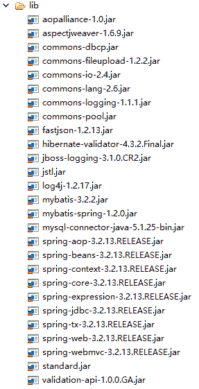
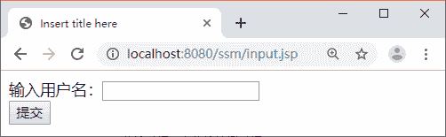
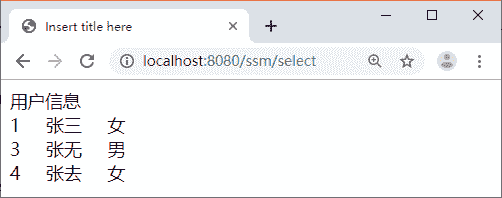

# SSM（Spring+Spring MVC+MyBatis）框架整合搭建详细步骤

> 原文：[`c.biancheng.net/view/4497.html`](http://c.biancheng.net/view/4497.html)

因为 Spring MVC 是 Spring 框架中的一个子模块，所以 Spring 与 SpringMVC 之间不存在整合的问题。实际上，SSM 框架的整合只涉及 Spring 与 MyBatis 的整合以及 Spring MVC 与 MyBatis 的整合。

实现 SSM 框架的整合首先需要准备 3 个框架的 JAR 包以及其他整合所需要的 JAR 包。

在《MyBatis 与 Spring 的整合步骤》教程中已经讲解了 Spring 与 MyBatis 框架整合所需要的 JAR 包，本节只需再加入 Spring MVC 的相关 JAR 包（spring-web-3.2.13.RELEASE.jar 和 spring-webmvc-3.2.13.RELEASE.jar）即可。因此，SSM 框架整合所需的 JAR 包如图 1 所示。


图 1  ssm 框架整合所需 JAR 包

## SSM 框架整合应用测试

下面是一个应用案例（根据用户名模糊查询用户信息，用户表是《第一个 MyBatis 程序》教程中的数据表 user），使用 SSM 框架实现该案例的具体步骤如下：

#### 1\. 创建应用并导入相关 JAR 包

创建应用 ssm，将图 1 所示的 JAR 包复制到应用的 lib 中。

#### 2\. 创建信息输入页面

在 WebContent 目录下创建 input.jsp 页面，具体代码如下：

```

<%@ page language="java" contentType="text/html; charset=UTF-8"
    pageEncoding="UTF-8"%>
<!DOCTYPE html PUBLIC "-//W3C//DTD HTML 4.01 Transitional//EN" "http://www.w3.org/TR/html4/loose.dtd">
<html>
<head>
<meta http-equiv="Content-Type" content="text/html; charset=UTF-8">
<title>Insert title here</title>
</head>
<body>
    <form action="${pageContext.request.contextPath }/select" method="post">
        输入用户名：<input type="text" name="uname"/><br>
        <input type="submit" value="提交"/>
    </form>
</body>
</html>
```

#### 3\. 创建持久化类

在 src 目录下创建一个名为 com.po 的包，并在该包中创建一个 PO 类 MyUser。具体代码如下：

```

package com.po;
/**
* mybatis 数据库中 user 表的持久化类
*/
public class MyUser {
    private Integer uid;
    private String uname;
    private String usex;

    public Integer getUid() {
        return uid;
    }

    public void setUid(Integer uid) {
        this.uid = uid;
    }

    public String getUname() {
        return uname;
    }

    public void setUname(String uname) {
        this.uname = uname;
    }

    public String getUsex() {
        return usex;
    }

    public void setUsex(String usex) {
        this.usex = usex;
    }
}
```

#### 4\. 创建 Dao 层

在 src 目录下创建一个名为 com.dao 的包，并在该包中创建一个名为 UserDao 的接口。具体代码如下：

```

package com.dao;
import java.util.List;
import org.springframework.stereotype.Repository;
import com.po.MyUser;

@Repository("userDao")
/*
* 使用 Spring 自动扫描 MyBatis 的接口并装配 （Spring 将指定包中所有被@Mapper 注解标注的接口自动装配为 Mybatis 的映射接口
*/
public interface UserDao {
    /**
     * 接口方法对应 SQL 映射文件 UserMapper.xml 中的 id
     */
    public List<MyUser> selectUserByUname(MyUser user);
}
```

#### 5\. 创建 Service 层

在 src 目录下创建一个名为 com.service 的包，并在该包中创建一个名为 UserService 的接口和该接口的实现类 UserServiceImpl。

UserService 接口的代码如下：

```

package com.service;
import java.util.List;
import com.po.MyUser;
public interface UserService {
    public List<MyUser> selectUserByUname(MyUser user);
}
```

UserServiceImpl 实现类的代码如下：

```

package com.service;

import java.util.List;

import org.springframework.beans.factory.annotation.Autowired;
import org.springframework.stereotype.Service;
import org.springframework.transaction.annotation.Transactional;

import com.dao.UserDao;
import com.po.MyUser;

@Service("userService")
@Transactional
/**
* 加上注解@Transactional 可以指定这个类需要受 Spring 的事务管理，
*注意@Transactional 只能针对 public 属性范围内的方法添加，
*本案例并不需要处理事务，在这里只是告诉读者如何使用事务
*/
public class UserServiceImpl implements UserService {
    @Autowired
    private UserDao userDao;

    @Override
    public List<MyUser> selectUserByUname(MyUser user) {
        return userDao.selectUserByUname(user);
    }
}
```

#### 6\. 创建 Controller 层

在 src 目录下创建一个名为 com.controller 的包，并在该包中创建一个名为 UserController 的控制器类。具体代码如下：

```

package com.controller;
import java.util.List;
import org.springframework.beans.factory.annotation.Autowired;
import org.springframework.stereotype.Controller;
import org.springframework.ui.Model;
import org.springframework.web.bind.annotation.RequestMapping;

import com.dao.UserDao;
import com.po.MyUser;

@Controller
public class UserController {
    @Autowired
    private UserDao userDao;

    @RequestMapping("/select")
    public String select(MyUser user, Model model) {
        List<MyUser> list = userDao.selectUserByUname(user);
        model.addAttribute("userList", list);
        return "userList";
    }
}
```

#### 7\. 创建用户信息显示页面

在 WEB-INF 目录下创建文件夹 JSP，并在该文件夹下创建用户信息显示页面 userList. jsp。具体代码如下：

```

<%@ page language="java" contentType="text/html; charset=UTF-8"
    pageEncoding="UTF-8"%>
<%@taglib prefix="c" uri="http://java.sun.com/jsp/jstl/core"%>
<!DOCTYPE html PUBLIC "-//W3C//DTD HTML 4.01 Transitional//EN" "http://www.w3.org/TR/html4/loose.dtd">
<html>
<head>
<meta http-equiv="Content-Type" content="text/html; charset=UTF-8">
<title>Insert title here</title>
</head>
<body>
    用户信息
    <br>
    <c:forEach items="${userList }" var="user">
    ${user.uid }&nbsp;&nbsp;&nbsp;&nbsp;
    ${user.uname }&nbsp;&nbsp;&nbsp;&nbsp;
    ${user.usex }<br>
    </c:forEach>
</body>
</html>
```

#### 8\. 创建相关配置文件

#### 1）web.xml

在 WEB-INF 目录下创建 web.xml 文件，并在该文件中实例化 ApplicationContext 容器、启动 Spring 容器、配置 DispatcherServlet 以及配置字符编码过滤器。具体代码如下：

```

<?xml version="1.0" encoding="UTF-8"?>
<web-app xmlns:xsi="http://www.w3.org/2001/XMLSchema-instance"
    xmlns="http://java.sun.com/xml/ns/javaee"
    xmlns:web="http://java.sun.com/xml/ns/javaee/web-app_2_5.xsd"
    xsi:schemaLocation="http://java.sun.com/xml/ns/javaee http://java.sun.com/xml/ns/javaee/web-app_3_0.xsd"
    version="3.0">
    <display-name>springMVC</display-name>
    <welcome-file-list>
        <welcome-file>index.jsp</welcome-file>
    </welcome-file-list>
    <!-- 实例化 ApplicationContext 容器 -->
    <context-param>
        <!-- 加载 src 目录下的 applicationContext-*.xml 文件-->
        <param-name>contextConfigLocation</param-name>
        <param-value>classpath:applicationContext-*.xml</param-value>
    </context-param>
    <filter>
        <filter-name>encodingFilter</filter-name>
        <filter-class>
            org.springframework.web.filter.CharacterEncodingFilter
        </filter-class>
        <init-param>
            <param-name>encoding</param-name>
            <param-value>UTF-8</param-value>
        </init-param>
        <init-param>
            <param-name>forceEncoding</param-name>
            <param-value>true</param-value>
        </init-param>
    </filter>
    <filter-mapping>
        <filter-name>encodingFilter</filter-name>
        <url-pattern>/*</url-pattern>
    </filter-mapping>
    <servlet>
        <servlet-name>spring</servlet-name>
        <servlet-class>org.springframework.web.servlet.DispatcherServlet</servlet-class>
        <init-param>
            <param-name>contextConfigLocation</param-name>
            <param-value>classpath:springmvc-servlet.xml</param-value>
        </init-param>
        <load-on-startup>1</load-on-startup>
    </servlet>
    <servlet-mapping>
        <servlet-name>spring</servlet-name>
        <url-pattern>/</url-pattern>
    </servlet-mapping>
    <listener>
        <listener-class>
            org.springframework.web.context.ContextLoaderListener
        </listener-class>
    </listener>
    <listener>
        <listener-class>
            org.springframework.web.util.Log4jConfigListener
        </listener-class>
    </listener>
</web-app>
```

#### 2）springmvc-servlet.xml

在 WEB-INF 目录下创建 Spring MVC 的核心配置文件 springmvc-servlet.xml，在该文件中仅配置控制器扫描包和视图解析器，具体代码如下：

```

<?xml version="1.0" encoding="UTF-8"?>
<beans xmlns="http://www.springframework.org/schema/beans"
    xmlns:xsi="http://www.w3.org/2001/XMLSchema-instance" 
    xmlns:mvc="http://www.springframework.org/schema/mvc"
    xmlns:p="http://www.springframework.org/schema/p" 
    xmlns:context="http://www.springframework.org/schema/context"
    xsi:schemaLocation="
        http://www.springframework.org/schema/beans
        http://www.springframework.org/schema/beans/spring-beans.xsd
        http://www.springframework.org/schema/context
        http://www.springframework.org/schema/context/spring-context.xsd
        http://www.springframework.org/schema/mvc
        http://www.springframework.org/schema/mvc/spring-mvc.xsd">
    <!-- 使用扫描机制扫描包 -->
    <context:component-scan base-package="com.controller" />
    <!-- 完成视图的对应 -->
    <!-- 对转向页面的路径解析。prefix：前缀， suffix：后缀 -->
    <bean
        class="org.springframework.web.servlet.view.InternalResourceViewResolver">
        <property name="prefix" value="/WEB-INF/jsp/" />
        <property name="suffix" value=".jsp" />
    </bean>
</beans>   
```

#### 3）log4j.properties

在 src 目录下创建 MyBatis 的日志文件 log4j.properties，具体代码如下：

# Global logging configuration
log4j.rootLogger=ERROR,stdout
# MyBatis logging configuration...
log4j.logger.com.mybatis=DEBUG
# Console output...
log4j.appender.stdout=org.apache.log4j.ConsoleAppender
log4j.appender.stdout.layout=org.apache.log4j.PatternLayout
log4j.appender.stdout.layout.ConversionPattern=%5p [%t] - %m%n

#### 4）applicationContext.xml

在 src 目录下创建 Spring 的配置文件 applicationContext.xml，在该文件中配置数据源、添加事务支持、开启事务注解、配置 MyBatis 工厂、进行 Mapper 代理开发以及指定扫描包。具体代码如下：

```

<?xml version="1.0" encoding="UTF-8"?>
<beans xmlns="http://www.springframework.org/schema/beans"
    xmlns:xsi="http://www.w3.org/2001/XMLSchema-instance" 
    xmlns:aop="http://www.springframework.org/schema/aop"
    xmlns:p="http://www.springframework.org/schema/p" 
    xmlns:tx="http://www.springframework.org/schema/tx"
    xmlns:context="http://www.springframework.org/schema/context"
    xsi:schemaLocation="  
            http://www.springframework.org/schema/beans 
            http://www.springframework.org/schema/beans/spring-beans-2.5.xsd  
            http://www.springframework.org/schema/aop 
            http://www.springframework.org/schema/aop/spring-aop-2.5.xsd  
            http://www.springframework.org/schema/tx 
            http://www.springframework.org/schema/tx/spring-tx-2.5.xsd
            http://www.springframework.org/schema/context
            http://www.springframework.org/schema/context/spring-context.xsd">
    <!--配置数据源 -->
    <bean id="dataSource" class="org.apache.commons.dbcp.BasicDataSource"
        destroy-method="close" scope="singleton">
        <property name="driverClassName" value="com.mysql.jdbc.Driver" />
        <property name="url"
            value="jdbc:mysql://localhost:3306/mybatis?characterEncoding=utf8" />
        <property name="username" value="root" />
        <property name="password" value="1128" />
        <property name="maxTotal" value="30" />
        <property name="maxIdle" value="10" />
        <property name="initialSize" value="5" />
    </bean>

    <!-- 添加事务支持 -->
    <bean id="txManager"
        class="org.springframework.jdbc.datasource.DataSourceTransactionManager">
        <property name="dataSource" ref="dataSource" />
    </bean>
    <!-- 开启事务注解 -->
    <tx:annotation-driven transaction-manager="txManager" />
    <!-- 配置 mybitas 工厂，同时指定数据源，并与 MyBatis 完美整合 -->
    <bean id="sqlSessionFactory" class="org.mybatis.spring.SqlSessionFactoryBean">
        <property name="dataSource" ref="dataSource" />
        <!-- configLocation 的属性值为 Mybatis 的核心配置文件 -->
        <property name="configLocation" value="classpath:mybatis-config.xml" />
    </bean>
    <!-- Mapper 代理开发，使用 Spring 自动扫描 Mybatis 的接口并装配 -->
    <bean class="org.mybatis.spring.mapper.MapperScannerConfigurer">
        <!-- mybatis-spring 组件的扫描器 -->
        <property name="basePackage" value="com.dao" />
        <property name="sqlSessionFactoryBeanName" value="sqlSessionFactory" />
    </bean>
    <!-- 指定需要扫描的包（包括子包），使注解生效。dao 包在 mybatis-spring 组件中已经扫描，这里不在需要扫描 -->
    <context:component-scan base-package="com.service" />
</beans>
```

#### 5）创建 MyBatis 的核心配置文件和 SQL 映射文件

在 src 目录下创建 com.mybatis 文件夹，并在该文件夹中创建 MyBatis 的核心配置文件 mybatis-config.xml。具体代码如下：

```

<?xml version="1.0" encoding="UTF-8"?> 
<!DOCTYPE configuration  PUBLIC "-//mybatis.org//DTD Config 3.0//EN"
        "http://mybatis.org/dtd/mybatis-3-config.dtd">
<configuration>
    <mappers><!-- 映射器告诉 MyBatis 到哪里去找映射文件 -->
        <mapper resource="com/dao/UserMapper.xml" />
    </mappers>
</configuration> 
```

在 com.mybatis 文件夹中创建 SQL 映射文件 UserMapper.xml。具体代码如下：

```

<?xml version="1.0" encoding="UTF-8"?>
<!DOCTYPE mapper PUBLIC "-//mybatis.org//DTD Mapper 3.0//EN"
        "http://mybatis.org/dtd/mybatis-3-mapper.dtd">
<mapper namespace="com.dao.UserDao">
    <select id="selectUserByUname" resultType="com.po.MyUser"
        parameterType="com.po.MyUser">
        select * from user where 1=1
        <if test="uname!=null and uname!=''">
            and uname like concat('%',#{uname},'%')
        </if>
    </select>
</mapper>
```

#### 9\. 发布并运行应用

首先将 springMVCDemo11 应用发布到 Tomcat 服务器并启动 Tomcat 服务器，然后通过地址“http://localhost:8080/ssm/input.jsp”访问信息输入页面，运行结果如图 2 所示。


图 2  信息输入页面
在图 2 中输入用户名，例如“张”，然后单击“提交”按钮，显示如图 3 所示的结果。


图 3  用户列表页面