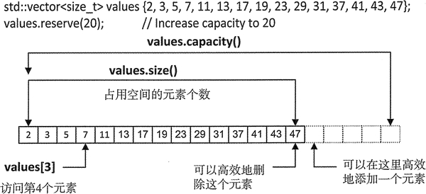

# C++ vector 容量和大小

vector 的容量大小，是指在不分配更多内存的情况下可以保存的最多元素个数，这时 可能有 20 个元素，也可能没有。vector 的大小是它实际所包含的元素个数，也就是有值的元素的个数。图 1 对此做了说明：

图 1 vector 的容量和大小
 显然 vector 的大小不能超出它的容董。当大小等于容量时，增加一个元素就会导致更多内存的分配。对于一个 vector 对象来说，可以通过调用 size() 和 capacity() 函数来得到它的大小和容量。它们返回的是我们自己定义的无符号整型值。例如：

```
std::vector<size_t> primes { 2, 3, 5, 7, 11, 13, 17, 19, 23, 29, 31, 37, 41 ,43 ,47 };

std::cout << "The size is " << primes.size() << std::endl;
std::cout << "The capacity is" << primes.capacity() << std::endl;
```

输出语句输出的容器大小和容董都为 15,这是由初始化列表决定的。然而，如果用 push_back() 函数添加一个元素，然后再输出容器的大小和容量，这时大小变为 16，容量变为 30。当容器的大小等于容量时，容器每次增加多少容量，取决于算法的实现。一些实现可能会双倍地增加容量。

我们可能想把容器的大小和容量保存在变量中。vector<T> 对象的大小和容量类型是 vector<T>::size_type，这表明 size_type 定义在一个由编译器从类模板中生成的 vector<T> 类中。因此，primes 的大小值是 vector<size_t>::size_type 类型。当定义一个变量去保存这些值时，通过使用 auto 关键字，可以让我们在大多数时候不需要去考虑这种细节。例如：

```
auto nElements = primes.size();
```

记住，对于 auto，需要使用 =，而不能使用初始化列表；否则，就不能确定 size_type 的类型。通常保存容器的大小是为了可以用索引遍历 vector 的元素。我们也可以使用循环来遍历 vector:

```
for(auto& prime : primes)
    prime *= 2;
```

在前面，我们知道可以通过调用 reserve() 来增加容器的容量；这时元素的个数并没有改变。通过调用成员函数 resize() 可以改变容器大小，这也可能导致容量的增加。下面是 resize() 的几种用法：

```
std::vector<int> values {1,2,3};
values.resize (5);
values.resize (7, 99);
values.resize (6);
```

第一个 resize() 调用会把元素的个数变为参数指定的值，所以会增加两个用默认值初始化的元素。如果添加了一个元素，导致超过当前容器的容景，容量会自动增加。

第二个 resize() 调用将元素增加到第一个参数指定的个数，并用第二个参数初始化增加的新元素。第三个 resize() 凋用将容器大小设为 6，小于当前元素的个数。当需要减小容器的大小时，会移除多余的元素，这就好像重复调用了几次 pop_back() 函数。在本章的后面，会对此做一些解释。减少容器的大小不会影响容器的容量。