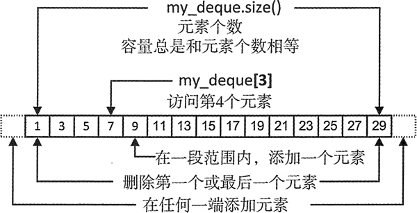

# C++ deque 使用、创建及初始化详解

deque<T>，一个定义在 deque 头文件中的容器模板，可以生成包含 T 类型元素的容器，它以双端队列的形式组织元素。可以在容器的头部和尾部高效地添加或删除对象，这是它相对于 vector 容器的优势。当需要这种功能时，可以选择这种类型的容器。

无论何时，当应用包含先入先出的事务处理时，都应该使用 deque 容器。处理数据库事务或模拟一家超市的结账队列，像这两种应用都可以充分利用 deque 容器。

## 生成 deque 容器

如果用默认的构造函数生成 deque 容器，容器中没有任何元素，因此添加第一个元素，就会导致内存的分配：

```
std::deque<int> a_deque;    // A deque container with no elements
```

可以生成给定元素个数的 deque 容器，这一点和 vector 容器在本质上相同：

```
std::deque<int> my_deque(10); // A deque container with 10 elements
```

如图 1 所示，有一个存储 int 型元素、名为 my_deque 的 deque 容器。在这个容器中，保存了一些奇数元素：


图 1 deque 容器示例
 当生成特定元素个数的 deque 时，每个元素保存的都是这种元素类型的默认值，因此前面定义的 my_deque 的所有元素的初始值都是 0。如果生成一个具有指定元素个数的 deque，每一个元素都会被构造函数 string() 初始化。

也可以用初始化列表来生成 deque 容器：

```
std:: deque<std:: string> words { "one", "none", "some", "all", "none","most", "many” };
```

这个容器将会有 7 个字符串元素，它们都是用初始化列表中的字符生成的。当然，也可以将初始化列表中的对象依次指定为 string("one")、string("none") 等。

deque 容器也有拷贝构造函数，可以生成现有容器的副本：

```
std::deque<std::string> words_copy { words };// Makes a copy of the words container
```

当生成一个 deque 容器时，也可以用由两个迭代器标识的一段元素来初始化它：

```
std::deque<std::string> words_part { std::begin(words),std::begin(words) + 5 };
```

这个容器有 5 个元素，它们和 words 容器的前 5 个元素相等。当然，作为初始值的一段元素，可以来自任何种类的容器，不需要一定是 deque。deque 提供了随机访问迭代器，所以能够以和 vector 相同的方式，从 deque 容器中获取 const 迭代器、non-const 迭代器、反向迭代器。