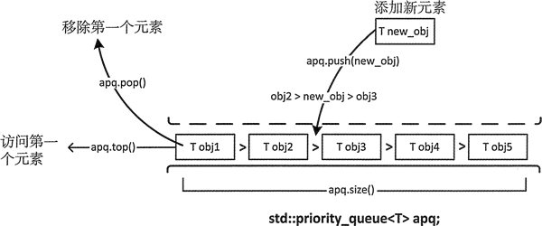

# C++ priority_queue(STL priority_queue)用法详解

不出所料，priority_queue 容器适配器定义了一个元素有序排列的队列。默认队列头部的元素优先级最高。因为它是一个队列，所以只能访问第一个元素，这也意味着优先级最高的元素总是第一个被处理。但是如何定义“优先级”完全取决于我们自己。如果一个优先级队列记录的是医院里等待接受急救的病人，那么病人病情的严重性就是优先级。如果队列元素是银行的借贷业务，那么借记可能会优先于信贷。

priority_queue 模板有 3 个参数，其中两个有默认的参数；第一个参数是存储对象的类型，第二个参数是存储元素的底层容器，第三个参数是函数对象，它定义了一个用来决定元素顺序的断言。因此模板类型是：

```
template <typename T, typename Container=std::vector<T>, typename Compare=std::less<T>> class priority_queue
```

如你所见，priority_queue 实例默认有一个 vector 容器。函数对象类型 less<T> 是一个默认的排序断言，定义在头文件 function 中，决定了容器中最大的元素会排在队列前面。fonction 中定义了  greater<T>，用来作为模板的最后一个参数对元素排序，最小元素会排在队列前面。当然，如果指定模板的最巵一个参数，就必须提供另外的两个模板类型参数。

图 1
图 1 中显示元素的方式反映了它们被检索的顺序。在 vector 中它们也可以不像这样排序。在讨论堆时，会解释原因。

## 创建 priority_queue

可以如下所示生成一个空的优先级队列：

```
std::priority_queue<std::string> words; 
```

可以用适当类型的对象初始化一个优先级队列：

```
std::string wrds[] { "one", "two", "three", "four"};
std::priority_queue<std::string> words { std::begin(wrds),std:: end(wrds)}; // "two" "three" "one" "four" 
```

初始化列表中的序列可以来自于任何容器，并且不需要有序。优先级队列会对它们进行排序。

拷贝构造函数会生成一个和现有对象同类型的 priority_queue 对象，它是现有对象的一个副本。例如：

```
std::priority_queue<std::string> copy_words {words}; // copy of words 
```

也有带右值引用参数的拷贝构造函数，它可以移动一个实参对象。

当对容器内容反向排序时，最小的元素会排在队列前面，这时候需要指定 3 个模板类型参数：

```
std:: string wrds[] {"one", "two", "three", "four"};
std::priority_queue<std::string, std::vector<std::string>,std: :greater<std::string>> words1 {std::begin (wrds) , std:: end (wrds) }; //"four" "one" "three" "two"
```

这会通过使用 operator>() 函数对字符串对象进行比较，进而生成一个优先级队列，因此这会和它们在队列中的顺序相反。

优先级队列可以使用任何容器来保存元素，只要容器有成员函数 front()、push_back()、pop_back()、size()、empty()。这显然包含了 deque 容器，因此这里也可以用 deque 来代替：

```
std::string wrds [] {"one", "two", "three", "four"};
std::priority_queue<std::string, std::deque<std::string>> words {std::begin(wrds), std::end(wrds)}; 
```

这个 words 优先级队列在 deque 容器中保存了一些 wrds 数组中的字符串，这里使用默认的比较断言，因此队列中的元素会和上面 word1 中元素的顺序相同。priority_queue 构造函数会生成一个和第二个类型参数同类型的容器来保存元素，这也是 priority_queue 对象的底层容器。

可以生成 vector 或 deque 容器，然后用它们来初始化 priority_queue。下面展示了如何以 vector 的元素作为初始值来生成 priority_queue 对象：

```
std::vector<int> values{21, 22, 12, 3, 24, 54, 56};
std::priority_queue<int> numbers {std::less<int>(),values};
```

priority_queue 构造函数的第一个参数是一个用来对元素排序的函数对象，第二个参数是一个提供初始元素的容器。在队列中用函数对象对 vector 元素的副本排序。values 中元素的顺序没有变，但是优先级队列中的元素顺序变为：56 54 24 22 21 12 3。优先级队列中用来保存元素的容器是私有的，因此只能通过调用 priority_queue 对象的成员函数来对容器进行操作。构造函数的第一个参数是函数对象类型，它必须和指定的比较模板类型参数相同，函数对象类型默认是 less<T>。如果想使用不同类型的函数，需要指定全部的模板类型参数。例如：

```
std::priority_queue<int, std::vector<int>,std::greater<int>> numbersl {std::greater<int>(), values};
```

第三个类型参数是一个比较对象类型。如果要指定这个参数，必须指定前两个参数——元素类型和底层容器类型。

## priority_queue 操作

对 priority_queue 进行操作有一些限制：

*   push(const T& obj)：将 obj 的副本放到容器的适当位置，这通常会包含一个排序操作。
*   push(T&& obj)：将 obj 放到容器的适当位置，这通常会包含一个排序操作。
*   emplace(T constructor a rgs...)：通过调用传入参数的构造函数，在序列的适当位置构造一个 T 对象。为了维持优先顺序，通常需要一个排序操作。
*   top()：返回优先级队列中第一个元素的引用。
*   pop()：移除第一个元素。
*   size()：返回队列中元素的个数。
*   empty()：如果队列为空的话，返回 true。
*   swap(priority_queue<T>& other)：和参数的元素进行交换，所包含对象的类型必须相同。

priority_queue 也实现了赋值运算，可以将右操作数的元素赋给左操作数；同时也定义了拷贝和移动版的赋值运算符。需要注意的是，priority_queue 容器并没有定义比较运算符。因为需要保持元素的顺序，所以添加元素通常会很慢。稍后会在堆(heaps)一节讨论 priority_queue 的内部操作。

以下展示了如何将键盘输入的数据记录到 priority_queue 中：

```
std::priority_queue<std::string> words;
std::string word; std::cout << "Enter words separated by spaces, enter Ctrl+Z on a separate line to end:\n";
while (true)
{
    if ((std::cin >> word).eof())
        break;
    words.push(word);
}
```

按下 Ctrl+Z 组合键会在输入流中设置文件结束状态，因此可以用来结束循环输入。istream 对象的成员函数 operator>>() 返回一个输入流对象，因此我们可以用 if 条件表达式来调用 eof() 以检查 cin 的状态。这里会对输入单词进行排序，所以最大的单词总在 words 队列的前面——自动对输入单词排序。

priority_queue 没有迭代器。如果想要访问全部的元素，比如说，列出或复制它们，会将队列清空；priority_queue 和 queue 有相同的限制。如果想在进行这样的操作后，还能保存它的元素，需要先把它复制一份，这里可以使用一个不同类型的容器。下面展示了如何列出优先级队列 words 的内容：

```
std::priority_queue<std::string> words_copy {words}; // A copy for output
while (!words_copy.empty())
{
    std:: cout << words_copy.top () <<" ";
    words_copy.pop();
}
std::cout << std::endl;
```

这里首先生成了一个 words 的副本，因为输出 words 会移除它的内容。输出 top() 返回的元素后，我们需要使用 pop() 来使下一个元素可访问。移除全部元素后，在循环条件中调用 empty() 以结束循环。也可以使用表达式 words_copy.size() 来控制循环，因为返回值会被隐式转换为布尔值，这样在 size() 返回 0 时，表达式的结果为 false。

如果为 words 输入：

one two three four five six seven
^Z

那么输出为：

two three six seven one four five

当然，如果需要多次输出 priority_queue 的内容，最好定义一个函数。这个函数应该是通用的，如下所示：

```
template<typename T>

void list_pq(std::priority_queue<T> pq, size_t count = 5)
{
    size_t n{count};
    while (!pq. empty())
    {
        std::cout << pq. top() << " ";
        pq.pop();
        if (--n) continue;
        std::cout << std::endl;
        n = count;
    }
    std::cout << std::endl;
}
```

参数是以传值方式传入的，因此这里会处理一个优先级队列的副本。它是一个适用于任何类型容器的函数模板，只要容器实现了用于向 ostream 输出的 operator<<() 函数。如果没有设置第二个参数，默认每 5 个输出值一行。当然也可以定义一个适用于 queue 容器适配对象的函数模板。可以如下所示使用 priority_queue 的成员函数 emplace():

```
words.emplace("nine");
```

以字符串为参数调用 string 类的构造函数会在容器的适当位置生成一个对象。这比下面的语句更有效率：

```
words.push("nine");
```

这里编译器会在字符文字处插入一个 string 构造函数来生成 push() 的参数，然后以这个临时 string 对象作为参数调用 push()。push() 函数然后会调用 string 类的拷贝构造函数来将生成对象添加到容器中。我们把这些代码段组织成一个完整的程序：

```
// Exercising a priority queue container adapter
#include <iostream> // For standard streams
#include <queue> // For priority_queue<T>
#include <string> // For string class
using std::string;

// List contents of a priority queue
template<typename T>
void list_pq(std::priority_queue<T> pq, size_t count = 5)
{
    size_t n {count};
    while (!pq.empty())
    {
        std::cout << pq.top() << " ";
        pq.pop();
        if (--n) continue;
        std::cout << std::endl;
        n = count;
    }
    std::cout << std::endl;
}

int main()
{
    std::priority_queue<std::string> words;
    std::string word;
    std::cout << "Enter words separated by spaces, enter Ctrl+Z on a separate line to end:\n";
    while (true)
    {
        if ((std::cin >> word).eof())
            break;
        words.push(word);
    }
    std::cout << "You entered " << words.size() << " words:" << std::endl;
    list_pq(words);
}
```

运行结果为：

Enter words separated by spaces, enter Ctrl+Z on a separate line to end:
one two three four five six seven eight nine ten eleven twelve
^Z
You entered 12 words:
two twelve three ten six
seven one nine four five
eleven eight

list_pq<T>() 函数模板实例的输出表明优先级队列对输出进行排序。