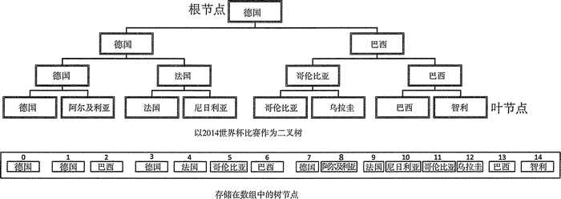
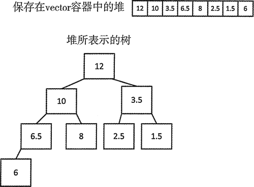
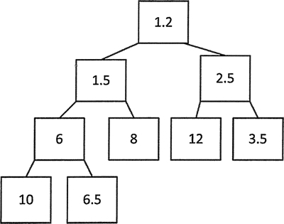
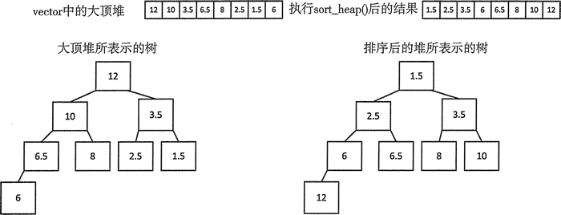

# C++堆用法详解

堆(heaps)不是容器，而是一种特别的数据组织方式。堆一般用来保存序列容器。

堆很重要，很多不同的计算机进程中都使用了它们。为了弄明白堆是什么，首先需要明白树是什么，因此首先说明树这种数据结构是什么。

树是分层排列的元素或节点。每个节点有一个键，它是节点中所保存的对象，就如同链表中的节点。父节点是有一个或两个子节点的节点。一般父节点可以有任意个数的子节点，树中的父节点不需要有相同个数的子节点。没有子节点的节点叫作叶节点。一般父节点的键与其子节点有一些关系。树都有一个根节点，它是树的基础，从根节点可以到达所有的子节点。

图 1 二叉树示例
图 1 展示了一棵树，它表示 2014 年世界杯最后一组比赛的结果。德国全部赢了，所以它是根节点；它在最后一场比赛中打败了巴西队，所以它和巴西队是它自己的子节点。每个父节点最多有两个子节点的树叫作二叉树。

图 1 中的树是一个完全二叉树，因为每个父节点都有两个子节点。任何树的父节点都有指向子节点的指针。完全二叉树可以用数组的方式保存，也可以用其他顺序表的方式保存，例如 vector，这样就不需要保存子节点的指针，因为知道每一层节点的编号。

如果将每一层树的层数记作 n，从根节点开始作为第 0 层，每一层包含 2^n 个节点。图 1 展示了世界杯比赛树的节点如何存储在数组中。每个节点上的整数值是索引值。根节点存放在数组的第一个元素中，后面是它的两个子节点。这对子节点的孩子节点出现在序列的下个位置，以此类推直到叶节点。子节点的索引值为 n,那么它的父节点的索引值就为 (n-1)/2。如果数组元素从 1 开始索引，那么父节点的索引表达式更加简单，它为 n/2。

现在可以定义一个堆：这个堆是一个完全二叉树，每个节点与其子节点位置相对。父节点总是大于或等于子节点，这种情况下被叫作大顶堆，或者父节点总是小于或等于子节点，这种情况下叫作小顶堆。注意，给定父节点的子节点不一定按顺序排列。

## 创建堆

用来创建堆的函数定义在头文件 algorithm 中。max_heap() 对随机访问迭代器指定的一段元素重新排列，生成一个堆。默认使用的是 < 运算符，可以生成一个大顶堆。例如：

```
std::vector<double>numbers{2.5,10.0,3.5,6.5,8.0,12.0,1.5,6.0};
std::make_heap(std::begin(numbers), std:rend(numbers));
// Result: 12 10 3.5 6.5 8 2.5 1.5 6
```

调用 make_heap() 后，vector 中的元素如注释所示，这也说明了图 2 所展示的结构。


图 2 堆所表示的树
根节点是 12，10 和 3.5 是它的子节点。10 的子节点是 6.5 和 8，3.5 的子节点是 2.5 和 1.5。6.5 只有一个叶节点 6。

priority_queue 是一个堆。在底层，一个 priority_queue 实例创建了一个堆。在堆中，所有成对的连续元素不需要有相同的比较关系。图 2 所示堆中的前 3 个元素是顺序递减的，但第 4 个元素却大于第 3 个元素。既然如此，为什么 STL 有 priority_queue (它是一个堆)，却还需要创建堆，特别是还需要将堆作为优先级队列？

这是因为 priority_queue 可以提供堆没有的优势，它可以自动保持元素的顺序；但我们不能打乱 priority_queue 的有序状态，因为除了第一个元素，我们无法直接访问它的其他元素。如果需要的是一个优先级队列，这一点非常有用。

从另一方面来说，使用 make_heap() 创建的堆可以提供一些 priority_queue 没有的优势：

1.  可以访问堆中的任意元素，而不限于最大的元素，因为元素被存储在一个容器中，就像是我们自己的 vector。这也提供了偶然破坏元素顺序的可能，但是总可以调用 make_heap() 来还原堆。
2.  可以在任何提供随机访问迭代器的序列容器中创建堆。这些序列容器包括普通数组、string 对象、自定义容器。这意味着无论什么时候需要，都可以用这些序列容器的元素创建堆，必要时，可以反复创建。甚至还可以为元素的子集创建堆。

如果使用保持堆顺序的函数，那么可以将堆当作优先级队列使用。

这里有另一个版本的 make_heap()，它有第 3 个参数，可以用来指定一个比较函数用于堆的排序。通过定义一个大于运算符函数，可以生成一个小顶堆。这里可以使用 functional 中的断言。例如：

```
std::vector<double> numbers {2.5, 10.0, 3.5, 6.5, 8.0, 12.0, 1.5, 6.0};
std::make_heap(std::begin(numbers), std::end(numbers),
std::greater<>()); // Result: 1.5 6 2.5 6.5 8 12 3.5 10
```

可以将模板类型参数指定为 greater。这里的这个尖括号为空的版本推断并返回了类型参数。已经有一个用 make_heap() 函数在容器中生成的堆。可以在它上面进行很多操作，下面我们来深入了解这些操作。

## 堆操作

堆不是容器，而是组织容器元素的一种特别方式。只能确定堆的范围，即开始和结束迭代器指定的范围。这意味着可以用容器中的元素子序列创建堆。可以在已生成的堆中添加元素。

乍一看，algorithm 中的函数模板 push_heap() 创建堆的方式可能会觉得有些奇怪。为了向堆中添加元素，首先可以用任何方法将元素附加到序列中。然后调用 push_heap() 来插入最后一个元素，为了保持堆的结构，这个元素会被重新排列到一个适当的位置。

```
std::vector<double> numbers {2.5, 10.0, 3.5, 6.5, 8.0, 12.0, 1.5, 6.0};
std::make_heap(std::begin(numbers),std::end(numbers));
// Result: 12 10 3.5 6.5 8 2.5 1.5 6
numbers.push_back(11); // Result: 12 10 3.5 6.5 8 2.5 1.5 6 11
std::push_heap(std::begin(numbers), std::end(numbers));
// Result: 12 11 3\. 5 10 8 2\. 5 1\. 5 6 6\. 5
```

注释显示了每个操作执行后的效果。必须以这种方式向堆中添加元素。只能通过调用成员函数向 queue 中添加新元素，而且这个成员函数只接受迭代器作为参数，不能直接以元素作为参数。

push_back() 会在序列末尾添加元素，然后使用 push_heap() 恢复堆的排序。通过调用 push_heap()，释放了一个信号，指出我们向堆中添加了一个元素，这可能会导致堆排序的混乱。push_heap() 会因此认为最后一个元素是新元素，为了保持堆结构，会重新排列序列。

从上面这个示例可以看出，重新排列是有必要的。我们注意到，尽管这个序列是一个堆，但是它的元素并不完全是按降序排列。这清楚地表明，尽管优先级队列是一个堆，但堆元素的顺序并不一定要和优先级队列相同。

当然，也可以用自己的比较函数来创建堆，但是必须和 push_heap() 使用相同的比较函数：

```
std::vector<double> numbers {2.5, 10.0, 3.5, 6.5, 8.0, 12.0, 1.5, 6.0};
std::make_heap(std::begin(numbers), std::end(numbers),
std::greater<>());//Result: 1.5 6 2.5 6.5 8 12 3.5 10 numbers. push—back(1\. 2);
//Result: 1.5 6 2.5 6.5 8 12 3.5 10 1.2
std::push_heap(std::begin(numbers), std::end(numbers),std::greater<>());
//Result: 1.2 1.5 2.5 6 8 12 3.5 10 6.5
```

如果 push_heap() 和 make_heap() 的第 3 个参数不同，代码就无法正常执行。注释显示的结果中，最后的 6.5 似乎有些奇怪，图 3 展示的堆树能说明这个问题。

图 3 浮点值数堆
从树来看，显然 6.5 是 6(而不是 10)的子节点，所以这个堆结构是正确的。

删除最大元素和添加元素到堆的过程有些相似，但所做的事是相反的。首先调用 pop_heap()，然后从容器中移除最大的元素，例如：

```
std::vector<double> numbers{2.5, 10.0, 3.5, 6.5, 8.0, 12.0, 1.5, 6.0};
std::make_heap(std::begin(numbers),std::end(numbers));
//Result:12 10 3.5 6.5 8 2.5 1.5 6
std::pop_heap(std::begin(numbers),std::end(numbers));
// Result:10 8 3.5 6.5 6 2.5 1.5 12
numbers.pop_back();// Result:10 8 3.5 6.5 6 2.5 1.5
```

pop_heap() 函数将第一个元素移到最后，并保证剩下的元素仍然是一个堆。然后就可以使用 vector 的成员函数 pop_back() 移除最后一个元素。如果 make_heap() 中用的是自己的比较函数，那么 pop_heap() 的第 3 个参数也需要是这个函数：

```
std::vector<double> numbers {2.5, 10.0, 3.5, 6.5, 8.0, 12.0, 1.5, 6.0};
std::make_heap(std::begin(numbers),std::end(numbers),std::greater<>());
// Result: 1.5 6 2.5 6.5 8 12 3.5 10
std::pop_heap(std::begin(numbers), std::end(numbers),std:: greater<>());
// Result: 2.5 6 3.5 6.5 8 12 10 1.5
numbers.pop_back();//Result: 2.5 6 3.5 6.5 8 12 10
```

从注释显示的操作结果来看，显然需要为 pop_heap() 提供一个比较运算符函数。pop_heap() 函数不会交换第一个元素和最后一个元素，它会对从 begin(numbers) 到 end(numbers)-1 这个范围内的元素重新排序，从而保持堆的顺序。为了能够正确执行这个操作，pop_heap() 必须和 make_heap() 使用相同的比较函数。

因为可能会打乱容器中的堆，所以 STL 提供了一个检查序列是否仍然是堆的方法：

```
if(std::is_heap(std::begin(numbers),std::end(numbers)))
    std::cout << "Great! We still have a heap.\n";
else
    std::cout << "oh bother! We messed up the heap.\n";
```

如果元素段是堆，那么 is_heap() 会返回 true。这里是用默认的比较断言 less<> 来检查元素顺序。如果这里使用的是用 greater<> 创建的堆，就会产生错误的结果。为了得到正确的结果，表达式需要写为：

```
std::is_heap(std::begin(numbers),std::end(numbers),std::greater<>())。
```

甚至可以更深入地检查元素中是否有部分元素为堆。例如：

```
std::vector<double> numbers {2.5, 10.0, 3.5, 6.5, 8.0, 12.0, 1.5, 6.0};
std::make_heap(std::begin(numbers), ::end(numbers),std:: greater<>());
// Result: 1.5 6 2.5 6.5 8 12 3.5 10
std::pop_heap (std::begin (numbers) , std::end(numbers),std::greater<>());
// Result: 2.5 6 3.5 6.5 8 12 10 1.5
auto iter = std::is_heap_until(std::begin(numbers),std::end(numbers),std::greater<>());
if(iter != std::end(numbers))
    std::cout << "numbers is a heap up to "<<*iter<<std::endl;
```

is_heap_until() 函数返回一个迭代器，指向第一个不在堆内的元素。这个代码段会输出最后一个元素的值 1.5，因为在调用 pop_heap() 后，这个元素就不在堆内了。如果整段元素都是堆，函数会返回一个结束迭代器，因此 if 语句可以确保我们不会解引用一个结束迭代器。如果这段元素少于两个，也会返回一个结束迭代器。这里还有另一个版本的 is_heap_until()，它有两个参数，以 less<> 作为默认断言。

STL 提供的最后一个操作是 sort_heap()，它会将元素段作为堆来排序。如果元素段不是堆，程序会在运行时崩溃。这个函数有以两个迭代器为参数的版本，迭代器指向一个假定的大顶堆(用 less<> 排列)，然后将堆中的元素排成降序。结果当然不再是大顶堆。下面是一个使用它的示例：

```
std::vector<double> numbers {2.5, 10.0, 3.5, 6.5, 8.0, 12.0, 1.5, 6.0};
std::make_heap(std::begin(numbers), std::end(numbers));
//Result: 12 10 3.5 6.5 8 2.5 1.5 6
std::sort_heap(std::begin(numbers), std::end(numbers));
// Result: 1.5 2.5 3.5 6 6.5 8 10 12
```

排序操作的结果不是一个大顶堆，而是一个小顶堆。如图 4 所示，尽管堆并不是全部有序的，但任何全部有序的序列都是堆。

图 4 堆大顶堆排序后生成的小顶堆
第 2 个版本的 sort_heap() 有第 3 个参数，可以指定一个用来创建堆的断言。如果用断言 greater() 来创建堆，会生成一个小顶堆，对它进行排序会生成一个降序序列。排序后的序列不是小顶堆。下面的代码对此做了展示：

```
std::vector<double> numbers {2.5, 10.0, 3.5, 6.5, 8.0, 12.0, 1.5, 6.0};
std::make_heap(std::begin(numbers), std::end(numbers),std::greater<>());
// Result: 1.5 6 2.5 6.5 8 12 3.5 10
std::sort_heap(std::begin(numbers), std::end(numbers),std::greater<>());
// Result: 12 10 8 6.5 6 3.5 2.5 1.5
```

如最后一行注释中显示的那样，对小顶堆执行 sort_heap() 后，会变成一个大顶堆。

我们知道可以用定义在 algorithm 头文件中的函数模板 sort() 来对堆排序，那么为什么还需要 sort_heap() 函数？sort_heap() 函数可以使用特殊的排序算法，巧合的是它被叫作堆排序。这个算法首先会创建一个堆，然后充分利用数据的局部有序性对数据进行排序。sort_heap 认为堆总是存在的，所以它只做上面的第二步操作。充分利用堆的局部有序性可以潜在地使排序变得更快，尽管这可能并不是一直有用。

通过修改上节代码，我们可以用堆作为优先级队列：

```
// Using a heap as a priority queue
#include <iostream>                              // For standard streams
#include <iomanip>                               // For  stream manipulators
#include <algorithm>                             // For heap support functions
#include <string>                                // For string class
#include <deque>                                 // For deque container
using std::string;

// List a deque of words
void show(const std::deque<string>& words, size_t count = 5)
{
    if(words.empty()) return;                     // Ensure deque has elements

    // Find length of longest string
    auto max_len = std::max_element(std::begin(words), std::end(words),
                                  [](const string& s1, const string& s2)
                                  {return s1.size() < s2.size(); })->size();
    size_t n {count};
    for(const auto& word : words)
    {
        std::cout << std::setw(max_len + 1) << word << " ";
        if(--n) continue;
        std::cout << std::endl;
        n = count;
    }
    std::cout << std::endl;
}

int main()
{
    std::deque<string> words;
    std::string word;
    std::cout << "Enter words separated by spaces, enter Ctrl+Z on a separate line to end:\n";
    while (true)
    {
        if ((std::cin >> word).eof())
        {
            std::cin.clear();
            break;
        }
        words.push_back(word);
    }
    std::cout << "The words in the list are:" << std::endl;
    show(words);

    std::make_heap(std::begin(words), std::end(words));
    std::cout << "\nAfter making a heap, the words in the list are:" << std::endl;
    show(words);
    std::cout << "\nYou entered " << words.size() << " words. Enter some more:" << std::endl;
    while (true)
    {
        if ((std::cin >> word).eof())
        {
            std::cin.clear();
            break;
        }
        words.push_back(word);
        std::push_heap(std::begin(words), std::end(words));
    }
    std::cout << "\nThe words in the list are now:" << std::endl;
    show(words);
}
```

运行结果为：

Enter words separated by spaces, enter Ctrl+Z on a separate line to end:
one two three four five six seven
^Z
The words in the list are:
   one    two  three   four   five
   six  seven

After making a heap, the words in the list are:
   two    one  three   four   five
   six  seven

You entered 7 words. Enter some more:
eight nine ten twelve fifteen ninety forty fifty-three
^Z

The words in the list are now:
         two       twelve        three         nine          ten
         six        seven        eight         four         five
         one      fifteen       ninety        forty  fifty-three

这个示例在一个 deque 容器中创建了一个堆，这和之前的示例不同；这里也可以使用 vector 容器。show() 函数可以列出 deque<string> 容器中的所有单词。为了能够整齐地输出，单词都以比最大单词长度长 1 的固定宽度输出。可以使用定义在 algorithm 头文件中的 max_element() 函数来计算单词最大长度。

通过使用提供的比较函数，max_element() 会返回一个指向最大元素的迭代器。前两个参数是指定序列范围的迭代器。第 3 个参数是一个用于比较运算的 lambda 表达式。

注意，max_dement() 函数需要定义小于而不是大于运算，用来查找最大元素。比较函数的形式如下：

```
bool comp(const T1& a,const T2& b);
```

大多数情况下，第一个参数和第二个参数的类型相同，但有时类型也可以不同。唯一的要求是，这个范围内的元素需要可以隐式转换为 T1、T2 类型。参数不需要指定为 const，但最好这样做。在任何情况下，比较函数都不能改变传给它的参数值。

lambda 表达式可以返回字符串的 size() 值的比较结果。max_element() 返回的迭代器指向最长的字符串，因此可以调用它的成员函数 size() 来将它的长度记录到 max_len 中。

用我们之前见过的方式从 cin 中读取单词。这里调用 cin 的成员函数 clear() 来清除 EOF 状态，这个状态是在输入 Ctrl+Z 时设置的。如果不调用 clear()，EOF 状态会继续保留，这样后面就无法再从标准输入流获取输入了。

读入一些单词序列后，通过调用 make_heap() 函数将 deque 容器中的内容排成堆。然后读取一些单词，在将每个单词添加到容器时，需要调用 push_heap() 来保持堆序。push_heap() 希望新元素被添加在容器的尾部；如果使用 push_front()，程序会因此崩溃，因为这时候堆是无效的。输出表明所有代码按预期工作。

当然，如果每次输入单词后，都使用 push_heap()，就不需要调用 make_heap()。该例展示了如何使用我们控制的底层容器来访问全部元素，并且保留它们，而不需要像使用优先级队列那样在使用前不得不先备份它。