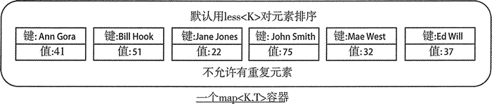
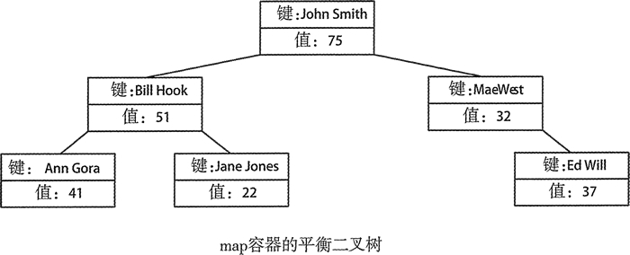

# C++ map 是什么

序列容器是管理数据的宝贵工具，但对大多数应用程序而言，序列容器不提供方便的数据访问机制。举个简单的示例，当我们用它处理姓名和地址时，在这种场景下，序列容器可能并不能如我们所愿。一种典型的方法是通过名称来寻找地址。如果记录保存在序列容器中，就只能通过搜索得到这些数据。相比而言，map 容器提供了一种更有效的存储和访问数据的方法。

map 容器是关联容器的一种。在关联容器中，对象的位置取决于和它关联的键的值。键可以是基本类型，也可以是类类型。字符串经常被用来作为键，如果想要保存姓名和地址的记录，就可以这么使用。名称通常可能是一个或多个字符串。关联容器中的对象位置的确定取决于容器中的键的类型，而且对于特定容器类型的内部组织方式，不同的 STL 有不同的实现。

map<K，T> 类模板定义在 map 文件头中，它定义了一个保存 T 类型对象的 map，每个 T 类型的对象都有一个关联的 K 类型的键。容器内对象的位置是通过比较键决定的。可以用适当的键值从 map 容器中检索对象。图 1 展示了一个用名称作为键的 map<K,T> 容器，对象是整数值，用来表示年龄。


图 1 map<K，T>容器的概念展示图
图 1 表示的是 map<Name，size_t> 类型的容器，其中的 Name 类可以这样定义：

```
class Name
{
private:
    std::string firstname{}; std::string secondname{};
public:
    Name(std::string first, std::string second) : firstname{first}, secondname{second}{};
    Name()=default;
    bool operator<(const Name& name)
    {
        return secondname < name.secondname ||((secondname == name.secondname) && (firstname < name.firstname));
    }
};
```

为了可以在必要时生成默认的元素，容器保存的对象通常需要定义一个默认的构造函数。当两个 Name 对象的 secondname 不同时，成员函数 operator<() 通过比较 secondname 来确定对象的顺序。如果 secondname 相等，比较结果就由 firstname 决定。string 类定义了 operator<()，因而可以用默认的 less<string> 来比较。

不要因为 map 使用 less<K> 对元素排序就被误导，这些元素并没有被组织成一个简单的有序序列，STL map 容器对元素的组织方式并没有具体要求，但元素一般都会保存在一个平衡二叉树中。容器中的元素被组织成一个平衡二叉树，因而树的高度——根节点和叶节点之间的高度是最低的。如果每个节点的左子树和右子树的高度差不超过 1，那么可以说这棵二叉树就是平衡的。图 2 展示了图 1 所表示的 map 容器可能的平衡二叉树。

图 2 map 容器的内部组织图
图 2 所示的树有 3 层，所以从根节点开始，找到任意的元素最多需要 3 步。这里选择的根节点可以使树的高度最小，而且对于每个父节点来说，它的键值大于它的左子节点，但小于它的右子节点。为了保持二叉树的平衡，当添加一个新的元素时，可能会导致根节点发生改变。所以显然，在添加新元素时，为了保持树的平衡，会产生一些额外的开销。作为回报，容器中的元素越多，相对于线性排列和非平衡树，平衡树组织元素的效率也越高。从包含 n 个元素的平衡二叉树中检索一个随机元素所需的时间为 O(log[2]n)，从序列中检索元素所需的时间为 O(n)。

注意，O(n) 计算时间随着参数的增加而增加。O 被认为是有序的，O(n) 表明线性执行时间在以 n 增加。O(log[2]n) 计算时间远没有 n 增加得快，因为它是以 log[2]n 计算的。