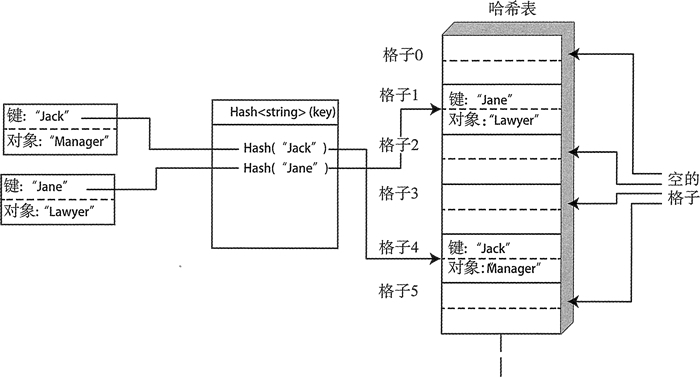

# C++ unordered_map 及其基本结构和特性

unordered_map 包含的是有唯一键的键/值对元素。容器中的元素不是有序的。元素的位置由键的哈希值确定，因而必须有一个适用于键类型的哈希函数。如果用类对象作为键，需要为它定义一个实现了哈希函数的函数对象。如果键是 STL 提供的类型，通过特例化 hash<T>，容器可以生成这种键对应的哈希函数。

因为键可以不通过搜索就访问无序 map 中的对象，所以可以很快检索出无序 map 中的元素。迭代遍历无序 map 中的元素序列的速度一般没有有序 map 快，因此在某个应用中选择何种容器取决于想如何访问容器中的元素。

unordered_map 容器中元素的组织方式和 map 有很大的不同，元素的内部组织方式取决于 C++ 实现。一般情况下，元素被保存在哈希表中，这个表中的条目被称为格子，每个格子可以包含几个元素。

一个给定的哈希值会选择特定的格子，因为哈希值可能的个数几乎可以肯定会大于格子的个数，两个不同的哈希值可能会映射到同一个格子上。因此，不同键会产生相同的哈希值，会产生碰撞，而且两个不同的哈希值选择相同的格子也会导致碰撞的产生。

下面的一些参数可以影响元素存储的管理：

*   容器中格子的个数有一个默认值，但也可以定指定初始个数。
*   载入因子是每个格子平均保存的元素的个数。这个值等于容器中元素个数除以格子的个数。

最大载入因子，默认是 1.0，但也可以修改。这是载入因子的上限。当容器达到最大载入因子时，容器会为格子分配更多的空间，这通常也会对容器中的元素重新进行哈希。

任何时候都不要将单个格子中的最大元素个数和最大载入因子混淆。假设有一个容器，它有 8 个格子，前两个格子中各有 3 个元素，剩下的格子都为空。那么这时候的最大载入因子为 6/8，也就是 0.75，小于默认的最大载入因子 1.0，所以这没有什么问题。

图 1 展示了 unordered_map 的基本结构图。

图 1 unordered_map 中的数据
为了简单起见，图 1 中的每个格子只有一个元素。可以使用从 0 开始的索引来访问格子。

组织格子的方式有很多。一种方式是将格子看作类似 vector 的序列，然后在哈希表中保存序列的地址。另一种方式是将格子定义为链表，在哈希表中保存根节点。具体使用哪种方法取决于我们的实现。

unordered_map 必须能够比较元素是否相等。当容器中有相同的键时，对从包含多个元素的格子中检索到的元素进行确认和选择很有必要。容器默认会使用定义在 fimctional 头文件中的 equal_to<K> 模板。它会用 == 运算符来比较元素，所以当键相等时，容器会认为它们是相同的，这一点和 map 容器不同，map 容器使用的是等价。如果使用的键是没有实现 operator=() 的类类型，那就必须提供一个函数对象来比较键。