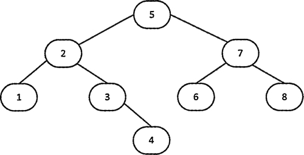
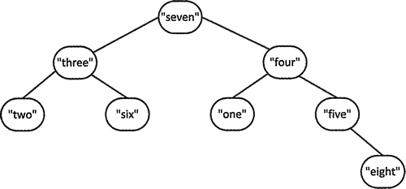

# C++ set 初始化（STL set 初始化）详解

通常，set<T> 容器内部元素的组织方式和 map<K，T> 相同，都是平衡二叉树。请考虑下面这个 set 容器的定义，可以用初始化列表来初始化 set 容器：

```
std::set<int> numbers {8, 7, 6, 5, 4, 3, 2, 1};
```

默认的比较函数是 less<int>，因此容器中的元素会升序排列。内部的二叉树和图 1 中所示的类似。


图 1 用 less<int> 排序的整数平衡二叉树
执行下面的语句后，容器中的元素变成升序：

```
std::copy( std::begin(numbers), std::end(numbers), std:: ostream_iterator<int>{std::cout," "});
```

copy() 算法会将前两个参数指定的一段元素复制到第三个参数指定的位置，这里第三个参数是一个输出流迭代器。这条语句会输出一个从 1 至 8 的整数递增序列。

当然，也可以为元素提供不同的比较函数:

```
std::set<std::string, std::greater<string>> words {"one", "two", "three", "four", "five", "six", "seven" , "eight"};
```

这个容器中的元素会降序排列，因此容器的树和图 2 类似。

图 2 用 greater<string> 排序的字符串的平衡二叉树
可以用元素段来创建 set 容器，并且可以指定它的比较函数：

```
std::set<string> words2 {std::begin(words), std::end(words)};
std::set<string, std::greater<string>> words3 {++std::begin(words2), std::end(words2)};
```

第一条语句定义了 words2，它包含了 words 中元素的副本，words 用默认的比较函数排序。第二条语句定义了 words3，它包含 words2 中除第一个元素外的所有元素的副本。这个容器使用 less<string> 实例排序。

set<T> 模板也定义了拷贝和移动构造函数。移动构造函数比较重要，因为它可以不通过拷贝就返回函数局部定义的 set 容器。在函数结束时会返回一个局部 set 容器，编译器会识别这个动作，从而选择使用移动构造函数来返回 set 容器。你在本章的后面会看到一个这种用法的示例。