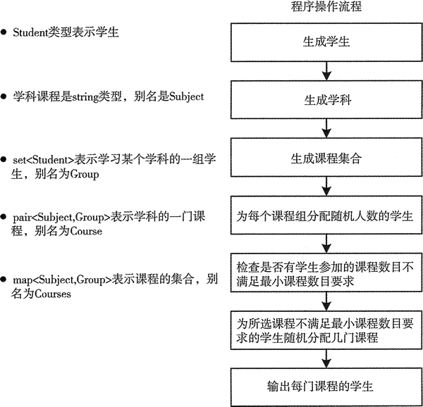

# C++ set 用法（STL set 用法）详解

是时候了解一下 set 容器的用法了。我们把 vector、set 和 map 容器组合在一起来创建一个示例，并且会介绍一种新的有用算法。

在这个示例中，你会将学习不同学科的学生分配到一组。每个学生都必须学习指定的最小数目的学科。每个学习特定学科的学生都被保存到 set 容器中，因为一个学生只能在一门特定课程中出现一次。这个示例不会特别有效率。在本例中会大量地拷贝学生对象，这里可能无关紧要，但是如果用来表示学生的对象很大，这就很重要了，因为这会产生很多开销。本章后面会介绍如何消除对象的副本。本例的基本工作流程如图 1 所示。


图 1 用 set 容器表示课程组
下面的 using 结构定义了一些本例中使用的别名：

```
using std::string;
using Distribution = std::uniform_int_distribution<size_t>;
using Subject = string;                                                                   // A course subject
using Subjects = std::vector<Subject>;                                                    // A vector of subjects
using Group = std::set<std::weak_ptr<Student>, std::owner_less<std::weak_ptr<Student>>>;  // A student group for a subject
using Students = std::vector<std::shared_ptr<Student>>;                                   // All the students
using Course = std::pair<Subject, Group>;                                                 // A pair representing a course
using Courses = std::map<Subject, Group>;                                                 // The container for courses
```

这些别名不是必需的，但它们可以使代码更加简洁。

首先，我们需要定义一个表示学生的类。Student 类的定义很简单，我们可以简单地在 Student.h 中定义这个类，例如：

```
// Student.h
// Student class definition for Ex5_02 - unchanged from Ex5_01
#ifndef STUDENT_H
#define STUDENT_H
#include <string>                                // For string class
#include <ostream>                               // For output streams

class Student
{
private:
    std::string first {};
    std::string second {};

public:
    Student(const std::string& name1, const std::string& name2) : first (name1), second (name2){}
    Student(Student&& student) : first(std::move(student.first)), second(std::move(student.second)){} // Move constructor
    Student(const Student& student) : first(student.first), second(student.second){}                  // Copy constructor
    Student() {}                                                                                      // Default constructor

    // Less-than operator
    bool operator<(const Student& student) const
    {
        return second < student.second || (second == student.second && first < student.first);
    }

    friend std::ostream& operator<<(std::ostream& out, const Student& student);
};

// Insertion operator overload
inline std::ostream& operator<<(std::ostream& out, const Student& student)
{
    out << student.first + " " + student.second;
    return out;
}
#endif
```

Student 只有两个数据成员，用来保存学生的名和姓。Student 对象最初保存在 vector 容器中，因此需要定义默认的构造函数。这里有拷贝构造函数和移动构造函数，后者可以在适当时避免对象的副本。因为 Student 会被保存在 set 容器中，用来表示不同学科的课程，所以需要定义小于运算符。这里用友元函数重载了一个流插入运算符来辅助输出。

## 创建 Student 对象

程序需要一定数量的 Student 对象，为了避免费力地从键盘输入数据，我们可以通过组合姓名的方式来创建 Student 对象的 vector 容器：

```
Students create_students()
{
    Students students;
    string first_names[] {"Ann", "Jim", "Eve", "Dan", "Ted"};
    string second_names[] {"Smith", "Jones", "Howe", "Watt", "Beck"};

    for(const auto& first : first_names)
        for(const auto& second : second_names)
        {
            students.emplace_back(std::make_shared<Student>(first, second));
        }

    return students;
}
```

这里用 using 语句为 Student 对象的 vector 容器定义了一个别名 Students。函数用两个数组中的元素组合出了所有可能的姓名，在局部 students 容器中创建 Student 对象。外循环对名进行迭代，内循环在给定的名后添加姓。因此我们会有 25 名学生。我们可以按如下方式调用函数来创建 students:

```
Students students = create_students();
```

vector 容器有移动构造函数，因此编译器会移动而不是拷贝返回的局部 students。上面的语句会调用 vector<Student> 的移动赋值运算符来移动 create_students() 的返回值，因此不会拷贝这个 vector 及其元素。这里 students 的类型是显式的，也可以使用 auto，因为编译器可以从 create_students() 的返回类型中推导出 students 的类型。

## 创建某门学科的学生集合

在这个示例中需要随机选择一些学生和课程，因此需要一个随机数创建器。为了在整个程序中都可以使用这个创建器，我们需要把它定义为全局变量：

```
static std::default_random_engine gen_value;
```

default_random_engine 和 uniforai_int_distribution 类型都定义在 random 头文件中，分布对象是一个函数对象，它可以创建分布内的随机数，可以将随机数创建器对象作为参数传给分布对象的成员函数 opemtor()()。这里我们定义了一个函数，用来为指定学科随机创 建一组学生：

```
Group make_group(const Students& students, size_t group_size, const Distribution& choose_student)
{
    Group group;                                             // The group of students for a subject

    // Select students for the subject group
    size_t count {};                                         // No. of students in the group
    std::pair<Group::iterator, bool> pr;                     // Stores return from inserting a student

    // Insert a random student into the group until there are group_size students in it
    while(count < group_size)
    {  // Increment count for a successful insertion...
        if(group.insert(students[choose_student(gen_value)]).second) ++count;
    }
    return group;
}
```

函数的第一个参数是一个包含 Student 对象的 vector，第二个参数是组中要求的学生个数，最后一个参数是分布的索引值，用来选择随机创建的学生。

group 是一个包含 Student 对象的 set 容器。从作为函数的第一个参数传入的 vector 中随机选择一些学生，然后通过调用 group 的成员函数 insert() 把它们插入到局部 set 容器 group 中。这里不需要检查插入是否成功。如果插入的元素已经在容器中，成员函数 insert() 不会插入新的对象。

从 students 容器中随机选择的学生可能已经在 group 容器中，但是循环会继续进行，尝试别的随机选择直到添加了 group_Size 个学生。当函数结束时，会通过移动而不是复制的方式返回局部的 group 对象，这和前面的函数是一样的。

## 创建学科和课程

学科的课程定义如下：

```
Subjects subjects {"Biology", "Physics", "Chemistry", "Mathematics", "Astronomy","Drama", "Politics", "Philosophy", "Economics"};
```

Subjects 是 vector<Subject> 的别名，Subject 是 string 的别名，因而 subjects 是一个包含 string 对象的 vector 容器。我们会在 map<Subject，Group> 中保存一些课程，每门学科的键都是 subjects 容器中唯一的 Subject 对象。map<Subject，Group> 的别名为 Courses，因此我们可以像下面这样定义一个包含全部课程的容器：

```
Courses courses; // All the courses with subject keys
```

这里定义了每个学生需要学习的最少学科数目。在创建某个学科的学生集合时，我们也对每个课程组的初始大小进行了限制：

```
size_t min_subjects {4}; // Minimum number of Subjects per student
size_t min_group {min_subjects}; // Minimum no. of students per course
size_t max_group {(students.size()*min_subjects) / subjects.size()}; // Maximum initial students per course
```

这里随便选了 4 作为需要学习的最少学科数，而且将每组的最少学生数都设为相同的 值。如果所有学生都学习最少的学科，而且被平均分配到每组，那么每个学科组的最大学生数就是一个平均值。可以尝试修改这些参数，看看它们对于学生分配有什么影响。

为了用随机值作为学科组分配的学生个数，也为了随机选择学生，我们需要定义一个用来在均匀分布中选择随机值的函数对象：

```
Distribution group_size {min_group, max_group}; // Distribution for students per course
Distribution choose_student {0, students.size() - 1}; // Random student selector
```

group_size 可以创建 min_group〜max_group 范围内的随机数。类似的，choose_student 分布可以创建 students 中的有效索引值。

我们也想为学生随机选择一些课程，所以这里也需要定义一个 Distribution 对象：

```
Distribution choose_course {0, subjects.size() - 1}; // Random course selector
```

上面的代码会创建 subjects 容器的一个有效索引值，可以用它来选择课程。

## 为课程分配学生

main() 中的 for 循环只用了一条语句就为 course 容器填充了一些表示课程信息的元素：

```
for(const auto& subject : subjects)
    courses.emplace(subject, make_group(students, group_size(gen_value), choose_student));
```

这个循环体中的语句看起来确实很长。调用 course 容器的 emplace() 可以在适当的位置创建元素。每个元素都是一个 pair<Subject，Group> 对象，因此 emplace() 的参数必须是一个 Subject 对象和一个 Group 对象，emplace() 函数会把它们传入 pair 的构造函数。Emplace() 第一个参数是循环变量 subject，因为循环迭代器需要遍历 subjects。第二个参数是由 make_group() 返回的。make_group() 的第一个参数是一个 vector 容器 students，第二个参数通过将随机数创建器传入函数对象 group_size() 来创建随机数，用它作为组的大小。第三个参数是一个用于选择学生的分布对象。

## 检查学生选择的课程

在使用上面的循环创建了所有课程信息后，我们必须检查每个学生是否都选了足够的课程。下面的循环会做这些事情，如果没有选择足够的课程，为他们申请其他的课程：

```
for(const auto& student : students)
{
    // Verify the minimum number of Subjects has been met
    // Count how many Subjects the student is on
    size_t course_count = std::count_if(std::begin(courses), std::end(courses), &student
    {  return course.second.count(student); });
    if(course_count >= min_subjects) continue;             // On to the next student Minimum no. of Subjects not signed up for
        size_t additional {min_subjects - course_count};       // Additional no. of Subjects needed
    if(!course_count)                                      // If none have been chosen...
        std::cout << *student << " is work-shy, having signed up for NO Subjects!\n";
    else                                                   // Some have - but E for effort
        std::cout << *student << " is only signed up for " << course_count << " Subjects!\n";

    std::cout << "Registering " << *student << " for " << additional<< " more course" << (additional > 1 ? "s" : "") << ".\n\n";

    // Register for additional Subjects up to the minimum
    while(course_count < min_subjects)
        if((courses.find(subjects[choose_course(gen_value)])->second.insert(student)).second)
            ++course_count;
}
```

外层循环遍历 vector 中的 Student 对象。count_if() 算法用来计算每个学生已报名参加的课程数。

在前两个参数指定的范围内，算法计算了可以使第三个函数参数返回 true 的元素个数。前两个参数指定的是 courses 容器中的一段元素，因此迭代器指向的是 pair<Subject， Group> 对象。count_if() 的第三个参数必须是一个二元函数，它的返回值必须是布尔值或其他可以隐式转换为布尔型的值。类型参数来自于迭代器的解引用。这里的 lambda 表达式返回了 course.second.count(student) 的值。course 是 pair<Subject，Group> 类型的对象，因此这里表达式首先选择的是 course 对象的第二个成员。第二个成员是 Group 对象，它是 set<Student> 类型的对象，所以这个表达式会调用 set 容器的成员函数 count()。因为 set 容器中不允许有重复元素，所以如果 student 在容器中，成员函数 count() 只会返回 1；如果不在容器中，返回 0。

幸运的是，这两个值都可以分别相应地转换为布尔值 true 和 false，因此，如果 student 在当前容器中，count_if() 会增加计数。

我们会对任何没有申请足够数量课程的学生输出一些适当的信息，然后在嵌套的 while 循环中为这些学生申请新的课程，直到他们申请的课程数目满足要求。这是另一条做了很多工作的单条循环语句。

从本质上来说，这是一条 if 语句，每当学生成功申请一门课程时，就会增加 course_count 的值。通过调用 courses 容器的成员函数 find() 来选择课程，它会返回一个迭代器，它指向参数键所对应的元素；如果没有找到对应的键，会返回一个结束迭代器。我们用所有可能的 Subject 作为键创建了 courses，所以后面的这种情况不会发生；如果真的发生了，我们会知道的，因为这会导致程序崩溃。

用 choose_course 分布产生的随机索引值作为 subjects 的键来选择一门新的课程。find() 返回的 pair 元素的第二个成员是选择这门课程的学生组，因此可以通过用 student 作为参数调用它的成员函数 insert()，来向组中添加一些之前不在这个组中的学生。

总有可能出现学生已经选了这门课程的情况，这时 insert() 返回的 pair 对象的第二个成员是 false，course_count 不会递增，循环会为当前学生继续随机选择其他的课程。在循环结束时，每个学生选择的课程数目都满足最小值 min_subjects。

## 输出课程信息

为了可以用另一个 STL 算法输出课程信息,我们需要在 List_CourSe.h 头文件中定义一个下面这种类型的函数对象：

```
// List_Courses.h
// Function object to output the students in a group for Ex5_02
#ifndef LIST_COURSE_H
#define LIST_COURSE_H
#include <iostream>                              // For standard streams
#include <string>                                // For string class
#include <set>                                   // For set container
#include <algorithm>                             // For copy()
#include <iterator>                              // For ostream_iterator
#include "Student.h"

using Subject = std::string;                     // A course subject
using Group = std::set<std::weak_ptr<Student>, std::owner_less<std::weak_ptr<Student>>>;  // A student group for a subject
using Course = std::pair<Subject, Group>;        // A pair representing a course

class List_Course
{
public:
    void operator()(const Course& course)
    {
        std::cout << "\n\n" << course.first << "  " << course.second.size() << " students:\n  ";
        std::copy(std::begin(course.second), std::end(course.second), std::ostream_iterator<std::weak_ptr<Student>>(std::cout, "  "));
    }
};

inline std::ostream& operator<<(std::ostream& out, const std::weak_ptr<Student>& wss)
{
    out << *wss.lock();
    return out;
}

#endif
```

List_Course 类的成员函数 operator()() 的参数是一个 Course 对象的引用，这个对象的类型是 pair<string，set<Student>>。这个函数会输出课程的一些信息，这些信息包括 course 的第一个成员，以及通过 pair 的第二个成员的成员函数 size() 得到的学习这门课程的学生数。前两个参数分别是 set<Student> 容器的开始迭代器和结束迭代器，这两个迭代器都是从 course 的第二个成员得到的。

Student 对象的复制目的地由 copy() 的第三个参数指定，它是一个 ostream_iterator<Student> 对象。这个对象会通过调用每个 Student 对象的成员函数 operator<<() 来将学生的信息输出到 cout，输出的信息用两个空格隔开。

通过 main() 中的一个 List_Course 实例，我们可以用一行语句输出所有的课程信息：

```
std::for_each(std::begin(courses), std::end(courses), List_Course());
```

for_each 算法会将第三个参数指定的函数对象应用到前两个参数所指定范围内的所有元素上。前两个参数定义的范围相当于所有的课程，因此会以课程为参数连续调用 List_Courses()()。结果会将每门课程的全部学生输出到 cout。

当然，也可以不用 List_Course。我们可以定义一个 lambda 表达式来代替它作为 for_each() 的第三个参数：

```
std::for_each(std::begin(courses), std::end(courses), [](const Course& course){
    std::cout << "\n\n" << course.first << "  " << course.second.size() << " students:\n  ";
    std::copy(std::begin(course.second), std::end(course.second), std::ostream_iterator<std::weak_ptr<Student>>(std::cout, "  "));
});
```

我们在这个示例中定义 List_Course 只是为了演示如何定义它，但在这个程序中需要多次使用这个函数对象，使用函数就比使用 lambda 表达式简单一些。

## 完整的程序

包含 main() 的源文件的内容如下：

```
// Registering smart pointers to students on Subjects
#include <iostream>                              // For standard streams
#include <string>                                // For string class
#include <map>                                   // For map container
#include <set>                                   // For set container
#include <vector>                                // For vector container
#include <random>                                // For random number generation
#include <algorithm>                             // For for_each(), count_if()
#include <memory>                                // For shared_ptr and weak_ptr
#include "Student.h"
#include "List_Course.h"

using std::string;
using Distribution = std::uniform_int_distribution<size_t>;
using Subject = string;                                                                   // A course subject
using Subjects = std::vector<Subject>;                                                    // A vector of subjects
using Group = std::set<std::weak_ptr<Student>, std::owner_less<std::weak_ptr<Student>>>;  // A student group for a subject
using Students = std::vector<std::shared_ptr<Student>>;                                   // All the students
using Course = std::pair<Subject, Group>;                                                 // A pair representing a course
using Courses = std::map<Subject, Group>;                                                 // The container for courses

static std::default_random_engine gen_value;

// Creates a vector of smart pointers to students
Students create_students()
{
    Students students;
    string first_names[] {"Ann", "Jim", "Eve", "Dan", "Ted"};
    string second_names[] {"Smith", "Jones", "Howe", "Watt", "Beck"};

    for(const auto& first : first_names)
        for(const auto& second : second_names)
        {
            students.emplace_back(std::make_shared<Student>(first, second));
        }

    return students;
}

// Create a group of students for a subject
Group make_group(const Students& students, size_t group_size, const Distribution& choose_student)
{
    Group group;                                             // The group of students for a subject

    // Select students for the subject group
    size_t count {};                                         // No. of students in the group
    std::pair<Group::iterator, bool> pr;                     // Stores return from inserting a student

    // Insert a random student into the group until there are group_size students in it
    while(count < group_size)
    {  // Increment count for a successful insertion...
        if(group.insert(students[choose_student(gen_value)]).second) ++count;
    }
    return group;
}

int main()
{
    Students students = create_students();
    Subjects subjects {"Biology", "Physics", "Chemistry", "Mathematics", "Astronomy","Drama", "Politics", "Philosophy", "Economics"};
    Courses courses;                                         // All the courses with subject keys

    size_t min_subjects {4};                                 // Minimum number of Subjects per student
    size_t min_group {min_subjects};                         // Minimum no. of students per course
    size_t max_group {(students.size()*min_subjects) / subjects.size()};  // Maximum initial students per course

    // Create groups of students for each subject
    Distribution group_size {min_group, max_group};          // Distribution for students per course
    Distribution choose_student {0, students.size() - 1};    // Random student selector
    for(const auto& subject : subjects)
        courses.emplace(subject, make_group(students, group_size(gen_value), choose_student));

    Distribution choose_course {0, subjects.size() - 1};     // Random course selector

    // Every student must attend a minimum number of Subjects...
    // ...but students being students we must check...
    for(const auto& student : students)
    { // Verify the minimum number of Subjects has been met

        // Count how many Subjects the student is on
        size_t course_count = std::count_if(std::begin(courses), std::end(courses), &student
        {  return course.second.count(student); });
        if(course_count >= min_subjects) continue;             // On to the next student

        // Minimum no. of Subjects not signed up for
        size_t additional {min_subjects - course_count};       // Additional no. of Subjects needed
        if(!course_count)                                      // If none have been chosen...
            std::cout << *student << " is work-shy, having signed up for NO Subjects!\n";
        else                                                   // Some have - but E for effort
            std::cout << *student << " is only signed up for " << course_count << " Subjects!\n";

        std::cout << "Registering " << *student << " for " << additional
              << " more course" << (additional > 1 ? "s" : "") << ".\n\n";

        // Register for additional Subjects up to the minimum
        while(course_count < min_subjects)
            if((courses.find(subjects[choose_course(gen_value)])->second.insert(student)).second) ++course_count;
    }

    // Output the students attending each course
    std::for_each(std::begin(courses), std::end(courses), List_Course());
    std::cout << std::endl;
}
```

由于程序输出篇幅很长，此处不再列出，读者可自行复制代码查看运行结果。