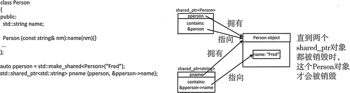

# C++ set 保存指针（智能指针）详解

如果改变对象，可能会改变 set 中对象指针的顺序，所以指针的比较函数不能和对象有关。大多数时候，我们并不在意元素在 set 中的顺序，而是在意容器中是否有这个元素。在这种情况下，就可以使用一个适用于指针但和它们所指向的元素无关的比较函数对象，推荐使用定义在 memory 头文件中的 owner_less<T> 函数对象类型的实例来比较容器中的智能指针。

owner_less<T> 模板为 shared_ptr 和 weak_ptr 对象定义了用于小于比较的函数对象类型。换句话说，允许 weak_ptr 对象和 shared_ptr 对象比较，反过来也可以，也允许和 weak_ptr 或 shared_ptr 对象比较。通过调用智能指针的成员函数 owner_before() 实现了一个 owner_less<T> 实例，它提供了一个小于运算符，可以和另一个智能指针进行比较。shared_ptr<T> 和 weak_ptr<T> 模板都定义了这个成员函数。

当这个智能指针比参数传入的智能指针小时，owner_before<T>() 实例会返回 true，否则返回 false。比较基于智能指针所拥有的对象地址，当两个指针指向同一个对象时，说明这两个指针等价。

在 shared_ptr<T> 类模板中，定义 owner_before() 实例的函数模板的原型看起来如下所示：

template<typename X> bool owner_before(const std::sharedjptr<X>& other) const;
template<typename X> bool owner_before(const std::weak_ptr<X>& other) const;

weak_ptr<T> 类模板定义了类似的成员。注意，这里模板类型参数和类模板的类型参数不同。这意味着可以比较指向相同类型对象的指针，也可以比较指向不同类型对象的指针。也就是说，shared_ptr<T1> 对象可以和 shared_ptr<T2> 对象或 weak_ptr<T2> 对象比较。这意味着指针所指向的对象可以和它所拥有的对象不同。

所有权对于 shared_ptr<T> 对象很重要。shared_ptr<T> 可以共享一个不属于它的对象的所有权。换句话说，shared 指针所包含的地址并不是属于它的对象的地址。这种 shared_ptr 的一种用途是指向一个它所拥有对象的成员，如图 1 所示。

图 1 两个 shared 指针指向同一个对象的不同对象
在图 1 中用来创建 pname 的构造函数叫作别名构造函数。它的第一个参数是另一个 shared_ptr，它拥有的对象 pname 也拥有。第二个参数是一个原生指针，它保存在 pname 中。第二个参数指向的对象不由 pname 管理。然而，pname 可以用来访问 Person 对象的数据成员。在这个示例中，pname 拥有的对象是 Person，它指向对象的成员。

销毁图 1 中的 pperson 指针不会导致它所拥有的对象被销毁，因为 pname 指针仍然拥有这个对象。创建 pname 指针是用来访问 Person 对象的成员变量 name。*pperson 是 Person 对象的引用，因为它包含了已共享所有权的对象的地址。*pname 是 Person 对象的成员 name 的引用，因为 pname 包含了这个成员的地址，而且它也拥有 Person 对象的所有权。

这时我们在没有包含 Person 地址的 shared_ptr<Person> 指针时，仍然可以继续使用 pname。当所有拥有对象所有权的 shared_ptr 对象都被销毁时，才能销毁它们所指向的 Person 对象。如果没有别名构造函数提供的这种能力，就无法保证 pname 所保存指针的有效性。