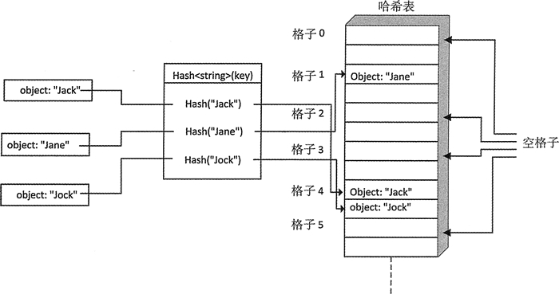

# C++ unordered_set 定义及初始化详解

unordered_set<T> 容器类型的模板定义在 unordered_set 头文件中。unordered_set<T> 容器提供了和 unordered_map<T> 相似的能力，但 unordered_set<T> 可以用保存的元素作为它们自己的键。T 类型的对象在容器中的位置由它们的哈希值决定，因而需要定义一个 Hash<T> 函数。

这种容器不能存放重复的元素。元素类型必须可以比较是否相等，因为这可以确定元素什么时候相等。就像 uordered_map，元素被存放在哈希表内部的格子中。每个格子保存哪个元素，是由元素的哈希值决定的。unordered_set 容器组织方式的概念图如图 1 所示：

图 1 unordered_set 容器组织数据的方式
图 1 展示了一种情况，对于两个不同的对象 "Jack" 和 "Jock"，它们的哈希值可能会使它们选择同一个格子。这里的格子个数是默认的，在创建容器时可以修改。

需要记住的是，正如我们在 unordered_map 中看到的那样，格子的个数通常是 2 的幂，这使我们可以更容易地从哈希值的比特数中选择格子。创建 unordered_set 的方式和 unordered_map 相似。下面是一些示例：

```
std::unordered_set<string> things {16}; // 16 buckets
std::unordered_set<string> words {"one", "two", "three", "four"};// Initializer list
std::unordered_set<string> some_words {++std::begin(words), std::end (words)};  // Range
std::unordered_set<string> copy_wrds {words}; // Copy constructor
```

模板参数是默认的参数类型，指出了哈希函数的类型。当需要保存对象时，必须为它提供哈希函数，也需要为构造函数指出模板类型参数和函数参数。为了保存前面章节中介绍的 Name 类型，需要按如下方式定义 unordered_set<Name> 容器：

```
std::unordered_set<Name, Hash_Name> names {8, Hash_Name()};//8 buckets & hash function
```

上面第二个模板类型参数是用来哈希 Name 对象的函数对象类型。构造函数的第二个参数是这个函数对象的一个实例，当指定哈希函数时，需要同时指定格子的个数，因为它是构造函数的第一个参数。如果省略构造函数的第二个参数，容器会默认使用第二个模板类型参数的实例。如果 Hash_Name 是函数对象类型，就不再需要指定构造函数的第二个参数。

可以通过调用当前容器的成员函数 reserve 来增加它的格子个数。这可能会花费一些时间，因为这会对当前的元素重新哈希，然后将它们分配到新的格子中。

最大载入因子是每个格子所能容纳的最大元素个数。默认是 1.0，就像 unordered_map，也像 map，可以通过为 max_load_factor() 传入一个新的载入因子来改变它。例如：

```
names.max_load_factor(8.0); // Max average no. of elements per bucket
```

通过增加最大载入因子，可以减少格子的使用个数，但会对元素访问的时间产生不利影响，因为增加访问元素会涉及格子的搜索可能性。

unordered_set 容器没有成员函数 at()，并且也没有定义下标运算，它和 unordered_map 有相同类型的成员函数。