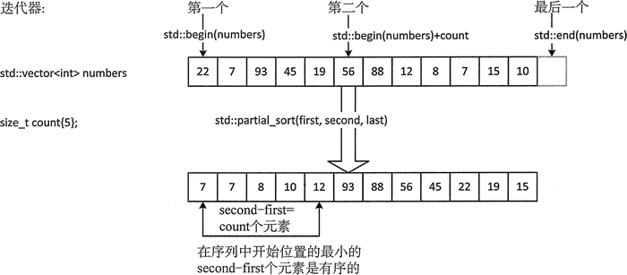

# C++ partial_sort(STL partial_sort)排序算法详解

通过示例很容易理解什么是部分排序。假设有一个容器，它保存了 100 万个数值，但我们只对其中最小的 100 个感兴趣。可以对容器的全部内容排序，然后选择前 100 个元素，但这可能有点消耗时间。这时候需要使用部分排序，只需要这些数中的前 100 个是有序放置的。

对于部分排序，有一个特殊的算法 partial_sort()，它需要 3 个随机访问迭代器作为参数。如果这个函数的参数是 first、second 和 last，那么这个算法会被应用到 [first，last) 这个范围内的元素上。执行这个算法后，[first，second) 会包含降序序列 [first，last) 中最小的 second-first 个元素。

注意，在这个示例中，有一种之前没遇到过的表示方式 [first，last)，用它来表示一个元素段，这是一个来自于数学领域的用来定义数字范围的概念——区间。这两个值叫作结束点，在这种表示法中，方括号表示包含相邻的结束点，圆括号表示相邻的结束点不包括在内。 例如，如果 (2，5) 是一个整数区间，2 和 5 都被排除在外，所以它只表示整数 3 和 4；这也被叫作开区间，因为两个结束点都不包含。区间 [2，5) 包含 2 但不包含 5，所以它表示 2、3 和 4。（2，5] 表示 3、4 和 5。[2,5] 表示 2、3、4、5，并且它被叫作闭区间，因为包含了两个结 束点。当然，first 和 last 都是迭代器，并且 first，last) 表示包含 first 指向的元素而不包含 last 指向的元素，所以可以用它准确表示 [C++ 中的范围。

下面这段代码演示了 partial_sort() 算法的工作方式：

```
size_t count {5}; // Number of elements to be sorted
std::vector<int> numbers {22, 7, 93, 45, 19, 56, 88, 12, 8, 7, 15, 10};
std::partial_sort(std::begin(numbers), std::begin(numbers) + count, std::end(numbers));
```

执行 partial__sort()后的效果如图 1 所示。

图 1 partial_sort() 算法的操作
最小的 count 个元素是有序的。在 [first，second) 范围内，second 指向的元素没有被包含在内，因为 second 是一个开结束点。图 1 展示的是在本人系统上这段代码执行后的结果。在你的系统上结果可能会不同。需要注意的是，不能保持未排序元素的原始顺序。在执行 partial_sort() 后这些元素的顺序是不确定的，这取决于我们的实现。

如果想让 partial_sort() 算法使用和 < 运算符不同的比较函数，可以提供一个函数对象作为它的额外参数。例如：

```
std::partial_sort(std::begin(numbers), std::begin(numbers) + count, std:: end (numbers) , std::greater<>());
```

现在，number 中最大的 count 个元素会是容器开始处的一个降序序列。在此系统上这条语句的输出结果为：

93 88 56 45 22 7 19 12 8 7 15 10

同样，没有保持 numbers 中未排序元素的原始顺序。

partial_sort_copy() 在本质上和 partial_sort() 是相同的，除了前者会将排序元素复制到一个不同的元素段（另一个容器中）。它的前两个参数是指定部分排序应用范围的迭代器； 第 3 个和第 4 个参数是标识结果存放位置的迭代器。目的位置的元素个数决定了输入元素段中被排序元素的个数。例如：

```
std::vector<int> numbers {22, 7, 93, 45, 19, 56, 88, 12, 8, 7, 15, 10};
size_t count {5}; // Number of elements to be sorted
std::vector<int> result(count); // Destination for the results 一 count elements
std::partial_sort_copy(std::begin(numbers), std::end(numbers), std::begin (result) , std::end (result)); std::copy(std::begin(numbers), std::end(numbers), std::ostream_iterator<int>{std::cout," " });
std::cout << std::endl;
std::copy(std::begin(result), std::end(result),std::ostream_iterator <int> {std::cout, " "}); std::cout << std::endl
```

这些语句实现了对 numbers 容器的部分排序。这个想法是先对 numbers 中最小的 count 个元素排序，然后把它们保存在结果容器中。我们指定的用于存放元素的目的位置必须存在，也就是说，目的容器 result 必须至少有 count 个元素，在这个示例中我们需要分配准确数目的内存。执行这段代码后的输出如下：

22 7 93 45 19 56 88 12 8 7 15 10
7 7 8 10 12

可以看到，numbers 中元素的顺序并没有被打乱，result 中包含了 number 中按升序排列的最小的 count 个元素。

当然，也可以用额外的参数来指定不同的比较函数：

```
std::partial_sort_copy(std::begin(numbers), std::end(numbers), std::begin(result), std::end(result),std::greatero());
```

指定一个 greater<> 的实例作为函数对象，将最大的 count 个元素以降序的形式复制到 result 中。如果这条语句后跟的是前一个代码段中的输出语句，会输出如下内容：

22 7 93 45 19 56 88 12 8 7 15 10
93 88 56 45 22

同前面一样，原始容器中元素的顺序没有被打乱。