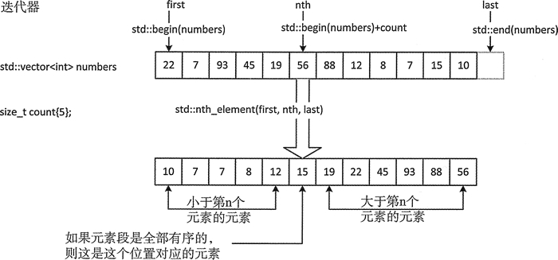

# C++ nth_element(STL nth_element)排序算法详解

nth_element() 算法和 partial_sort() 不同。应用的范围由它的第一个和第三个参数指定。第二个参数是一个指向第 n 个元素的迭代器。如果这个范围内的元素是完全有序的，nth_dement() 的执行会导致第 n 个元素被放置在适当的位置。这个范围内，在第 n 个元素之前的元素都小于第 n 个元素，而且它后面的每个元素都会比它大。算法默认用 `<` 运算符来生成这个结果。

下面是一个使用 nth_elemen() 的示例：

```
std::vector<int> numbers {22, 7, 93, 45, 19, 56, 88, 12, 8, 7, 15, 10};
size_t count {5}; // Index of nth element
std::nth_element(std::begin(numbers), std::begin(numbers) + count, std::end(numbers));
```

这里的第 n 个元素是 numbers 容器的第 16 个元素，对应于 numbers[5]，图 1 展示了它的工作方式。

图 1 nth_element() 算法的操作
第 n 个元素之前的元素都小于它，但不必是有序的。同样，第 n 个元素后的元素都大于它，但也不必是有序的。如果第二个参数和第三个参数相同（元素段的末尾），这时这个算法是无效的。

正如本章前面的算法一样，可以自己定义比较函数作为函数的第 4 个参数：

```
std::nth_element(std::begin(numbers), std::begin(numbers) + count, std::end(numbers) , std::greater<>());
```

这里使用 `>` 运算符来比较函数，所以第 n 个元素将是元素按降序排列后的第 n 个元素。第 n 个元素之前的元素都大于它，之后的元素都小于它。如果 number 容器中的初始值和之前的一样，那么结果为：

45 56 93 88 22 19 10 12 15 7 8 7

在你的系统上，第 n 个元素两边元素的顺序可能会不同，但它左边的元素都应该比它大，而右边的元素都应该比它小。