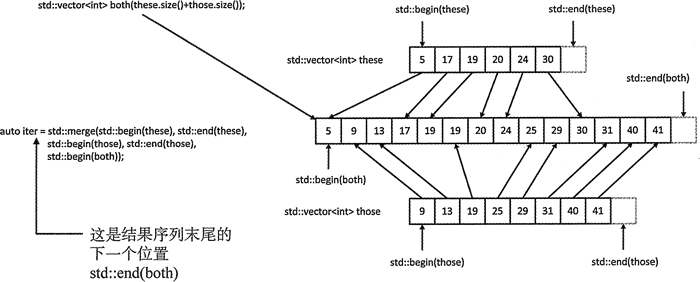

# C++ merge 和 inplace_merge（STL merge 和 inplace_merge）算法详解

合并操作会合并两个有相同顺序的序列中的元素，可以是两个升序序列，也可以是两个降序序列。结果会产生一个包含来自这两个输入序列的元素副本的序列，并且排序方式和原始序列相同。图 1 说明了其工作方式。


图 1 合并两个 vector 容器中的元素
merge() 算法会合并两个序列并将结果保存到第三个序列中，它使用 < 运算符来比较元素。图 1 表明合并操作被运用到 these 和 those 容器的内容上，结果序列保存在 both 容器中。

merge() 算法需要 5 个参数。其中前两个指定第一个输入序列的迭代器，在这个示例中是 these，后面两个迭代器指定第二个输入序列，在这个示例中是 those，最后一个参数是一个指定合并元素存放位置的迭代器，即 both 容器。用来指定输入序列的迭代器只需要是最低层次的迭代器，用来保存合并结果的迭代器需要是一个输出迭代器。

merge() 算法并没有关于被合并序列容器的信息，所以它们不能创建元素，只能用提供的作为第 5 个参数的迭代器来保存元素。因而在这个示例中，目的序列中的元素必须是已经存在的。在图 1 中，通过以两个输入容器元素个数之和为指定的元素个数创建一个 both 容器来保证此要求。创建的结果序列可以放在任何位置，甚至可以放在一个源序列容器中，但源序列和目的序列不能重叠；如果它们重叠了，结果是未定义的，但可以肯定的是效果肯定不好。当然，可以用一个插入迭代器来指定目的位置，元素会被自动创建。

merge() 算法返回的迭代器指向合并序列末尾的后一个位置，所以可以通过这个函数调用使用的第 5 个参数加上这个函数返回的迭代器来确定合并序列的范围。

当需要使用不同于 < 运算符的其他比较运算时，可以提供一个函数对象用来作为第 6 个参数。例如：

```
std::vector<int> these {2, 15, 4, 11, 6r 7};//1st input to merge
std::vector<int> those {5, 2, 3, 2, 14, 11, 6}; // 2nd input to merge
std::stable_sort(std:rbegin(these), std::end(these),std::greatero ());// Sort 1st range in descending sequence
std::stable_sort(std::begin(those), std::end(those), std::greater<>()); // Sort 2nd range
std::vector<int> result(these.size() + those.size() + 10);//Plenty of room for results
auto end_iter = std::merge(std::begin(these), std::end(these),std::begin(those), std::end(those),std::begin (result), std::greater<>());// Merge 1st range and 2nd range into result
std:: copy (std::begin (result), end_iter, std::ostream_iterator<int>{std::cout, " "});
```

这段代码首先用 stable_sort() 将两个 vector 容器的尚容排成降序，stable_sort() 可以保证维持相等元素的原始顺序。合并操作会将两个容器的内容合并到第三个容器 result 中，创建的元素比需要的还多 10 个(仅仅是为了说明 merge() 返回迭代器的用法)。

copy() 算法会将由 result 的开始迭代器和 merge() 返回的 end_iter 迭代器指定范围内的元素复制到输出迭代器。输出如下：

15 14 11 11 7 6 6 5 4 3 2 2 2

## inplace_merge 算法

inplace_merge() 算法可以合并同一个序列中两个连续有序的元素序列。它有三个参数： first、second、last 和 last 是一个双向迭代器。这个序列中的第一个输入序列是 first，second)， 第二个输入序列是 [second,last)，因而 second 指向的元素在第二个输入序列中。结果为 [first, last)。图 2 展示了这个操作。

![
图 2 inplace_merge() 操作
图 2 中的 data 容器有两个序列，并且都是升序序列。inplace_merge() 操作将它们合并为同一容器中的升序序列。