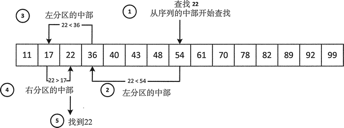

# C++ binary_search(STL binary_search)二分查找算法详解

目前为止，你在本章中见到的搜索算法都是对序列进行顺序搜索，而且没有事先对元素进行排序的要求。二分查找一般比顺序搜索要快，但要求序列中的元素是有序的。这主要是因为二分查找的搜索机制，图 1 说明了这种机制。


图 1 二分查找
图 1 展示了在一个升序序列中二分查找 22 的过程。因为元素是升序排列的，所以查找机制使用小于运算符来查找元素。搜索降序序列需要使用小于运算符来比较元素。二分查找总是选择从序列中部的元素开始，并将它和搜索的值作比较。如果元素和被查找的元素相等，就认为是匹配的，所以当 !(x<n)&&!(n<x) 时，n 的值也就匹配 x 的值。

如果检查的元素不匹配，比如 x<n，会继续从左分区的中间元素开始查找，否则继续从右分区的中间元素开始查找。当找到相等的元素或所检查的分区只有一个元素时，查找结束。此时如果不匹配，就说明元素不在这个序列中。

## binary_search()算法

正如你们所想的那样，binary_search() 实现了一个二分查找算法。它会在前两个参数指定范围内搜索等同于第三个参数的元素。指定范围的迭代器必须是正向迭代器而且元素必须可以使用 < 运算符来比较。这个序列中的元素必须被排成升序序列或者至少相对于所查找元素是有序的。如果找到第三个参数，这个算法会返回布尔值 true，否则返回 false。

所以，binary_search() 能告诉我们元素是否在这个序列中，但当它在序列中时，却不能告诉我们它的位置。 当然，如果必须知道它的位置，可以使用前面介绍的查找算法或 lower_bound()、 upper_bound() 或 equal_range(}。下面是一个使用 binary_search() 的示例：

```
std::list<int> values {17, 11, 40, 36, 22, 54, 48, 70, 61, 82, 78, 89, 99, 92, 43};
values.sort (); // Sort into ascending sequence
int wanted {22};    // What we are looking for
if(std::binary_search(std::begin(values), std::end(values), wanted))
    std::cout << wanted << " is definitely in there - somewhere..."<< std::endl;
else
    std::cout << wanted << " cannot be found - maybe you got it wrong..." << std::endl;
```

这里用 list 来保存一个任意顺序的任意值的集合，目的是为了提醒你记住这个容器的用法。这段代码使用 binary_search() 算法来查找期望的值。因为 binary_search() 只能使用有序序列，所以首先我们确保 list 中的元素是有序的。不能对 list 容器中的元素应用 sort() 算法，因为它需要的是随机访问迭代器，而 list 容器只提供了双向迭代器。因为这个 list 定义了一个成员函数 sort()，可以将全部的元素排成升序，所以可以用这个函数来对容器中的元素进行排序。当这段代码执行时，会输出是否找到希望值的消息。

另一个版本的 binary_search() 接受一个额外的参数，它是一个用于查找元素的函数对象；显然，它必须和用于对被查找序列进行排序的比较操作有相同的效果。下面是一个演示如何将值排成降序，然后查找期望值的示例：

```
std::list<int> values {17, 11, 40, 36, 22, 54, 48, 70, 61, 82, 78, 89, 99, 92, 43};
auto predicate = [](int a, int b){ return a > b;};
values.sort(predicate);
int wanted {22};
if (std::binary_search (std::begin (values), std::end (values), wanted, predicate))
    std::cout << wanted << " is definitely in there - somewhere..."<< std:: endl;
else
    std::cout << wanted << " cannot be found - maybe you got it wrong..."<< std::endl;
```

这里使用的 list 容器的成员函数 sort() 接受一个定义比较的函数对象作为参数，这里它是由一个 lambda 表达式定义的。同一个 lambda 表达式也被作为 binary_searcli() 的第 4 个参数。当然，结果和前一段代码相同。