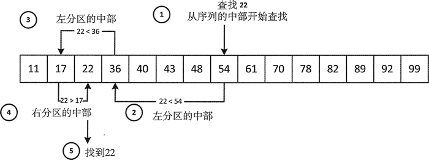

# C++ lower_bound(STL lower_bound)二分查找算法详解

二分查找一般比顺序搜索要快，但要求序列中的元素是有序的。这主要是因为二分查找的搜索机制，图 1 说明了这种机制。


图 1 二分查找
图 1 展示了在一个升序序列中二分查找 22 的过程。因为元素是升序排列的，所以查找机制使用小于运算符来查找元素。搜索降序序列需要使用小于运算符来比较元素。二分查找总是选择从序列中部的元素开始，并将它和搜索的值作比较。如果元素和被查找的元素相等，就认为是匹配的，所以当 !(x<n)&&!(n<x) 时，n 的值也就匹配 x 的值。

如果检查的元素不匹配，比如 x<n，会继续从左分区的中间元素开始查找，否则继续从右分区的中间元素开始查找。当找到相等的元素或所检查的分区只有一个元素时，查找结束。此时如果不匹配，就说明元素不在这个序列中。

## lower_bound()

lower_bound() 算法可以在前两个参数指定的范围内查找不小于第三个参数的第一个元素，也就是说大于等于第三个参数的第一个元素。前两个参数必须是正向迭代器。例如：

```
std::list<int> values {17, 11, 40, 36, 22, 54, 48, 70, 61, 82, 78, 89, 43};
values.sort();  // Sort into ascending sequence
int wanted {22};    // What we are looking for
std::cout << "The lower bound for "<< wanted<< " is "<< *std:: lower_bound (std::begin (values), std::end(values), wanted)<< std::endl;
```

运行结果为：

The lower bound for 22 is 22

从 list 容器的整数中可以看出算法正像我们所描述的那样工作。该算法还有额外的版本，它接受一个函数对象作为第三个参数，用于指定序列排序所使用的比较。