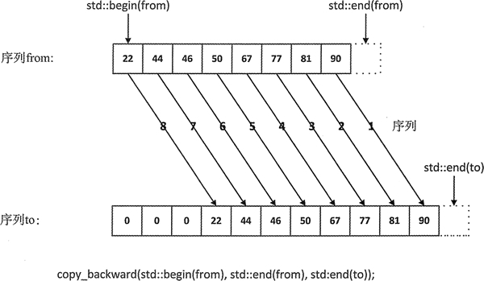
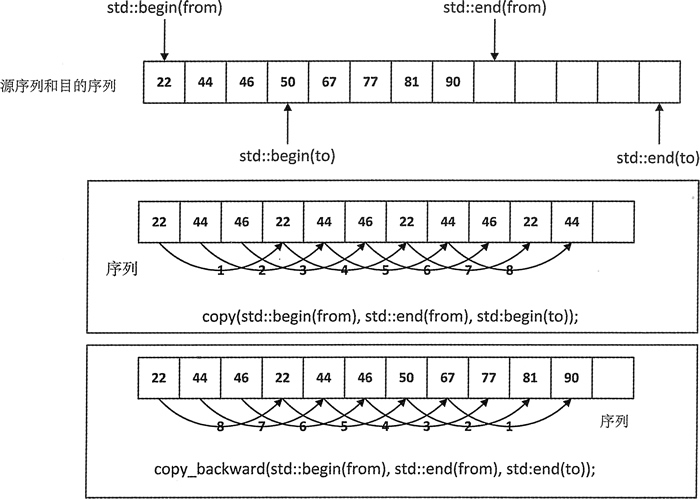

# C++ copy_backward(STL copy_backward)算法详解

不要被 copy_backward() 算法的名称所误导，它不会逆转元素的顺序。它只会像 copy() 那样复制元素，但是从最后一个元素开始直到第一个元素。

copy_backward() 会复制前两个迭代器参数指定的序列。第三个参数是目的序列的结束迭代器，通过将源序列中的最后一个元素复制到目的序列的结束迭代器之前，源序列会被复制到目的序列中，如图 1 所示。copy_backward() 的 3 个参数都必须是可以自增或自减的双向迭代器，这意味着这个算法只能应用到序列容器的序列上。

图 1 copy_backward() 的工作方式
图 1 说明了源序列 from 的最后一个元素是如何先被复制到目的序列 to 的最后一个元素的。从源序列的反向，将每一个元素依次复制到目的序列的前一个元素之前的位置。在进行这个操作之前，目的序列中的元素必须存在，因此目的序列至少要有和源序列一样多的元素，但也可以有更多。copy_backward() 算法会返回一个指向最后一个被复制元素的迭代器，在目的序列的新位置，它是一个开始迭代器。

我们可能会好奇，相对于普通的从第一个元素开始复制的 copy() 算法，copy_backward() 提供了哪些优势。

一个回答是，在序列重叠时，可以用 copy() 将元素复制到重叠的目的序列剩下的位置——也就是目的序列第一个元素之前的位置。如果想尝试用 copy() 算法将元素复制到同一个序列的右边，这个操作不会成功，因为被复制的元素在复制之前会被重写。如果想将它们复制到右边，可以使用 copy_backward()，只要目的序列的结束迭代器在源序列的结束迭代器的右边。图 2 说明了在将元素复制到重叠的序列的右边时，这两个算法的不同。


图 2 从右复制重叠序列
图 2 展示了在序列右边的前三个位置运用 copy() 和 copy_backward() 算法的结果。在想将元素复制到右边时，copy() 算法显然不能如我们所愿，因为一些元素在复制之前会被重写。在这种情况下，copy_backward() 可以做到我们想做的事。相反在需要将元素复制到 序列的左边时，copy() 可以做到，但 copy_backward() 做不到。

下面是一个说明 copy_backward() 用法的示例：

```
std::deque<string> song{ "jingle", "bells"，"jingle", "all", "the", "way"};
song.resize(song.size()+2); // Add 2 elements
std::copy_backward(std::begin(song), std::begin(song)+6, std::end(song));
std::copy(std::begin(song), std::end(song), std::ostream iterator <string> {std::cout, " "});
std::cout << std::endl;
```

为了能够在右边进行序列的反向复制操作，需要添加一些额外的元素，可以通过使用 deque 的成员函数 resize() 来增加 deque 容器的元素个数。copy_backward() 算法会将原有的元素复制到向右的两个位置，保持前两个元素不变，所以这段代码的输出如下：

jingle bells jingle bells jingle all the way