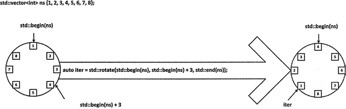

# C++ rotate(STL rotate)算法详解

rotate() 算法会从左边选择序列的元素。它的工作机制如图 1 所示。

图 1 rotate()算法的工作方式([点此查看大图](http://c.biancheng.net/uploads/allimg/180920/2-1P92010401J32.jpg))
为了理解如何旋转序列，可以将序列中的元素想象成手镯上的珠子。rotate() 操作会导致一个新元素成为开始迭代器所指向的第一个元素。在旋转之后，最后一个元素会在新的第一个元素之前。

rotate() 的第一个参数是这个序列的开始迭代器；第二个参数是指向新的第一个元素的迭代器，它必定在序列之内。第三个参数是这个序列的结束迭代器。图 1 中的示例说明在容器 ns 上的旋转操作使值为 4 的元素成为新的第一个元素，最后一个元素的值为 3。元素的圆形序列会被维持，因此可以有效地旋转元素环，直到新的第一个元素成为序列的开始。这个算法会返回一个迭代器，它指向原始的第一个元素所在的新位置。例如：

```
std::vector<string> words { "one", "two", "three", "four", "five","six", "seven", "eight"};
auto iter = std::rotate(std::begin(words), std::begin(words)+3, std::end(words));
std::copy(std::begin(words), std::end(words),std::ostream_iterator<string> {std::cout, " "});
std::cout << std::endl << "First element before rotation: " << *iter << std::endl;
```

这段代码对 words 中的所有元素进行了旋转。执行这段代码会生成如下内容：

four five six seven eight one two three
First element before rotation: one

输出说明 "four" 成为新的第一个元素，而且 rotate() 返回的迭代器指向之前的第一个元素"one"。

当然，不需要对容器中的全部元素进行旋转。例如：

```
std::vector<string> words { "one", "two", "three", "four", "five","six", "seven", "eight", "nine", "ten"};
auto start = std::find(std:rbegin(words), std::end(words), "two");
auto end_iter = std::find(std::begin(words), std::end(words), "eight");
auto iter = std::rotate(start, std::find(std::begin(words), std::end (words), "five") , end_iter);
std::copy(std::begin(words), std::end(words), std::ostream_iterator<string>{std::cout, " "});
std::cout << std::endl << "First element before rotation: " << *iter << std::endl;
```

这里用 find() 算法分别获取了和"two"、"eight"匹配的元素的迭代器。它们定义了被旋转的序列，这个序列是容器元素的子集。这个序列会被旋转为使"five"成为第一个元素，输出说明它是按预期工作的：

one five six seven two three four eight nine ten
First element before rotation: two