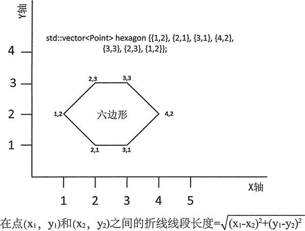

# C++ transform(STL transform)函数用法详解

transform() 可以将函数应用到序列的元素上，并将这个函数返回的值保存到另一个序列中，它返回的迭代器指向输出序列所保存的最后一个元素的下一个位置。

这个算法有一个版本和 for_each() 相似，可以将一个一元函数应用到元素序列上来改变它们的值，但这里有很大的区别。for_each() 中使用的函数的返回类型必须为 void，而且可以通过这个函数的引用参数来修改输入序列中的值；而 transform() 的二元函数必须返回一个值，并且也能够将应用函数后得到的结果保存到另一个序列中。

不仅如此，输出序列中的元素类型可以和输入序列中的元素类型不同。对于 for_each()，函数总是会被应用序列的元素上，但对于 transform()，这一点无法保证。

第二个版本的 transform() 允许将二元函数应用到两个序列相应的元素上，但先来看一下如何将一元函数应用到序列上。在这个算法的这个版本中，它的前两个参数是定义输入序列的输入迭代器，第 3 个参数是目的位置的第一个元素的输出迭代器，第 4 个参数是一个二元函数。这个函数必须接受来自输入序列的一个元素为参数，并且必须返回一个可以保存在输出序列中的值。例如：

```
std::vector<double> deg_C {21.0, 30.5, 0.0, 3.2, 100.0};
std::vector<double> deg_F(deg_C.size());
std::transform(std::begin(deg_C), std::end(deg_C), std:rbegin(deg_F),[](double temp){ return 32.0 + 9.0*temp/5.0; });
//Result 69.8 86.9 32 37.76 212
```

这个 transform() 算法会将 deg_C 容器中的摄氏温度转换为华氏温度，并将这个结果保存到 deg_F 容器中。为了保存全部结果，生成的 deg_F 需要一定个数的元素。因此第三个参数是 deg_F 的开始迭代器。通过用 back_insert_iterator 作为 transform() 的第三个参数，可以将结果保存到空的容器中：

```
std::vector<double> deg_F; // Empty container
std::transform(std::begin(deg_C), std::end(deg_C),std::back_inserter(deg_F),[](double temp){ return 32.0 + 9.0* temp/5.0; });
// Result 69.8 86.9 32 37.76 212
```

用 back_insert_iterator 在 deg_F 中生成保存了操作结果的元素；结果是相同的。第三个参数可以是指向输入容器的元素的迭代器。例如：

```
std::vector<double> temps {21.0, 30.5, 0.0, 3.2, 100.0}; // In Centigrade
std::transform(std::begin (temps), std::end(temps), std::begin(temps),[](double temp){ return 32.0 + 9.0* temp / 5.0; });
// Result 69.8 86.9 32 37.76 212
```

这里将 temp 容器中的值从摄氏温度转换成了华氏温度。第三个参数是输入序列的开始迭代器，应用第 4 个参数指定的函数的结果会被存回它所运用的元素上。

下面的代码展示了目的序列和输入序列是不同类型的情况：

```
std::vector<string> words {"one", "two", "three", "four","five"};
std::vector<size_t> hash_values;
std::transform (std::begin(words), std::end(words),std::back_inserter(hash_values),std::hash<string>()); // string hashing function
std::copy(std::begin(hash_values), std::end(hash_values),std::ostream_iterator<size_t> {std::cout," "});
std::cout << std::endl;
```

输入序列包含 string 对象，并且应用到元素的函数是一个定义在 string 头文件中的标准的哈希函数对象。这个哈希函数会返回 size_t 类型的哈希值，并且会用定义在 iterator 头文件中的辅助函数 back_inserter() 返回的 back_insert_iterator 将这些值保存到 hash_values 容器中。在笔者的系统上，这段代码产生的输出如下：

3123124719 3190065193 2290484163 795473317 2931049365

你的系统可能会产生不同的输出。注意，因为目的序列是由 back_insert_iterator 对象指定的，这里 transform() 算法会返回一个 back_insert_iterator<vector<size_T>> 类型的迭代器，因此不能在 copy() 算法中用它作为输入序列的结束迭代器。为了充分利用 transform() 返回的迭代器，这段代码可以这样写：

```
std::vector<string> words {"one", "two", "three", "four", "five"}; std::vector<size_t> hash_values(words.size());
auto end_iter = std::transform(std::begin(words),std::end(words), std::begin(hash_values), std::hash<string>()); // string hashing function
std::copy(std::begin(hash_values) , end_iter, std::ostream iterator<size t>{std::cout," "});
std::cout << std::endl;
```

现在，transform() 返回的是 hash_values 容器中元素序列的结束迭代器。

可以在 transform() 所运用的函数中为元素序列调用一个算法。下面举例说明：

```
std::deque<string> names {"Stan Laurel", "Oliver Hardy", "Harold Lloyd"};
std::transform(std::begin(names), std::end(names), std::begin(names),[](string& s) { std::transform(std::begin(s), std::end(s), std::begin(s), ::toupper);return s;})；
std::copy(std::begin(names), std::end(names), std::ostream iterator<string>{std::cout," "});
std::cout << std::endl;
```

transform() 算法会将 lambda 定义的函数应用到 names 容器中的元素上。这个 lambda 表达式会调用 transform()，将定义在 cctype 头文件中的 toupper() 函数应用到传给它的字符串的每个字符上。它会将 names 中的每个元素都转换为大写，因此输出为：

STAN LAUREL OLIVER HARDY HAROLD LLOYD

当然，也有其他更简单的方式可以得到相同的结果。

应用二元函数的这个版本的 transform() 含有 5 个参数：

*   前两个参数是第一个输入序列的输入迭代器。
*   第 3 个参数是第二个输入序列的开始迭代器，显然，这个序列必须至少包含和第一个输入序列同样多的元素。
*   第 4 个参数是一个序列的输出迭代器，它所指向的是用来保存应用函数后得到的结果的序列的开始迭代器。
*   第 5 个参数是一个函数对象，它定义了一个接受两个参数的函数，这个函数接受来自两个输入序列中的元素作为参数，返回一个可以保存在输出序列中的值。

让我们来思考一个关于几何计算的简单示例。一条折线是由点之间连续的线组成的。折线可以表示为一个 Point 对象的 vector，折线线段是加入连续点的线。如果最后一个点和前一个点相同，折线就是闭合的一个多边形。
图 1 一条表示六边形的折线
Point 被定义为一个类型别名，图 1 展示了一个示例：

```
using Point = std::pair<double, double>; // pair<x,y> defines a point
```

这里有 7 个点，因此图 1 中的六边形对象有 6 个折线段。因为第一个点和最后一个 点是相同的，这 6 条线段实际上组成了一个多边形——六边形。可以用 transform() 算法来 计算这些线段的长度：

```
std::vector<Point> hexagon {{1,2}, {2,1}, {3,1}, {4,2}, {3,3}, {2,3}, {1,2}};
std::vector<double> segments; // Stores lengths of segments
std::transform (std::begin (hexagon),std::end(hexagon) — 1, std::begin (hexagon) + 1, std::back_inserter(segments),[](const Points p1, const Points p2){return st d::sqrt((p1.first-p2.first)*(p1.first-p2.first) +(p1.second - p2.second)*(p1.second - p2.second)); });
```

transform() 的第一个输入序列包含六边形中从第一个到倒数第二个 Point 对象。第二个输入序列是从第二个 Point 对象开始的，因此这个二元函数调用的连续参数为点 1 和 2、点 2 和 3、点 3 和 4，依此类推，直到输入序列的最后两个点 6 和 7。图 1 展示了计算 (x1,y1) 和 (x2,y2) 两点之前距离的公式，作为 transform() 最后一个参数的 lambda 表达式实现的就是这个公式。线段的长度是由 lambda 表达式计算的，它们会被保存在 segments 容器中。我们可以用两种以上的算法来输出线段的长度和这个六边形的周长。例如：

```
std::cout << "Segment lengths: ";
std::copy(std::begin(segments), std::end(segments),std::ostream_iterator<double> {std::cout," "});
std::cout << std::endl;
std::cout << "Hexagon perimeter: "<< std::accumulate(std::begin(segments), std::end(segments), 0.0) << std::endl;
```

这里使用 copy() 算法来输出线段的长度。accumulate() 函数可以求出 segments 中元素值之和，从而得到周长。