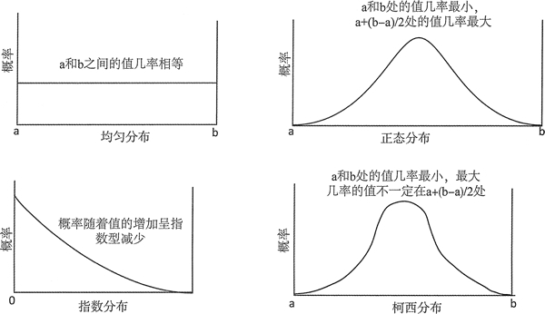

# 概率、分布和熵及其概述

生成随机数隐隐包含着统计学的一些概念，下面会对它们进行概述。本节只是为了让你熟悉这些概念，并且应该足以使你明白本章的其他内容，即使你可能从来没接触过这些概念。

## 什么是概率

概率的值在 0 和 1 之间，它可以衡量事件发生的可能性。0 说明事件永远不会发生，1 说明事件肯定会发生。投一次骰子得到 6 的概率，或者实际上得到任何可能值的概率，都是 1/6。得到任意数字的概率是 1。

通常，事件发生的概率是它发生的次数除以它可能发生的次数。如果事件发生的概率是 p，那么它不发生的概率为 1-p。这样就为生活提供了宝贵指导。例如，在英国买彩票中奖的概率，从 49 个数中选取 6 个数，大约是 1/14 000 000；这意味着不中的概率大约为 13 999 999/ 14 000 000，基本是不可能中奖的。从这个角度来说，被闪电击中的概率是中彩票的 10 倍。

## 什么是分布

分布描述的是假设变量为序列中某个特定值的可能性。分布可以是离散或连续的：

离散分布描述的是假设变量是一组固定值中任意一个值的概率。根据定义，整数值的分布就是离散分布。用一个变量来表示投一次骰子的结果就是一个典型的离散分布的示例，它只能是从 1 到 6 的整数值。在离散分布中，所有可能值的概率之和为 1。

连续分布表示的是假设连续变量是序列中某个特定值的概率。连续变量可以是序列中的任意一个值，一天中某个给定时间的温度就是一个示例。

用来表示一个连续随机变量在某个范围内的值的概率的曲线被叫作概率密度函数 (Probability Density Function, PDF)。变量为给定值时，概率是点在 PDF 上对应的值。假设变量为 a 到 b 之间的任意值，变量的概率就是 a 到 b 之间的 PDF 曲线下方的面积。这意味着在 a 到 b 之间的 PDF 曲线下方的面积必须是 1，因为变量总为这个范围内的一个可能值。

离散变量的 PDF 被叫作离散概率函数。离散变量的不同值的概率通常使用图形的一套点或竖条来表示。像之前所说的那样，概率之和加起来必须为 1。

在现实世界中，有很多用来模型化事件是如何发生或如何测量的分布。它们通常被描述为数学公式，当以图形的形式展示时，就可以很容易地理解它们。图 1 展示了 4 个分布的示例。

图 1 分布示例
在图 1 中，每个图表表示的是范围内可能值的出现概率。横轴记录的是变量的值；竖轴是概率。现实世界中不同种类变量的分布有很大的不同。在图 1 展示的均匀分布中，所有可能值的概率是相等的；均匀分布可以用来表示投掷一次骰子的结果。正态分布表示的是平均值每一侧的不同值。灯泡的寿命可能就是一个正态分布，因为灯泡的工作时间周期是分布在平均值两侧的，一般老式灯泡的灯丝可以使用 2000 小时，最新的 LED 灯泡被认为可以使用超过 15 000 小时，尽管后者在实践中并没有被确认。指数分布一般和随着时间推移而发生的事件相关：例如，放射性材料射出粒子的时间区间。

图 1 中的第 4 个例子是柯西分布。在图示中，它看起来和正态分布隐约相似，但它们并不相同，曲线形状的差别可以很大。柯西分布在现实生活中出现的频率少于图 1 中所示的其他分布；它适用的一个场景是，量子力学的非稳态能量分布。有时候，会用不同的名称来引用一个分布；例如，正态分布也被叫作高斯分布。我们将会看到，STL 甚至支持更多其他种类的分布。

## 什么是熵

熵是对混乱程度的度量。当宇宙达到熵的最大值时，宇宙会发生热寂，根据热力学第二定律，这是不可避免的。但还不会发生一我们仍然有时间完成这本书。对于数据而言，熵的含义是由美国数学家克劳德·香农提出的。

熵可以度量表示信息的效率，也可以度量数据的混乱程度。压缩文件通常用的无损算法，如果用它来生成一个 ZIP 文件，会增加熵。如果将文件压缩成 ZIP 文档，可以发现文件的大小并没有大大减小，这是因为原始文件有很高的熵一换句话说，它是非常随机的，因此不能被更有效地表示。

英文文本的熵相当低，因为它不是特别随机。包含本章内容的英文文件如果被压缩到一个 ZIP 文件中，它的大小会大大减小，因为它不是随机数据。文件中的随机内容越少，数据的熵越低，压缩的潜力就越大。

在随机数生成的场景中，熵可以度量比特序列的随机性。最大的熵意味着全部随机序列的每一个比特都可能是 1 或 0；这种序列的信息量是最大的，因为信息不能被表示为更短的序列。最小的熵意味着序列是完全可预测的。转换其中的 1 和 0，或者诸如 1010 1010 1010... 或 1100 1101 1100 1101... 这样的序列，它们有很低的熵。这种序列的信息量是很低的，因为它们是可预测的，并且可以很容易地用更短的序列来表示这些信息。当生成随机数时，希望可以使序列的熵最大，尽管这和生成这些值所需要计算的开销是不平衡的。