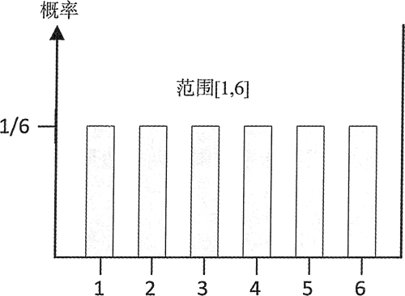

# C++ uniform_int_distribution 离散均匀分布类用法详解

在均匀分布中，范围中内所有值都是等可能性的。均匀分布可以离散或连续的，其中，离散均匀分布如图 1 所示：

图 1 离散均匀分布
注意图 1 中的范围规范。离散均匀分布包含上边界和下边界。

uniform_int_distribution 类模板定义了分布对象，它返回的是均勻分布在闭合范围 [a，b] 内的随机整 &。模板参数的类型是生成的整数的类型，默认类型是 int: 定义在类中的类型别名 result_type 和分布所生成的值的类型相对应。模板类型参数只接受整数类型。

一个构造函数有两个用来定义范围的上边界和下边界；下边界的默认值为 0，上边界的默认值是这种类型所生成的最大值。例如:

```
std::uniform_int_distribution<> d; // Distribution over 0 to max for type int, inclusive
std::cout << "Range from 0 to "<< std::numeric_limits<std::uniform_int_distribution<> :: result_type>::max()<<std::endl; // Range from 0 to 2147483647
```

第一条语句调用默认的构造函数来生成分布对象 d。所有的参数都是默认的，因此生成值的类型是 int，范围从 0 到 int 类型的最大值。最后的注释显示了得到的范围的界限；上边界是 int 类型的最大值，由定义在 limits 头文件中的函数模板 numeric_imits() 生成。获取范围的界限有很多更加简单的方式。可以调用所有分布对象都有的成员函数 min() 和 max()：

```
std::cout <<"Range from " << d.min () << " to " << d.max () << std::endl;
```

在这种情况下，还有另外一种可能。uniform_int_distribution 类模板定义了成员函数 a() 和 b()，它们可以分别返回范围的下边界和上边界。因此可以将前面的语句这样写：

```
std::cout << "Range from "<< d.a() << " to " << d.b() << std::endl;
```

成员函数 a() 和 b() 的名称比 min() 和 max() 更能说明它们所返回的值是如何和均勻分布关联的。

如果只想分布的整数范围大于或等于给定值，只需要提供构造函数的第一个参数：

```
std::uniform_int_distribution<> d {500};
std::cout << "Range from "<< d.a() << " to " << d.b ()<< std::endl; // Range from 500 to 2147483647
```

当然，构造函数的参数也可以是负数。一般来说，需要指定范围的两个边界，这里有几个这样做的实际示例：

```
std::uniform_int_distribution<long> dist {-5L, 5L};
std::random_device rd; // Non-deterministic seed source
std::default_random_engine rng {rd()}; // Create random number generator
for(size_t i{}; i < 8; ++i)
    std::cout << std::setw (2) << dist (rng) << " ";
// -3 0 5 1 -2 -4 0 4
```

第一条语句定义了一个用来生成 long 类型随机整数的分布对象。范围从 -5 到 +5，所 以这个分布对象能够返回 11 个可能的值。因此，每个可能值的出现概率为 1/11。通常，对于范围在 [a，b] 内的整数的均匀分布，返回的任何特定值的概率都是 1/(1+b-a)。在本人系统上，所得到的输出如最后一句代码的注释所示，它肯定和在你系统上得到的不一样。

可以调用均匀分布的成员函数 param() 来改变它所产生的值的范围。这里会向成员函数 param() 传入一个均匀分布：指定新范围的 uniform_int_distribution 类，它的类型是由被分布类所定义的 param_type 别名指定的。也可以无参数地调用 param() 来获取封装了这个分布的当前参数设置的对象。下面的代码说明了这两种可能：

```
std::uniform_int_distribution<> dist {0, 6};
std::random_device rd;  // Non-determinstic seed source
std::default_random_engine rng {rd()}; // Create random number generator
for(size_t i{}; i < 8; ++i)
    std::cout << std::setw (3)<< dist (rng) << " "; // first output line
std::cout << std::endl;
//Save old range and set new range

auto old_range = dist.param();  // Get current params
dist.param(std::uniform_int_distribution<>::param_type {-10,20}); for(size_t i{}; i < 8; ++i)
    std::cout << std::setw (3) << dist (rng) <<" "; // Second output line
std::cout << std::endl;
// Restore old range...
dist.param(old_range);
for(size_t i {}; i < 8; ++i)
    std::cout << std::setw(3) << dist(rng) << " ";// Third output line
std::cout << std::endl;
```

这段代码的输出如下：

6   1   5   6   1   3   6   2
19  16  15  5   0   7   6   -8
0   0   0   3   2   6   6   5

可以通过定义别名来简化 para() 的参数类型：

```
using Range = std::uniform_int_distribution<>::param_type;
```

现在可以按如下方式用 param() 调用来设置新的范围：

```
dist.param(Range {-10,20});
```

有很多场景能用到修改范围的界限的能力。一个显然的应用是，在一个程序中，当我们需要几个给定类型值的均匀分布时，每一个都需要一套不同的参数。这时候就可以只使用一个分布对象，然后根据需要在程序的任何地方设置参数。