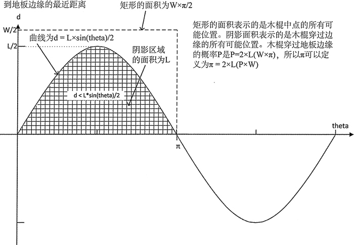

# C++ uniform_real_distribution 连续均匀分布类模板用法详解

uniform_real_distribution 类模板定义了一个默认返回 double 型浮点值的连续分布。可以按如下方式生成一个返回值在范围 0,10) 内的分布对象：

```
std::uniform_real_distribution<> values {0.0, 10.0};
std::random_device rd; // Non-de terrains tic seed source
std::default_random_engine rng {rd()}; // Create random number generator for(size_t i {}; i<8; ++i)
std::cout << std::fixed << std::setprecision(2)<< values (rng) <<" ";
// 8.37 6.72 6.41 6.08 6.89 6.10 9.75 4.07
```

生成和使用 uniform_real_distribution 函数对象的方式和 uniform_int_distribution 有密切的相似之处。可以将一个随机数生成器对象作为参数值给分布函数对象来获取一个随机值。可以通过调用对象的成员函数 pamm() 来获取和设置范围的界限。除了返回分布界限的成员函数 min() 和 max()，uniform_real_distribution 对象也有成员函数 a() 和 b()。注意，连续分布的范围是半开放的，分布对象返回值的范围不包括上边界。

现实世界中，能够应用均匀连续分布的变量是很少的。例如，和天气相关的参数的测量中，范围值并不是等可能性的。当我们看手表时，秒针的位置可能是一个均匀分布，但这没有什么用，这可能是真正的示例。均匀连续分布被用在应用于金融业的蒙特卡罗方法中，也被用到了工程和科学中。将它们放到一个使用连续均分分布或 π 的值程序。

## 使用连续均匀分布

你知道可以用一根木棍来确定 π 的值吗？当然，并不是让你用木棍来烕胁一个数学家，从而让他告诉你 π 的值，而是可以扔任意一根直的物品一铅笔甚至法拉克福香肠都可以。必须是一块光秃秃的带有地板的地面，并且扔的物品也必须是直的，它的长度必须小于地板的长度。过程很简单一只需要数扔木棍的次数，以及木棍落地时，它穿越地板边缘的次数。

为了得到一个不错的结果，需要将棍子拋掷一定的次数。当然，这会花费一些时间，并且还有点乏味，并不是说有多累。在几组均匀分布的帮助下，我们可以通过电脑来模拟拋掷并计算处 π 的值。图 1 展示了木棍在地面上的随机位置以及它和地板的关系。为了解释发生了什么，需要用到一点数学知识，但并不难。

![图 1 地板上的木棍图 1 显示了木棍在任意位置和地板底部边缘的距离以及相对地板的角度。木棍总会落到一个地板或另一个地板上，因此我们只需要考虑一个地板。图 1 显示了木棍和地板边缘相交的条件。在这种情况下，由 p1 和 p2 表示的木棍的任意一端在地板的上面或它的边缘。因为木棍只会穿过一个地板的边缘，从木棍的中心到闭合边缘之间的距离必须小于 L*sin(theta)/2。我们会将木棍拋掷很多次，然后用 throws 来记录抛掷的总次数，木棍和地板的边缘重叠的次数记为 hits。因此现在我们有两个计数，我们如何从它们得到 π 值？图 2 会有些帮助。
图 2 通过从木棍穿过地板边缘的概率来确定 π 值
木棍穿过地板边缘的概率 P 为 hit 和 throws 的比率，因此我们能用 P 以及图 2 中最 后的等式来得到 π 值。π 值是下面这个表达式的结果：

2*stick_length*throws/(board_width*hits)

现在我们知道它是如何工作的了。下面是它的代码实现：

```
// Finding pi by throwing a stick
#include <iostream>                                             // For standard streams
#include <random>                                               // For distributions, random number gen
#include <cmath>                                                // For sin() function

int main()
{
    const double pi = 3.1415962;
    double stick_length {};                                       // Stick length
    double board_width {};                                        // Board width

    std::cout << "Enter the width of a floorboard: ";
    std::cin >> board_width;
    std::cout << "Enter the length of the stick (must be less than " << board_width << "): ";
    std::cin >> stick_length;
    if(board_width < stick_length) stick_length = 0.9*board_width;

    std::uniform_real_distribution<> angle {0.0, pi};             // Distribution for angle of stick
    std::uniform_real_distribution<> position {0.0, board_width}; // Distribution for stick center position, relative to board edge
    std::random_device rd;                                        // Non-deterministic seed source
    std::default_random_engine rng {rd()};                        // Create random number generator
    const size_t throws {5'000'000};                              // Number of random throws
    size_t hits {};                                               // Count of stick intersecting the board

    // Throw the stick down throws times
    for(size_t i {}; i < throws; ++i)
    {
        double y {position(rng)};
        double theta {angle(rng)};
        // Check if the stick crosses the edge of a board
        if(((y + stick_length*sin(theta) / 2) >= board_width) || ((y - stick_length*sin(theta) / 2) <= 0))
            ++hits;                                                   // It does, so increment count
    }

    std::cout << "Probability of the stick crossing the edge of a board is: "<< (static_cast<double>(hits) / throws) << std::endl;
    std::cout << "Pi is: " << (2 * stick_length*throws) / (board_width*hits) << std::endl;
    return 0;
}
```

你可能已经看到，确定 π 值的这个程序中有一点小小的瑕疵，在求 π 值之前需要知道它的值。然而，它仅仅是一个模拟。唯一的取代方式是真正地扔 5 000 000 次木棍，如果身体不错并且有一根耐用的木棍的话，这可能也是一个选择。如果每 3 秒扔一次，需要大约 8 个月一而且还不能睡觉或吃饭……

相对于地板边缘的木棍中心的随机位置是由 position 分布对象生成的，木棍在每个位置的角度是由 angle 分布生成的。循环体中实现了图 1 中的计算，循环后的代码使用了图 2 中的公式。在你的系统上可以将扔木棍的次数改为合理的值。该程序得到的输出如下：

Enter the width of a floorboard: 12
Enter the length of the stick (must be less than 12): 5
Probability of the stick crossing the edge of a board is: 0.265177
Pi is: 3.14256

当然，运行之间的输出会有所不同，因为程序每次执行时会产生不同的随机序列。木 棍相对于地板的长度也会受此影响，throws 的大小也一样。

注意，图 2 中曲线下的阴影面积就是木棍的长度，这需要一点微积分的知识，知道即可，无需了解推导过程。