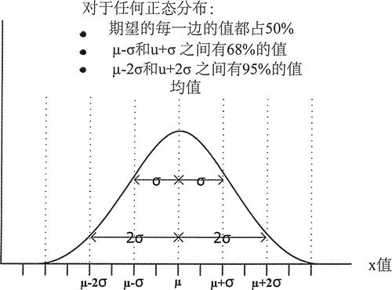
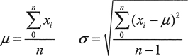

# C++ normal_distribution 高斯正态分布函数用法详解

图 1 显示的是正态(或高斯)分布。它是一条连续的贝尔曲线，期望两边的值是相等的，可以理解为期望就是平均值。它是一个概率分布，因此曲线下方的面积是 1。正态分布是由两个参数完全定义的：期望和标准差，它们是衡量期望两边的值如何分布的一种方式。


图 1 正态分布
期望和标准差分别是用希腊字母 μ 和 σ 来表示的，变量 x 有 n 个样本，这些是由下面的公式定义的：


因此，期望就是值的和除以值的个数一换句话说，也就是平均值。可以通过值和期望的差值的平方子和除以 n-1，然后对结果开方来得到标准差。对于不同的期望和标准差的值，正态分布的相对宽度和高度分布曲线的变化是相当大的。但是，分布值总是如图 1 所示。这意味着，如果知道一个符合正态分布的变量的期望和标准差，例如在大量人口中个体的身高，就可以知道 95% 的人身高不超过期望的 2σ。标准正态分布的期望为 0，标准差为 1。

uniform_distribution 模板定义了可以产生随机浮点值的分布对象类型，默认是 double 类型。默认构造函数创建的是标准正态分布，因此期望是 0，方差是 1.0:

```
std::normal_distribution<> dist; // mu: 0 sigma: 1
```

下面展示了如何创建一个有特定值和标准差的正态分布：

```
double mu {50.0}, sigma {10.0};
std::normal_distribution<> norm {mu, sigma};
```

这里定义了一个生成 double 值的分布对象，期望为 50.0，标准差是 10.0。为了生成值，可以将一个随机数生成器传给 norm 函数对象。例如：

```
std::random_device rd;
std::default_random_engine rng {rd()};
std::cout << "Normally distributed values: "<< norm (rng) << " " << norm (rng) << std::endl; // 39.6153 45.5608
```

可以通过调用对象的成员函数 mean() 和 stddev() 来获取它的期望值和标准差：

```
std::cout<<"mu: "<< norm.mean () << " sigma: " << norm.stddev ()<< std::endl; // mu: 50 sigma: 10
```

通过调用无参数的成员函数 param()，可以得到一个封装了这两个值的 param_type 对象。为了设置期望或标准差，需要将一个 param_type 对象传给成员函数 Pamm()。分布类有用来获取期望和标准差的成员，param_type 对象拥有和它们的名字相同的成员函数。下 面是一个示例：

```
using Params = std::normal_distribution<>::param_type; // Type alias for readability
double mu {50.0}, sigma {10.0};
std::normal_distribution<> norm {mu, sigma};// Create distribution
auto params = norm.param(); // Get mean and standard deviation
norm.param(Params {params.mean(),params.stddev() + 5.0}); // Modify params
std::cout << "mu: "<< norm.mean() << " sigma: " << norm.stddev ()<< std::endl; // mu: 50 sigma: 15
```

这里调用无参数的 param() 来获取包含期望和方差的 param_type 对象。在第二个 param() 调用中，通过传入一个 Pams 对象将标准差增加了 5.0。

可以通过传入一个 param_type 对象作为一个分布对象调用的第二个参数来临时设置期望和标准差：

```
using Params = std::normal_distribution<>::param_type; // Type alias for readability
std::random_device rd;
std::default_random_engine rng {rd()};
std::normal_distribution<> norm {50.0, 10.0}; // Create distribution
Params new_p {100.0, 30.0};// mu=100 sigma=30
std::cout << norm(rng, new_p) << std::endl; // Generate value with new_p: 100.925
std::cout << norm,mean() << " " << norm.stddev()<< std::endl;// 50 10
```

new_p 定义的期望和标准差只会被应用到它被作为第二个参数传入的 norm 的执行中。原始的期望和标准差会被应用到随后的没有第二个参数的 norm 调用中。

成员函数 min() 和 max() 返回的是分布可以产生的最小值和最大值。对于分布来说，这并不是特别有用。因为返回值的类型可以这样表示最大值和最小值：

```
std::cout << "min: " << norm.min () << " max: " << norm.max ()<< std::endl; // min:4.94066e-324 max: 1.7 9769e+308
```