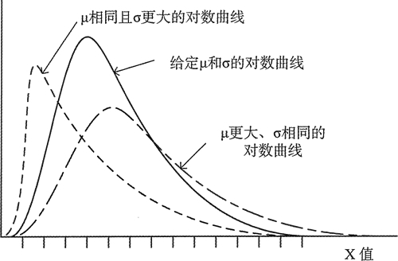

# C++ lognormal_distribution 对数分布随机数函数用法详解

对数分布和表示随机变量的正态分布有关，这些值的对数分布是一个正态分布。对数分布是由期望和标准差定义的，但这些参数和变量无关，它们和变量的对数相关。具体来说，一个期望为 μ 标准差为 σ 的随机变量 x 的对数分布，说明 log x 是一个期望为 μ、标准差为 σ 的正态分布。图 1 展示了一个对数分布的曲线，以及改变期望和标准差时的效果。

图 1 对数分布
对于大自然中的很多随机变量来说，对数分布比正态分布更接近概率的表示。病人的感染率就是一个对数分布模式。

lognormal_distribution 模板的一个实例定义了一个默认返回浮点类型值的对数分布对象。 下面是一个期望为 5.0、标准差为 0.5 的对数分布对象的定义：

```
double mu {5.0}, sigma {0.5};
std::lognormal_distribution<> norm {mu, sigma};
```

构造函数的参数以 0 和 1 为默认值，因此省略了定义标准对数分布的参数。还有另一个构造函数，它接受封装了期望和标准差的 param_type 对象作为参数。

lognormal_distribution 对象也有所有分布类型都有的成员函数，如成员函数 m() 和 s()，它们分别返回期望和标准差。可以像看到的其他分布那样去使用这个对象，因此让我们在示例中试试它的用法。

## 使用对数分布

为了不绘制不包含星号的行，这个示例会对前面章节中的函数模板 dist_plot() 做一点修改。这是因为对数分布曲线会有很长的尾巴，不需要去欣赏这个分布的形状。plot_data() 的最后一条语句为：

```
std::for_each(std::begin(plot_data), std::end(plot_data),max_f, width
{ if ((width*v.second)/max_f > 0)
    std::cout << std::setw(3) << v.first << "-丨"<< string((width*v.second)/max_f,"*") << std::endl;
})；
```

下面是程序代码：

```
// Checking out lognormal distributions
#include <random>                                          // For distributions and random number generators
#include <algorithm>                                       // For generate(), for_each(), max_element(), transform()
#include <numeric>                                         // For accumulate()
#include <iterator>                                        // For back_inserter()
#include <vector>                                          // For vector container
#include <map>                                             // For map container
#include <cmath>                                           // For pow(), round(), log() functions
#include <iostream>                                        // For standard streams
#include <iomanip>                                         // For stream manipulators
#include <string>
using std::string;
using Params = std::lognormal_distribution<>::param_type;

// Template to plot a distribution from a range of sample values
template<typename Iter>
void dist_plot(Iter& beg_iter, Iter& end_iter, size_t width = 90)
{
    // Create data for distribution plot
    std::map<int, size_t> plot_data; // Elements are pair<value, frequency>

    auto pr = std::minmax_element(beg_iter, end_iter, [](const double v1, const double v2) {return v1 < v2; });
    for(int n {static_cast<int>(*pr.first)}; n < static_cast<int>(*pr.second); ++n)
    plot_data.emplace(n, 0);

    // Create the plot data
    std::for_each(beg_iter, end_iter,&plot_data { ++plot_data[static_cast<int>(std::round(value))]; });

    // Find maximum frequency to be plotted - must fit within page width
    size_t max_f {std::max_element(std::begin(plot_data), std::end(plot_data),[](const std::pair<int,int>& v1, const std::pair<int,int>& v2) { return v1.second < v2.second; })->second};

    // Draw distribution as histogram
    std::for_each(std::begin(plot_data), std::end(plot_data),
    max_f, width
    {
        if((width*v.second) / max_f > 0)
            std::cout << std::setw(3) << v.first << " -| " << string((width*v.second) / max_f, '*') << std::endl;
    });
}

int main()
{
    std::random_device rd;
    std::default_random_engine rng {rd()};
    std::lognormal_distribution<> log_norm;
    double mu {}, sigma {};
    const size_t sample_count {20000};
    std::vector<double> values(sample_count);
    std::vector<double> log_values;
    while(true)
    {
        std::cout << "\nEnter values for the mean and standard deviation, or Ctrl+Z to end: ";
        if((std::cin >> mu).eof()) break;
        std::cin >> sigma;
        log_norm.param(Params {mu, sigma});
        std::generate(std::begin(values), std::end(values), [&log_norm, &rng] { return log_norm(rng); });

        // Create data to plot lognormal curve
        dist_plot(std::begin(values), std::end(values));

        // Create logarithms of values
        std::vector<double> log_values;
        std::transform(std::begin(values), std::end(values), std::back_inserter(log_values),[] (double v){ return log(v); });

        // Create data to plot curve for logarithms of values
        std::cout << "\nThe distribution for logarithms of the values:\n";
        dist_plot(std::begin(log_values), std::end(log_values));

        // Get the mean and standard deviation -  for the logarithms of the values
        double mean {std::accumulate(std::begin(log_values), std::end(log_values), 0.0) / log_values.size()};

        std::transform(std::begin(log_values), std::end(log_values), std::begin(log_values),&mean { return std::pow(value - mean, 2); });
        double s_dev {std::sqrt(std::accumulate(std::begin(log_values), std::end(log_values), 0.0) / (log_values.size() - 1))};
        std::cout << "For generated values, mean = " << mean << " standard deviation = " << s_dev << std::endl;
    }
}
```

各位读者可自行拷贝代码查看运行结果。通过查看结果，可以看到对数的值是正态分布的，它是一幅标准差很小的狭窄图形。