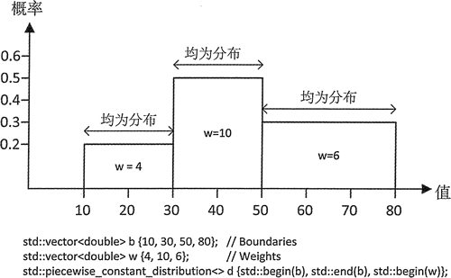

# C++ piecewise_constant_distribution 分段常数分布随机数用法详解

piecewise_constant_distribution 模板定义了一个在一组分段子区间生成浮点值的分布。给定子区间内的值是均匀分布的，每个子区间都有自己的权重。n 个区间边界可以定义 n-1 个子区间和 n-1 个可以运用到子区间的权重，由这 n 个区间边界定义一个对象，图 1 说明了这一点。

图 1 中的分布定义了 3 个区间，每个都有自己的权重。这 3 个区间是由定义在容器 b 中的 4 个边界值定义的。每个区间都有一个由容器 w 中的元素定义的权重。它的前两个参数是指定边界序列的迭代器，第三个参数是指向权重序列的第一个元素的迭代器。每个区间内的值都是均勻分布的，特定区间内的随机值的概率是由这个区间的权重决定的。


图 1 分段常数分布
除了所有分布都实现的成员函数之外，piecewise_constant_distribution 还有成员函数 intervals() 和 densities()，它们分别返回区间的边界和区间内值的概率密度；这两个函数返回的值都是 vector 容器。通过尝试和图 1 所示的相似的分布，我们可以运用这些成员，并深入了解这个分布的效果。但区间很狭窄，因此输出需要的空间很少：

```
// Demonstrating the piecewise constant distribution
#include <random>                                        // For distributions and random number generator
#include <vector>                                        // For vector container
#include <map>                                           // For map container
#include <utility>                                       // For pair type
#include <algorithm>                                     // For copy(), count(), remove()
#include <iostream>                                      // For standard streams
#include <iterator>                                      // For stream iterators
#include <iomanip>                                       // For stream manipulators
#include <string>                                        // For string class
using std::string;

int main()
{ 
    std::vector<double> b {10, 20, 35, 55};                 // Intervals: 10-20, 20-35, 35-55
    std::vector<double> w {4, 10, 6};                       // Weights for the intervals
    std::piecewise_constant_distribution<> d {std::begin(b), std::end(b), std::begin(w)};

    // Output the interval boundaries and the interval probabilities
    auto intvls = d.intervals();
    std::cout << "intervals: ";
    std::copy(std::begin(intvls), std::end(intvls), std::ostream_iterator<double>{std::cout, " "});
    std::cout << "  probability densities: ";
    auto probs = d.densities();
    std::copy(std::begin(probs), std::end(probs), std::ostream_iterator<double>{std::cout, " "});
    std::cout << '\n' << std::endl;

    std::random_device rd;
    std::default_random_engine rng {rd()};
    std::map<int, size_t> results;  //Stores and counts random values as integers
    // Generate a lot of random values...
    for(size_t i {}; i < 20000; ++i)
        ++results[static_cast<int>(std::round(d(rng)))];

    // Plot the integer values
    auto max_count = std::max_element(std::begin(results), std::end(results),[](const std::pair<int, size_t>& pr1, const std::pair<int, size_t>& pr2)
                      { return pr1.second < pr2.second; })->second;
    std::for_each(std::begin(results), std::end(results),max_count
                                   { if(!(pr.first % 10))  // Display value if multiple of  10
                                       std::cout << std::setw(3) << pr.first << "-|";
                                     else
                                       std::cout << "    |";
                                     std::cout << std::string(pr.second * 80 / max_count, '*')<< '\n'; });
}
```

这样就生成了一个我们之前看到的区间和权重的分布，并用这个分布生成了大量的值，然后在将它们转换为整数后，将这些值的出现频率绘制成直方图。值会在页的下面运行，条形图从左到右地表示相对频率。

该程序的输出如下：

intervals: 10 20 35 55   probability densities: 0.02 0.0333333 0.015

10-|***********************
    |***********************************************
    |****************************************
    |*******************************************
    |**********************************************
    |********************************************
    |**********************************************
    |**********************************************
    |***********************************************
    |********************************************
20-|**********************************************************
    |************************************************************************
    |**************************************************************************
    |***************************************************************************
    |******************************************************************************
    |*****************************************************************************
    |********************************************************************************
    |***********************************************************************
    |****************************************************************************
    |***************************************************************************
30-|**************************************************************************
    |*******************************************************************************
    |******************************************************************************
    |*************************************************************************
    |***************************************************************************
    |*******************************************************
    |**********************************
    |*********************************
    |******************************
    |***********************************
40-|***********************************
    |**********************************
    |********************************
    |*******************************
    |******************************
    |***********************************
    |*********************************
    |******************************
    |********************************
    |**********************************
50-|*************************************
    |*******************************
    |*********************************
    |*********************************
    |*********************************
    |***************

输出中有趣的地方是概率密度的值，以及第一个和最后一个区间内条形图的相对长度。这两个区间的权重分别为 4 和 6，因此值在第一个区间的概率是 4/20，也就是 0.2；值在第二个区间的概率为 10/20，也就是 0.5；值在最后一个区间的概率是 6/20，也就是 0.3。然而，最后一个区间输出的条形图低于第一个区间，这似乎和概率有些矛盾。无论如何，输出中的概率密度都是不同的，为什么会这样？

原因在于它们是不同的。概率密度是区间内给定值出现的概率，而不是随机值出现在区间内的概率，一个值的概率密度与区间值出现概率除以区间的值的范围是对应的。因此，这个 3 个区间内值的概率密度分别为 0.2/10、0.5/15、0.3/20，幸运的是，这和输出是相同的。最后一个区间得到的值恰好是第一个区间的两倍，但它所跨越的范围更大，因此条形图更短。因此，条形图的长度反映了概率密度。