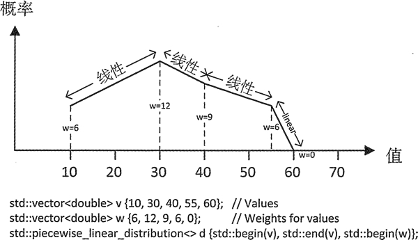
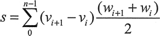
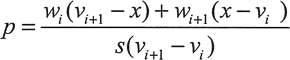

# C++ piecewise_linear_distribution 分段线性分布随机数用法详解

piecewise_linear_distribution 模板定义了浮点值的连续分布，它的概率密度函数是从一系列的样本值所定义的点得到的。每个样本值的权重都决定了它的概率密度值。图 1 展示了一个示例。
图 1 分段线性分布图 1 展示了由 5 个定义在容器 v 中的样本值确定的分布。每个值都有权重，权重是由 w 容器中对应的元素定义的，每个权重确定了对应值的概率密度。一个样本和另一个样本之间的概率密度值是线性的，在这两个样本的概率密度之间。构造函数的前两个参数是指定值序列的迭代器，第三个参数指向 weights 序列中第一个元素的迭代器。这个以分段线性曲线表示概率密度的分布会生成从 10 到 60 的随机值。分布中的样本值可以通过调用它的成员函数 intervals() 来获取。可以通过调用这个分布对象的 densities() 来得到一个包含这些概率密度的 vector 容器。确定整个序列中值的概率密度有些复杂。整个概率曲线下的面积表示的是整个序列中出现的任何值的概率，因此必须是 1。为了适应这种情况，区间内值的概率可以按如下方式来计算，首先计算出定义区间的权重值的平均数乘以区间的长度之和。因此，s 可以由下面这个等式定义：

 v[i] 是样本值，w[i] 是它们对应的权重。两个样本值之间的区间内任意值 x 的概率是 p，[v[i] ,v[i] +1) 是由样本值概率的线性组合决定的，每个区间末尾所共享的概率和 x 到样本值的距离成正比。下面用数学术语来表示 x 的概率：
在图 1 所示的示例中，s 为 (30-10)x(12+6)/2+(40-30)x(9+12)/2+(55-40)x(6+9)/2+(60-55)x(0+6)/2，等于 412.5。第 i 个样本值的概率为 w[i] /s,因此图 1 中的概率值为 6/412.5、12/412.5、9/412.5、6/412.5 和 0/412.5。计算器指出它们分别对应于 0.0145、0.029、0.0218、0.0145 和 0。这里有一个示例，可以展示这是否正确，而且可以展示分段线性分布的全部特性：

```
// Demonstrating the piecewise linear distribution
#include <random>                                        // For distributions and random number generator
#include <vector>                                        // For vector container
#include <map>                                           // For map container
#include <utility>                                       // For pair type
#include <algorithm>                                     // For copy(), count(), remove()
#include <iostream>                                      // For standard streams
#include <iterator>                                      // For stream iterators
#include <iomanip>                                       // For stream manipulators
#include <string>                                        // For string class
using std::string;

int main()
{
    std::vector<double> v {10, 30, 40, 55, 60};             // Sample values
    std::vector<double> w {6, 12, 9, 6, 0};                 // Weights for the samples
    std::piecewise_linear_distribution<> d {std::begin(v), std::end(v), std::begin(w)};

    // Output the interval boundaries and the interval probabilities
    auto values = d.intervals();
    std::cout << "Sample values: ";
    std::copy(std::begin(values), std::end(values), std::ostream_iterator<double>{std::cout, " "});
    std::cout << "  probability densities: ";
    auto probs = d.densities();
    std::copy(std::begin(probs), std::end(probs), std::ostream_iterator<double>{std::cout, " "});
    std::cout << '\n' << std::endl;

    std::random_device rd;
    std::default_random_engine rng {rd()};
    std::map<int, size_t> results;                          //Stores and counts random values as integers
                                                          // Generate a lot of random values...
    for(size_t i {}; i < 20000; ++i)
        ++results[static_cast<int>(std::round(d(rng)))];

    // Plot the integer values
    auto max_count = std::max_element(std::begin(results), std::end(results),[](const std::pair<int, size_t>& pr1, const std::pair<int, size_t>& pr2)
    { return pr1.second < pr2.second; })->second;
    std::for_each(std::begin(results), std::end(results),max_count
    { if(!(pr.first % 10))  // Display value if multiple of  10
    std::cout << std::setw(3) << pr.first << "-|";
    else
    std::cout << "    |";
    std::cout << std::string(pr.second * 80 / max_count, '*')<< '\n'; });
}
```

该程序的输出结果为：

Sample values: 10 30 40 55 60   probability densities: 0.0145455 0.0290909 0.0218182 0.0145455 0

 10-|**********************
    |*******************************************
    |*******************************************
    |***************************************
    |*********************************************
    |*****************************************************
    |**************************************************
    |*********************************************************
    |********************************************************
    |**************************************************************
 20-|*********************************************************
    |*************************************************************
    |************************************************************
    |******************************************************************
    |******************************************************************
    |**********************************************************************
    |***************************************************************************
    |*****************************************************************************
    |******************************************************************************
    |*******************************************************************************
 30-|*****************************************************************************
    |********************************************************************************
    |****************************************************************************
    |********************************************************************
    |************************************************************************
    |******************************************************************************
    |************************************************************************
    |********************************************************************
    |************************************************************
    |***********************************************************
 40-|**************************************************************
    |************************************************************
    |*****************************************************
    |*******************************************************
    |*********************************************************
    |********************************************************
    |***********************************************
    |***********************************************
    |*************************************************
    |**********************************************
 50-|******************************************
    |***********************************************
    |********************************************
    |*******************************************
    |***************************************
    |**************************************
    |**********************************
    |**********************
    |**************
    |******
 60-|*

这和用计算器计算出的概率密度非常相似。此分布为定义任何形状的概率密度函数提供了一个强有力的工具。