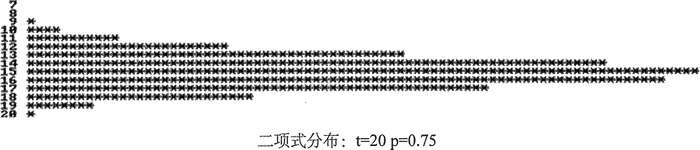
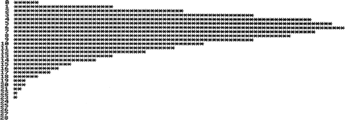

# C++ binomial_distribution 二项式分布随机数用法解析

二项式分布是一个离散分布，它可以模型化一系列独立的二元事件。每一个事件只有两种结果（成功或失败），所有事件的成功率相同。

它是由两个参数定义的，t 和 p，t 是实验的次数，p 是一次实现中成功的概率。下面展示了如何用 binomial_distribution 模板生成一个对象：

```
int t{20}; // Number of trials
double p {0.75};    // Probability of success
std::binomial_distribution<> binomial_d {t, p};
```

这个对象的成员函数 t() 和 p() 会返回这些参数值。binomial_d 生成的值的图形如图 1 所示。

图 1 二项式分布
伯努利分布是一个 t 参数为 1 的二项式分布。STL 提供的 bernoulli_distribution 类定义了这种分布。因为 t 被固定为 1，那么就只需要像构造函数一样提供一个 p 值，并且这个对象会返回一个随机的布尔值。成员函数 p() 可以返回成功的概率。下面是一个展示如何生成和使用这种对象的代码段：

```
std::random_device rd;
std::default_random_engine rng {rd()};
double p {0.75};    // Probability of success
std::bernoulli_distribution bernoulli_d {p};
std::cout << std::boolalpha; // Output bool as true or false
for(size_t i {}; i < 15; ++i)
    std::cout << bernoulli_d(rng) << ' ';
std::cout << std::endl;
```

执行这段代码后，得到的输出如下：

true true false true true true true true false true false true true false true

## 负二项式分布

负二项式分布是一个离散分布，它可以模型化试验序列中指定的成功次数之前的失败次数。试验只有两个可能的结果，它们彼此是相互独立的。如果成功的次数是 1，这个分布就成了几何分布。也可以将这个分布看作给定成功次数之前的失败次数的模型。

negative_binomial_distribution 模板定义了一个默认返回 int 型整数的对象类型。negative_ binomial_distribution 模板的构造函数需要两个参数：失败次数 k 和成功的概率 p。下面是生成一个对象的示例：

```
int k {5}; //Number of successes
double p {0.4}; // Probability of success
std::negative_binomial_distribution<> neg_bi_d {k, p};
```

neg_bi_d 的成员函数 k() 和 p() 可以返回参数的值，neg_bi_d 生成的值的图形如图 2 所示。


图 2 负二项式分布：k=5 p=0.4