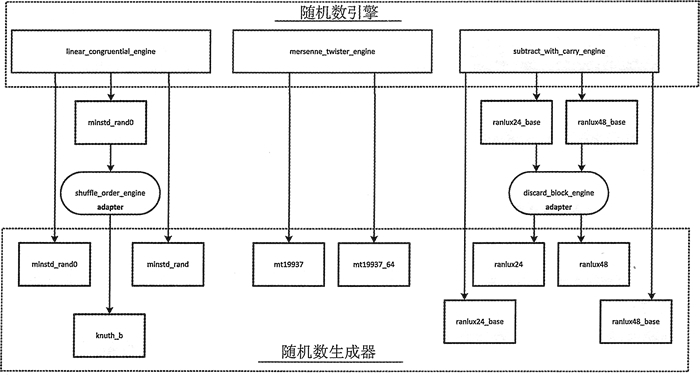

# C++ 随机数生成器和随机数引擎及其两者间关系解析

ST L 中有 3 个随机数引擎的类模板。它们中的每一个都实现了用来生成随机数序列的著名且高效的算法，但它们都有不同的优缺点。

这里的 3 个模板是 STL 提供的所有 10 个标准的随机数生成器类类型的基础。除了默认的 default_random_engine 生成器类型(这是实现的定义)之外，还有 9 个更进一步的生成器类类型，可以自定义引擎来实现生成随机序列的已知的可靠算法。

有 3 个随机数引擎适配器可以自定义从一个引擎得到的序列。它们中的每一个都有一个指定运用哪个引擎的模板参数。这 3 个引擎适配器模板是：

*   independent_bits_engine 适配器模板会将引擎生成的值修改为指定的比特个数。
*   discard_block_engine 适配器模板会将引擎生成的值修改为丢弃给定长度的值序列中的一些元素。
*   shuffle_order_engine 适配器模板会将引擎生成的值返回到不同的序列中。通过保存从引擎得到的给定长度的值序列来做到这些，然后在随机序列中返回它们。

生成器类既可以直接用一套指定的模板参数值自定义一个引擎模板，也可以用一个随机数引擎适配器来自定义另一个生成器。引擎产生生成器的方式如图 1 所示。

图 1 随机数生成器和随机数引擎的关系（[点此查看高清大图](http://c.biancheng.net/uploads/allimg/180921/2-1P92115044K43.jpg)）
每个生成器类类型都是通过将一套模板参数值应用到一个引擎模板生成的。为了让你明白它们做了些什么，在此会对随机数引擎进行一些概述，但强烈推荐用一种可以自定义引擎的随机数生成器类类型，而不是尝试自定义引擎模板。下面介绍在更小的细节上检查引擎以及从它们中定义的生成器类型。