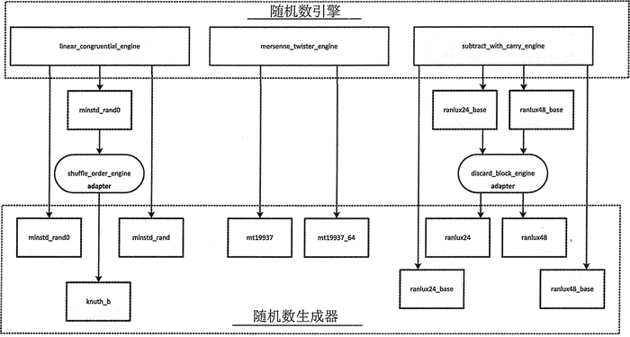

# C++带进位的线性同余法（subtract_with_carry_engine）生成随机数详解

subtract_with_carry_engine 模板定义了实现带进位减法的随机数引擎，这是对线性同余算法的改进。像线性同余算法一样，带进位减法算法釆用递归关系定义序列中的连续值，但是每个值 x[i] 都是从序列的前两个值 x[i-r] 和 x[i-s] 计算出的，并不是只由前一个值计算得出。r 和 s 分别被称作长脚和短脚，并且都必须是正数，r 必须大于 s。生成这个序列的等式如下：△i ={x[i-r] - x[i-s] - c[i-1]) mod m，其中 m 是 2n，n 是一个单词的比特个数。

c 是一个可能是 0 或 1 的“进位”，这取决于先前的状态。这个算法要求种子值 r 和进位 c 的初始值。和线性同余算法一样，带进位减法算法也对参数值的选择非常敏感。

## 带进位的线性同余法的实例

r 为 24、s 是 10 的 ranlux24_base 生成器类会生成 24 位整数的随机序列。r 是 12、s 是 5 的 ranlux48_base 类产生成 48 位整数的序列。


图 1（[点此查看高清大图](http://c.biancheng.net/uploads/allimg/180921/2-1P92115044K43.jpg)）
如图 1 所示，使用带进位减法引擎的生成器有两个更加高级的类，分别是 ranlux24 和 ranlux48，它们是通过将 ranlux24_base 和 ranlux48_base 传入一个 discard_block_engine 适配器的实例生成。一个 ranlux24 的实例会丢弃每个含有 233 个值的块中的 200 个值，块中的值是由 ranlux24_bas 生成的；一个 ranlux48 的实例会丟弃每个含有 389 个值的块中的 378 个值，块中的值是由 ranlux48_base 生成的，因此它们的值都是从它们接受的基础数据源中精挑细选的。

ranlux24 和 mnlux48 都广泛应用于蒙特卡罗模拟。ranlux 这个名字来源于第一个用 Fortran 实现这个算法的弗雷德詹姆斯。这个名字来自于随机和奢侈地丢掉基础序列中的许多值。下面是一个使用 ranlux24 的示例：

```
std::random_device rd;
std::ranlux24 rng {rd()};
std::uniform_real_distribution<long double> d {-5.0L, 5.OL};
for(size_t i {}; i < 8; ++i)
    std::cout << std::setw(5) << d(rng)<< " ";
//2.02142 -0.920689 -0.277198 -1.33417 4.70217 -3.31706 -3.32692 4.36376
```

这段代码本质上和其他的生成器是相同的。这个生成器对象生成的值需要基于构造函数的参数的初始状态。