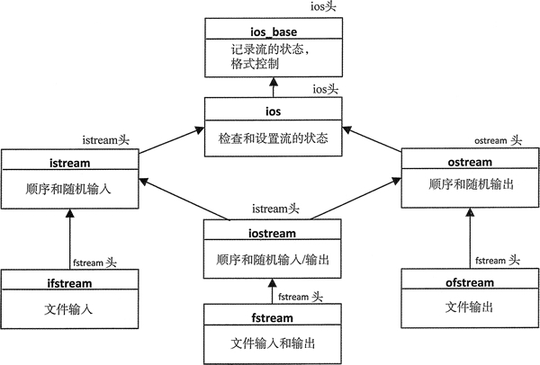

# 流迭代器实现文件操作（读取和写入）方法详解

流迭代器并不知道底层流的特性。当然，它们只适用于文本模式，否则它们不会关心数据是什么。流迭代器可以以文本模式来读写任何类型的流。这意味着除了其他的一些流之外，我们可以用迭代器以文本模式来读和写文件。在深入讲解如何对文件使用流迭代器之前，需要提醒你文件流的一些本质特征以及如何生成一个封装了文件的流对象。

## 文件流

文件流封装了一个实际的文件。文件流有长度，也就是这个流中字符的个数，因此对于新的输出文件，长度就是 0；文件流有起始位置，起始位置是流中索引为 0 的第一个字符的索引；文件流也有结束位置，结束位置是文件流中最后一个字符的下一个位置。文件流还有当前位置，是下一个写或读操作的开始位置的索引。可以以文本模式或二进制模式将数据转移到文件中或从文件中读出来。

在文本模式下，数据是字符的序列。可以用提取和插入运算符来读写数据，至少对于输入来说，数据项必须由一个或多个空格隔开。数据经常被写成以 '\n' 终止的连续行。一些系统，例如微软的 Windows 系统，在读写时会转换换行符。在读到回车和换行符时，它们会被映射到单个字符 '\n'。在另一些系统中，换行符被当作单个字符读写。因此，文件输入流的长度依赖于它们所来自的系统环境。

在二进制模式下，内存和流之间是以字节的形式传送数据的，不需要转换。流迭代器只能工作在文本模式下，因此不能用流迭代器来读写二进制文件。本章后面要介绍的流缓冲迭代器，可以读写二进制文件。

尽管在二进制模式下，从内存中读取和写入的字节从来不会改变，但当谈到处理写到不同系统中的二进制文件时，仍然会有很多陷阱。一个考虑是，写文件的系统的字节顺序和读文件的系统的字节顺序是相反的。字节顺序决定了内存中字的写入顺序。

在小端字节序的处理器中，例如英特尔的 X86 处理器，最低位的字节在最低的地址，所以字节的写入顺序是从最底字节到最髙字节。在大端字节序的处理器中，例如 EBM 大型机，比特的顺序是相反的，最高字节在最低位置，因此它们的文件会出现和小端字节序的处理器相反的顺序。因此，当在小端字节序的系统中读来自于大端字节序的系统中的二进制文件时，需要考虑字节序的差别。

注意，大端字节序也被称为网络字节序，因为数据一般是以大端序在互联网上传输的。

## 文件流类的模板

这里有 3 个表示文件流的类模板：

*   ifstream：表示文件的输出流；
*   ofstream：是为输出定义的文件流；
*   fstream：定义了可以读和写的文件流；

这些类的继承关系如图 1 所示。

图 1 表示文件流的类模板的继承层次结构
文件流模板从 istream 和 / 或 ostream 继承，因此在文本模式中，它们的工作方式和标准流相同。能够对一个文件流做什么是由它的打开状态决定的，可以用下面这些定义在 ios_base 类中的常量的组合来指定它们的打开状态:

*   binary：会将文件设置成二进制模式。如果没有设置二进制模式，默认的模式是文本模式。
*   app：在每个写操作(append operation)之前会移到文件的末尾。
*   ate：会在打开文件之后(at the end)，移到文件的末尾。
*   in：打开文件来读。对于 ifstream 和 fstream 来说，这是默认的。
*   out：打开文件来写。对于 ostream 和 fstream 来说，这是默认的。
*   trunc：将当前存在的文件长度截断为 0。

生成的文件流对象默认是在文本模式下；为了得到二进制模式，必须指定常量 binary。文本模式的操作会用 >> 和 << 运算符来读写数据，数值数据在被写到流之前会被转换为它们的字符表示。在二进制模式下，没有数据转换；内存中的字节会被直接写到文件中。当指定一个并不存在的文件的名称作为 ofstream 的构造函数参数时，这个文件会被生成。如果在生成或打开一个文件输出流对象时不指定 app 或 ate，任何存在的文件的内容都会被覆盖。

在本节的几个示例中都会读 dictionary.txt，它被包含在下载的代码中。在微软的 Windows 环境下，会用文本模式来写文件；但如果在不同的环境中执行这个程序，这个示例也应该读它。这个示例使用了微软 Windows 的路径 G:。这样做是为了使需要改变这些来适应系统环境变得更加可能，同时会使我们有责任确认不会覆盖掉重要的文件。

## 用流迭代器进行文件输入

一旦创建用于读文件的文件流对象，用流迭代器来访问数据和从标准输入流读数据就 基本相同。我们可以写一个查找字谜的程序，通过下载代码中的字典文件来查找它们。在这种情况下，我们需要用流迭代器来将字典文件中的所有单词读取到容器中。下面是代码：

```
//1.cpp
// Finding anagrams of a word
#include <iostream>                                      // For standard streams
#include <fstream>                                       // For file streams
#include <iterator>                                      // For iterators and begin() and end()
#include <string>                                        // For string class
#include <set>                                           // For set container
#include <vector>                                        // For vector container
#include <algorithm>                                     // For next_permutation()
using std::string;

int main()
{
    // Read words from the file into a set container
    string file_in {"G:/Beginning_STL/dictionary.txt"};
    std::ifstream in {file_in};
    if(!in)
    {
        std::cerr << file_in << " not open." << std::endl;
        exit(1);
    }
    std::set<string> dictionary {std::istream_iterator<string>(in), std::istream_iterator<string>()};
    std::cout << dictionary.size() << " words in dictionary." << std::endl;

    std::vector<string> words;
    string word;
    while(true)
    {
        std::cout << "\nEnter a word, or Ctrl+z to end: ";
        if((std::cin >> word).eof()) break;
        string word_copy {word};
        do
        {
            if(dictionary.count(word))  words.push_back(word);
            std::next_permutation(std::begin(word), std::end(word));
        } while(word != word_copy);

        std::copy(std::begin(words), std::end(words), std::ostream_iterator<string>{std::cout, " "});
        std::cout << std::endl;
        words.clear();                                              // Remove previous permutations
    }
    in.close();                                                   // Close the file
}
```

字典文件中包含超过 100 000 个单词，因此读取会花费一些时间。ifstream 对象是用文件 dictionary.txt 的全路径来生成。这个文件包含了相当数量的不同单词，可以用来搜查检查字谜。整个文件的内容被用来作为 set 容器的初始值。正如我们知道的那样，set 容器会以升序保存单词，并且这个容器中的每个单词都有自己的 key。words 容器中包含从 cin 中输入的单词的字谜。每一个单词都在 while 循环的第一个 if 表达式中读取。这里调用流对象的 eof()，当输入 Ctrl+Z 时，eof() 会返回 true。

输入的单词的字符重排列是通过在 do-while 循环中调用 next_permutation() 算法生成的。对于每次排列，包括第一次，都调用 count() 来确定这个单词是否在 dictionary 容器中。如果在，这个单词会被附加到 words 容器中。当排列返回原始单词时，do-while 循环结束。当找到一个单词的所有字谜时，会用以输出流迭代器作为目的地址的 copy() 算法将 words 写到 cout 中。如果期望每次出现 8 个字谜，需要使用循环来生成多行输出：

```
size_t count {}, max {8};
for (const auto& wrd : words)
    std::cout << wrd << ((++count % max == 0) ? '\n' : ' ');
```

下面是一些示例输出：

109582 words in dictionary.

Enter a word, or Ctrl+z to end: realist
realist retails saltier slatier tailers

Enter a word, or Ctrl+z to end: painter
painter pertain repaint

Enter a word, or Ctrl+z to end: dog、
dog god

Enter a word, or Ctrl+z to end: ^Z

## 用流迭代器来反复读文件

当然，如果字典文件非常大，可能不想把它全部读到内存中。在这种情况下，可以在每次想要查找字谜时，用流迭代器来重读文件。下面的版本可以实现这一点，尽管它的表现并不怎么令人印象深刻：

```
//2.cpp 
//Finding anagrams of a word by re-reading the dictionary file
#include <iostream>                                      // For standard streams
#include <fstream>                                       // For file streams
#include <iterator>                                      // For iterators and begin() and end()
#include <string>                                        // For string class
#include <set>                                           // For set container
#include <vector>                                        // For vector container
#include <algorithm>                                     // For next_permutation()
using std::string;

int main()
{
    string file_in {"G:/Beginning_STL/dictionary.txt"};
    std::ifstream in {file_in};
    if(!in)
    {
        std::cerr << file_in << " not open." << std::endl;
        exit(1);
    }
    auto end_iter = std::istream_iterator<string> {};

    std::vector<string> words;
    string word;
    while(true)
    {
        std::cout << "\nEnter a word, or Ctrl+z to end: ";
        if((std::cin >> word).eof()) break;
        string word_copy {word};
        do
        {
            in.seekg(0); // File position at beginning

            // Use find() algorithm to read the file to check for an anagram
            if(std::find(std::istream_iterator<string>(in), end_iter, word) != end_iter)
                words.push_back(word);
            else
                in.clear(); // Reset EOF

            std::next_permutation(std::begin(word), std::end(word));
        } while(word != word_copy);

        std::copy(std::begin(words), std::end(words), std::ostream_iterator<string>{std::cout, " "});
        std::cout << std::endl;
        words.clear(); // Remove previous permutations
    }
    in.close(); // Close the file
}
```

结束流迭代器不会改变，因此为了可以多次使用它，会将它定义为 end_iter。循环基本相同，除了用来发现给定的排列是否在文件中，如果在文件中，就是一个字谜。文件的位置需要是第一个字符的位置，在这个示例中会调用文件对象的 seekg() 来保证这一点。find() 的前两个参数是定义从当前位置得到的序列的 istream_iterator<string> 对象，它们被设置为文件的开始位置和结束位置。find() 算法会返回一个迭代器，它指向的元素和第三个参数匹配，或者返回结束迭代器，如果它并不存在的话。因此，如果 find() 返回的是结束流迭代器，就没有找到 word；返回其他任何迭代器都意味着找到了 word。当 w 没有找到 word 时，为文件流对象调用 dear() 来清除 EOF 标志是有必要的。如果不这么做，随后访问文件会失败，因为 EOF 标志已被设置。

下面是一些说明它工作的示例输出：

Enter a word, or Ctrl+z to end: rate
rate tare tear erat

Enter a word, or Ctrl+z to end: rat
rat tar art

Enter a word, or Ctrl+z to end: god
god dog

Enter a word, or Ctrl+z to end: ^Z

选择输入短单词，因为检查字谜的过程缓慢而痛苦。n 个字符的单词有 n! 种排列。为检查一个排列是否在文件中，需要比较 100 000 次读操作，取决于它是否在文件中。因此，检查一个单词，例如“retain”需要 7 百万次读操作，这也是为什么这个过程十分缓慢的原因。

istream_iterator<T> 对象会从流中一次读取一个 T 对象，因此如果有大量的对象，这个过程也总是很慢。一旦文件被读到 set 容器中，1.cpp 肯定比 2.cpp 快，因为随后的所有操作都是在内存的字典 words 中进行的。

 1.cpp 更快的第二个原因是，对 set 容器的访问包含时间复杂度为 `O(logn)` 的二分查找。串行访问文件包含每次从起始位置开始读单词直到找到匹配，时间复杂度为 `O(n)`。如果文件中的数据是有序的(dictionary.txt 中的单词是有序的)，就能用二分查找技术来找到数据项。在这种情况下，流迭代器是多余的，因为总会读单个单词，对流对象使用 >> 运算符可以更容易地做到这一点。然而，这并不容易实现，因为单词的长度不同。

## 用流迭代器输出文件

写文件和写标准输出流没有什么不同。例如，可以按如下方式用流迭代器复制 dictionary.txt 文件的内容：

```
// Copying file contents using stream iterators
#include <iostream>                                      // For standard streams
#include <fstream>                                       // For file streams
#include <iterator>                                      // For iterators and begin() and end()
#include <string>                                        // For string class
using std::string;

int main()
{
    string file_in {"G:/Beginning_STL/dictionary.txt"};
    std::ifstream in {file_in};
    if(!in)
    {
        std::cerr << file_in << " not open." << std::endl;
        exit(1);
    }
    string file_out {"G:/Beginning_STL/dictionary_copy.txt"};
    std::ofstream out {file_out};
    std::copy(std::istream_iterator<string>{in}, std::istream_iterator<string>{}, std::ostream_iterator<string> {out, " "});
    in.clear();                                              // Clear EOF
    std::cout << "Original file length: " << in.tellg() << std::endl;
    std::cout << "File copy length: " << out.tellp() << std::endl;
    in.close();
    out.close();
}
```

这个程序会从输入文件复制单词到输出文件，以空格隔开输出的单词。这个程序总会覆盖输出文件的内容。下面是得到的输出：

Original file length: 1154336
File copy length: 1154336

输出文件流的打开模式除了有 ios_base::out 标志之外，还有 ios_base::trunc 标志，因此如果文件已经存在，它会被截断。这阻止生成不断增长的文件，如果多次运行这个示例的话。如果用编辑器检查 dictionary.txt 的内容，会看到单词是被单个空格隔开的。我们写的文件副本的每个单词之间都有一个空格，因此文件的长度相同。

然而，如果原始文件中的单词是用两个或两个以上空格隔开的，文件的副本会更短。为了确保能够用流迭代器准确地复制原文件，必须一个字符一个字符地读文件，并阻止 >> 运算符忽略空格。下面展示了如何这么做：

```
std::copy(std::istream_iterator<char>{in >> std::noskipws},std::istream iterator<char>{},std::ostream_iter ator<char> {out});
```

这段代码会按字符复制 in 流，包含空格，这样复制文件比流迭代器更快，在本章的后面会进行解释。