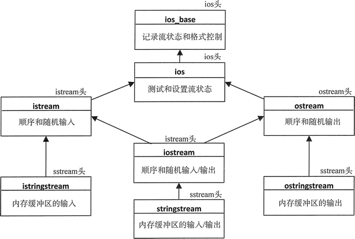

# string 流，C++ string 流及其用法详解

可以用流迭代器和流缓冲区迭代器来传送数据和读取 string 流。string 流是表示内存中字符缓冲区中的 I/O 对象,是定义在 sstream 头文件中的 3 个模板中的一个模板的实例：

*   basic_istringstream：支持从内存中的字符缓冲区读取数据。
*   basic_ostringstream：支持写数据到内存中的字符缓冲区。
*   basic_stringstream：支持字符缓冲区上的输入和输出操作。

字符数据类型是一个模板参数，对于 char 类型的 string 流有如下类型别名：istringstream、ostringstream 和 stringstream。这些对象的继承层次如图 1 所示。

图 1 string 流类型的继承层次
你会注意到这里的直接和非直接基类与文件流的类型是相同的，这意味着对文件流做的几乎任何事，同样也可以对 string 流做。可以用插入和提取运算符来格式化 string 流的 I/O；这意味着可以用流迭代器来读写它们。它们也支持文件流支持的无格式的 I/O 操作，因此可以用流缓冲区迭代器来读写它们。

为了保存 wchar_t 类型的字符，string 流也有一些别名，这些名称是 char 别名的名称加上前缀 'w'。只使用 char 类型的 string 流，因为它们正是通常所需要的。

要能够为内存缓冲区上的 I/O 操作提供极大的灵活性。当需要读很多次数据时，从内存缓冲区读取数据的速度要比从外部设备读取快。一个出现这种情况的场景是，当输入流的内容是变动的时。需要多次读取来确定数据是什么。可以用一个有 string 流和 string 流迭代器的代码来示范：

```
// Using a string stream as the dictionary source to anagrams of a word
#include <iostream>                                      // For standard streams
#include <fstream>                                       // For file streams
#include <iterator>                                      // For iterators and begin() and end()
#include <string>                                        // For string class
#include <set>                                           // For set container
#include <vector>                                        // For vector container
#include <algorithm>                                     // For next_permutation()
#include <sstream>                                       // For string streams
using std::string;

int main()
{
    string file_in {"G:/Beginning_STL/dictionary.txt"};
    std::ifstream in {file_in};
    if(!in)
    {
        std::cerr << file_in << " not open." << std::endl;
        exit(1);
    }
    std::stringstream instr; // String stream for file contents
    std::copy(std::istreambuf_iterator<char>{in}, std::istreambuf_iterator<char>(), std::ostreambuf_iterator<char>{instr});
    in.close();                                                   // Close the file

    std::vector<string> words;
    string word;
    auto end_iter = std::istream_iterator<string> {};             // End-of-stream iterator
    while(true)
    {
        std::cout << "\nEnter a word, or Ctrl+z to end: ";
        if((std::cin >> word).eof()) break;

        string word_copy {word};
        do
        {
            instr.clear();                                             // Reset string stream EOF
            instr.seekg(0);                                            // String stream position at beginning

            // Use find() to search instr for word
            if(std::find(std::istream_iterator<string>(instr), end_iter, word) != end_iter)
                words.push_back(word);                                  // Store the word found

            std::next_permutation(std::begin(word), std::end(word));
        } while(word != word_copy);

        std::copy(std::begin(words), std::end(words), std::ostream_iterator<string>{std::cout, " "});
        std::cout << std::endl;
        words.clear();                                              // Remove previous anagrams
    }
}
```

copy() 算法会将 dictionary.txt 的全部内容复制到一个 stringstream 对象中。复制的过程使用了流缓冲区迭代器，因此没有包含数据转换（文件的字节被复制到 instr 对象中）。当然，可以对流迭代器使用格式化的 I/O 操作，在这种情况下，复制操作将变为：

```
std::copy(std::istream_iterator<string>{in},std::istream_iterator<string>(),std::ostream_iterator<string>{instr, " "});
```

这清楚地表明流迭代器适用于 string 流对象，但比前面的版本要慢。如下是一个将文件内容复制到 stringstream 对象的更快方法：

```
instr << in.rdbuf();
```

ifstream 对象的成员函数 rdbuf() 会返回一个封装了文件内容的 basic_filebuf 对象的地址。basic_filebuf 以 basic_streambuf 为基类，并重载了插入运算符，用来将右操作数指向的 basic_streambuf 对象复制到左操作数 basic_ostream 对象中。这个操作很快，因为没有包含格式化或数据转换。

在 instr 中查找字谜和在文件流中查找是一样的，因为它是一个流（正好在内存中）。读取 string 流会移动当前位置，所以在再次读取内容时，必须调用它的成员函数 seekg() 来将位置重置为开始位置。类似地，在读到 instr 中数据的末尾时会设置 EOF 标志，必须调用成员函数 dear() 来重置这个标志。如果不这么做，随后的读操作会失败。

下面是该程序的一些示例输出：

Enter a word, or Ctrl+z to end: part
part prat rapt tarp trap

Enter a word, or Ctrl+z to end: painter
painter pertain repaint

Enter a word, or Ctrl+z to end: ^Z

程序运行效率仍然不那么可观。分析 4 个字母的单词相当快，但分析 7 个字母的单词就会花很长时间。除了分析 7 个字母的单词所花费的时间约是分析 4 个字母的单词的 210 倍这一事实之外，这也部分说明了用带有格式化输入的提取运算符会产生多少开销。它如此慢的另一个原因是：访问 set 容器查找单词使用的是二分查找，但在此处是从 string 流的开始位置顺序查找单词的。