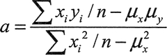

# C++ inner_product 内积计算方法详解

两个 vector 的内积是对应元素的乘积之和。为了能够得到内积，vector 的长度必须相同。内积是矩阵算术的基本运算。两个矩阵的乘积是一个矩阵，它是由第一个矩阵的每一行乘以第二个矩阵的每一列得到的，如图 1 所示。


图 1 矩阵乘法和内积运算
为了使矩阵内积成为可能，左操作数（矩阵 A）的列数必须和右操作数（矩阵 B）的行数相同。如果左操作数有 m 行和 n 列（mxn 的矩阵），右操作数有 n 行和 k 列（nxk 的矩阵），结果是一个 m 行和 k 列的矩阵（mxk 的矩阵）。

定义在 numeric 头文件中的 inner_product() 算法可以计算两个 vector 的内积。这个函数模板有 4 个参数：前两个参数是定义第 1 个 vector 的输入迭代器，第 3 个参数是确定第 2 个 vector 的开始输入迭代器，第 4 个参数是和的初值。算法会返回 vector 的内积。例如：

```
std::vector<int> v1(10);
std::vector<int> v2(10);
std::iota(std::begin(v1), std::end(v1), 2); // 2 3 4 5 6 7 8 9 10 11
std::iota (std::begin(v2) , std::end(v2),3); // 3 4 5 6 7 8 9 10 11 12
std::cout << std::inner_product(std::begin(v1), std::end(v1), std::begin(v2),0)<<std:rendl;    // Output: 570
```

因为两个 vector 的内积的标准定义，内积的初值为 0，但可以选择为对应元素的乘积 之和指定不同的初值。在使用 inner_product() 时，使用正确的类型很重要，如下所示：

```
std::vector<double> data {0.5, 0.75, 0.85};
auto resultl = std::inner_product(std::begin(data), std::end(data), std::begin(data),0)；
double result2 = std::inner_product(std:rbegin(data),std::end(data), std:: begin(data), 0);
auto result3 = std::inner_product(std::begin(data), std::end(data), std:rbegin(data)r 0.0);
std::cout << resultl << " "<<result2<< " " << result3 <<std:: endl; // Output: 0 0 1.535
```

第二条和第三条语句显然做的是同样的事，但返回的类型是由第 4 个参数决定的。即使迭代器指向的是浮点参数，当内积的初值是整数类型时，对应元素相乘的结果的组合运算适用的是整数运算。这同样适用于 accumulate() 算法，因此需要保证内积的初值是合适的类型。幸运的是，当初值的类型和这个运算所涉及的元素不同时，大多数编译器会发出警告。我们可以在一个示例中尝试使用 inner_product() 算法和其他的一些算法。

## 应用内积

最小二乘线性回归是求系数的一种方法，对于 a、b、y=ax+b，这最适合通过一组点 (x,y)，这些点通常是现实世界中的某种数据样本。这个方法来自高斯，找到 a 和 6 的系数，这样样本点到行的垂直距离平方和是最小的。下面介绍一个可以做到这些的等式，不需要知道这些等式是如何得到的，但是如果不想和任何数学打交道，可以跳过它直接看代码。

给定 n 个点 (x[i],y[i])，这个方法涉及求解下面的等式：

 解出等式的系数 a 和 b：


 如果能随着 x 和 y 的平均值计算出各种和，就能将它代入这些方程中，得到回归直线的系数。前面章节介绍过，变量 x 的 n 个值的平均值 u 的等式是：

显然，accumulate() 和 inner_product() 算法对这些是非常有帮助的。

这个示例会生成与从文件中得到的一组数据点相拟合的直线。文件在下载的代码中，记录了每千瓦时的耗电成本和欧洲几个国家平均每人的可再生能源发电装机瓦数。程序的输出应该显示配置的可再生能源的容量和成本是否是线性关系。下面是代码：

```
// Least squares regression
#include <numeric>                                       // For accumulate(), inner_product()
#include <vector>                                        // For vector container
#include <iostream>                                      // For standard streams
#include <iomanip>                                       // For stream manipulators
#include <fstream>                                       // For file streams
#include <iterator>                                      // For iterators and begin() and end()
#include <string>                                        // For string class
using std::string;

int main()
{
    // File contains country_name renewables_per_person kwh_cost
    string file_in {"G:/Beginning_STL/renewables_vs_kwh_cost.txt"};
    std::ifstream in {file_in};
    if(!in)                                       // Verify  we have a file
    {
        std::cerr << file_in << " not open." << std::endl;
        exit(1);
    }

    std::vector<double> x;                        // Renewables per head
    std::vector<double> y;                        // Corresponding cost for a kilowatt hour

    // Read the file and show the data
    std::cout << "   Country   " << " Watts per Head " << " kwh cost(cents) " << std::endl;
    while(true)
    {
        string country;
        double renewables {};
        double kwh_cost {};

        if((in >> country).eof()) break;                           // EOF read - we are done
        in >> renewables >> kwh_cost;
        x.push_back(renewables);
        y.push_back(kwh_cost);
        std::cout << std::left << std::setw(12) << country<< std::right<< std::fixed << std::setprecision(2) << std::setw(12) << renewables
<< std::setw(16) << kwh_cost << std::endl;
    }

    auto n = x.size();                                            // Number of points
    auto sx = std::accumulate(std::begin(x), std::end(x), 0.0);   // Sum of x values
    auto sy = std::accumulate(std::begin(y), std::end(y), 0.0);   // Sum of y values
    auto mean_x = sx/n;                                           // Mean of x values
    auto mean_y = sy/n;                                           // Mean of y values

    // Sum of x*y values and sum of x-squared
    auto sxy = std::inner_product(std::begin(x), std::end(x), std::begin(y), 0.0);
    auto sx_2 = std::inner_product(std::begin(x), std::end(x), std::begin(x), 0.0);

    double a {}, b {};                                            // Line coefficients
    auto num = n*sxy - sx*sy;                                     // Numerator for a
    auto denom = n*sx_2 - sx*sx;                                  // Denominator for a
    a = num / denom;
    b = mean_y - a*mean_x;
    std::cout << std:: fixed << std::setprecision(3) << "\ny = "<< a << "*x + " << b << std::endl;
}
```

在 while 循环中读取了文件。只保存数值，每一个都完整记录了国家名称、人均新再生能源装机量的瓦特数，每千瓦时花费的成本则以美分的形式被写到标准输出流中。对于保存在 vector 容器中的两个值；x 记录的是每个国家人均的可再生容量，记录的是对应的千瓦时的成本。

x 和 y 的平均值是由 accumulate() 算法通过算出每个容器中的元素之和计算得出的，然后用结果除以元素的个数。x 的平方之和与 xy 的内积之和是通过 innier_product() 算法计算得出的。通过使用前面展示的等式，可以用这些结果算出直线的系数 a 和 b。

注意，可以简化系数 a 的等式。如果将分母和分子除以 n²，等式就可以写为：


现在 x 的值和的值不再显式需要了。计算系数的代码可以写为：

```
auto n = x.size(); // Number of points
//Calculate mean values for x, y, xy, and x 一 squared
auto mean_x = std::accumulate(std::begin(x), std::end(x), 0.0);
auto mean_y = std::accumulate(std::begin(y), std::end(y), 0.0);
auto mean_xy = std::inner_product(std::begin(x), std::end(x),std::begin (y), 0.0);
auto mean_x2 = std::inner_product(std::begin(x), std::end(x), std::begin(x), 0.0);
//Calculate coefficients
auto a = (mean_xy - mean_x*mean_y)/(mean_x2-mean_x*mean_x);
auto b = mean_y - a*mean_x;
```

这里用更少的代码实现了相同的结果。图 2 的右边显示了程序的输出，左边是回归直线和原始数据点的图形。


图 2 最小二乘线性回归的结果（[点此查看大图](http://c.biancheng.net/uploads/allimg/180925/2-1P92514525a41.jpg)）
绘制的图形相当有说服力(原始点很接近它)。看起来好像人均每增加 100 瓦的可再生能源发电量，每千瓦时需要付出几乎两美分的成本。

## 定义内积运算

之前见到的 inner_product() 版本将两个输入序列的对应元素相乘，然后算出总数。第二个版本有两个以上的定义函数对象的参数。第二个函数对象定义了运用到两个序列中对应元素的二元运算，以及第一个用来代替加法合并结果的二元运算。我们提供的作为参数的函数对象不能使任何迭代器无效，也不能修改输入序列的元素。下面展示了如何生成和的积而不是积的和：

```
std::vector<int> v1(5);
std::vector<int> v2(5);
std::iota(std::begin(v1), std::end(v1), 2); // 2 3 4 5 6
std::iota(std::begin(v2), std::end(v2), 3);    // 3 4 5 6 7
std::cout << std:: inner_product (std::begin (v1), std: :end(v1), std::begin(v2), 1, std::multiplies<>(),std::plus <>())>>std::endl;    // Output: 45045
```

inner_product() 调用中，作为参数的函数对象被定义在 functional 头文件中。plus<T> 对象会计算出两个 T 类型值的和，这里定义运算的模板实例会被应用到来自于输入序列的 int 类型的对应元素上。作为 inner_product() 的第 5 个参数的 multiples 实例，它会将乘法结果累计起来，注意因为结果是乘积，如果不想结果总是为 0，初值必须不为 0。

Functional 头文件中也定义了可以用于 inner_product() 的其他二元算术运算（减、除、求余）。也可以用定义了位运算的函数对象的模板，它们是 bit_and、bit_or、bit_eor。