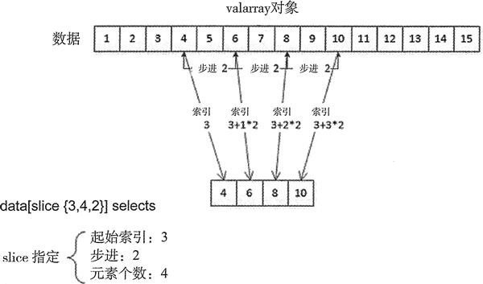
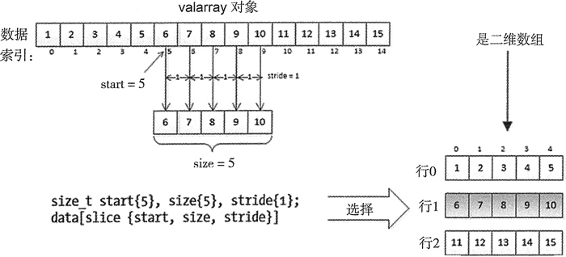
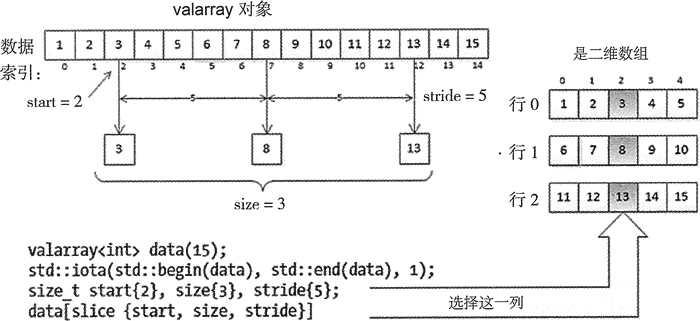

# C++ valarray 获取（访问）对象方法详解

valarray 对象以序列的方式保存其中的元素。像之前说的那样，通过使用下标运算符来使用索引可以得到任何元素的引用，并能够获取或设置值。下面是一些示例：

```
std::valarray<int> data {1,2,3,4,5,6,7,8,9};
data[1] = data[2] + data[3]; // Data[1] is   7
data[3] *= 2; // Data[3] is   8
data[4] = ++data[5] - data[2];// data[4] is 4, data[5] is 7
```

这就像访问一般数组的元素一样。但是，valarray 对象的下标运算符有更多用处。可以用有下标运算符的辅助类的实例来代替索引。这使我们能够指定和访问元素的子集。辅助类定义的元素选择机制使它们可以用于元素，只要这些元素所在的数组是二维或更多维数的数组。理解这是如何工作的很重要，因为这是 valarray 超越序列容器的主要优势。

还有很多细节，因此让我们先看看大致的流程。我们首先会探讨元素选择机制一般是如何工作的，然后如何从二维数组中选择特定的行或列。会解释如何将辅助类用于 valarray 对象以不同方式选择的元素子集上，以及如何表示子集。在说明生成子集的各种可能方式之后，会讨论能对它们做些什么。在这之后，会展示如何将这些技术运用到应用的场景中。

## 创建切片

std::slice 类定义在 valarray 头文件中。由传给 valarray 对象的下标运算符的 slice 对象定义的 slice 就像索引。可以用 slice 对象作为 valarray 对象的下标来选择两个或更多个元素。被选择的元素不需要是数组中的连续元素。slice 选择的数组元素可以作为引用，因此可以访问或改变这些元素的值。

从根本上说，slice 对象为从 valarray 选择的元素封装了一系列索引。可以将 3 个 size_t 类型的值传给 slice 构造函数来定义 slice 对象：

*   valarray 对象中的 start index (起始索引)指定了子集的第一个元素；
*   size 是子集中的元素个数；
*   stride (步进)是为从子集中得到下一个元素的 valarray 索引的增量；

构造函数的参数釆用描述的顺序，因此可以按如下方式定义 slice 对象：

```
slice my_slice {3, 4, 2}; // start index = 3, size = 4, stride = 2
```

这个对象指定了从索引 3 开始的 4 个元素，后续索引的增量为 2。也有构造函数，因此可以复制进行 slice 对象。默认的构造函数会将 start index、size 和 stride 全部设为 0，它的唯一目的是进行切片对象数组的创建。

可以调用 slice 对象的成员函数 start() 来得到它的 start index。slice 对象也有成员函数 size() 和 stride()，它们各自返回 size 和 stride。返回的 3 个值都是 size_t 类型。

通常，在使用 slice{start，size, stride} 对象作为 valarray 对象的下标时，可以选择索引值位置的元素：

start, start + stride, start + 2*stride,...start + (size - 1)*stride

图 1 用一个值从 1 到 15 的 valarray 对象进行了展示。


图 1 slice 对象选择的 valarray 中的元素子集
图 1 中以 slice 对象为 data 的下标运算符的参数会选择索引位置在 3、5、7、9 的元素，它们是数组中的第 4 个、第 6 个、第 8 个和第 10 个元素。slice 构造函数的第一个参数是第一个元素的索引，第二个参数是索引值的个数，第三个参数是索引值从一个到另一个的增量。用 slice 对象作为 valairay<T> 对象的索引的结果是得到另一个对象，它是一个 slice_array<T> 类型的对象，封装了 slice 在 valarray<T> 中选择的元素的引用。在解释更多关于如何使用分片之后，会回来说明能够用 slice_array 对象做些什么。

## 选择行

假设图 1 中 data 对象的值表示的是有 3 行 5 个元素的二维数组——按行的顺序，图 2 说明了如何用 slice 对象选择第二行。


图 2 选择二维数组的单行
start index 是第二行的第一个元素的索引，值为 15。stride 是 1，每一行内的元素都是连续保存的。size 是 5，因为每行有 5 个元素。调用表示一行的 slice 对象的成员函数会返回这一行的第一个元素，在我们使用多行时，这是很有用的。当然，a_slice 定义的 valarray 对象的第 n 个元素(索引从 0 开始)的索引是 a_slice.start()+n。

## 选择列

假设想从二维数组中选择一列。数组中列的元素不是连续的。图 3 说明了如何定义一个 slice 对象来选择图 2 中同一个数组的第三列。


图 3 从二维数组中选择单列
一如往常，start value 是子序列的第一个元素的索引。列中一个元素到下一个元素的增量是 5，每一列有 3 个元素，因此 size 是 3。

## 使用切片

在用 slice 对象作为下标时，slice_array<T> 对象是从 valarray<T> 对象选择的元素子集的代理。这个模板定义了有限个数的成员函数。slice_array 可用的唯一的 public 构造函数是拷贝构造函数，所以唯一的可能是用来生成对象，远不止用 slice 对象作为下标，还可以用来生成 slice_array 对象的副本。例如：

```
valarray<int> data(15);
std::iota(std::begin(data), std::end(data), 1);
size_t start {2}, size {3}, stride {5};
auto d_slice = data[slice {start, size, stride}];//References data[2],data[7], data[12]
slice_array<int> copy_slice {d_slice}; // Duplicate of d_slice
```

这里没有默认的构造函数，因此无法生成 slice_array 对象的数组。可以应用到 slice_array 对象的唯一操作是赋值和复合赋值。赋值运算符会将 slice_array 对象引用的全部元素设为给定值。也能够用它将被引用的元素设为另一个 valarray 对应元素的值，只要这个 valarray 与 slice_array 对象关联的 valarray 有相同的元素个数和类型。例如：

```
valarray<int> data {1, 2, 3, 4, 5, 6, 7, 8, 9, 10, 11, 12, 13, 14, 15};
valarray<int> more {2, 2, 3, 3, 3, 4, 4, 4, 4, 5, 5, 5, 5, 5, 6};
data[slice{0, 5, 1}] = 99; // Set elements in 1st row to 99
data [slice{10, 5, 1} ] = more; // Set elements in last row to values from more
std::cout << "data:\n";
print(data, 5, 4);
```

可以看到，能够很容易用 data[slice{0，5，1}] 这种表达式在赋值运算的左边生成 slice_airay。这里调用了 slice_array 的成员函数 operator=()。右操作数可以是一个单值元素，或是一个包含相同类型元素的 valarray，或是另一个同类型的 slice_array。将单值元素赋给 slice_array 会将 valarray 中的元素设置为它所引用的值。当右操作数是 valarray 或 slice_array 时，必须保证它至少包含和左操作数一样多的元素；如果元素没有那么多，得到的结果将不是我们想要的。执行上面的代码，输出是：

data:
99  99  99  99  99
6   7   8   9   10
2  2   3   3   3

可以看到 data 的第一行和第三行已经被改变了。

下面的任何一个复合赋值运算符 (op=) 都可以用于 slice_array 对象：

*   算术运算符+=、-=、*=、/-、％=
*   位操作运算符&=、|=、^=
*   移位运算符>>=、<<=

在每种情况下，左操作数都必须是一个 slice_array 对象，右操作数都必须是一个包含和 slice_array 同类型元素的 valarray 对象。op= 运算符会将 op 运用到 slice_array 的每一个元素引用和作为右操作数的 valarray 的相应元素之间。注意不支持单值右操作数；总是需要用一个 valarray 对象作为右操作数，即使右边的所有对应元素的值都相同。

右操作数 valarray —般会包含和左操作相同个数的元素，但不是绝对必要的。它包含的元素不能比另一个操作数少，但可以多。如果 slice_array 是有 n 个元素的左操作数，运算会使用右操作数的前 n 个元素。下面是一个用 += 来修改 valarray 对象的分片的示例：

```
valarray<int> data {1, 2, 3, 4, 5A 6, 7, 8, 9, 10, 11, 12, 13, 14, 15};
auto d_slice = data [slice {2, 3, 5} ] ; // References data [2] , data [7] , data [12]
d_slice += valarray<int>{10, 20, 30}; // Combines the slice with the new valarray
std::cout << "data: \n";
print(data, 5, 4);
```

对于 data 中被 d_slice 引用的元素，有更多的对象会被加到相应索引位置的元素值上。输出如下：

data:
1   2   13  4  5
6   7   28  9   10
11  12  43  14  15

在这个运算之后，slice 所选的 data 数组中列元素的值是从 3+10、8+20 和 13+30 得到的。在分片中和元素相乘也很简单：

```
valarray<int> factors {22, 17, 10};
data[slice{0, 3, 5}] *= factors; // Values of the 1st column: 22 102 110
```

slice 对象会选择 data 中的第一列，这一列的每一个元素都会和 factor 对象中的相应元素相乘。如果只是想用分片乘以一个给定的值，可以只生成一个适当的 valarray 对象：

```
valarray<int> data {1, 2, 3, 4, 5, 6, 7, 8, 9, 10, 11, 12, 13, 14, 15};
slice row3 {10, 5, 1};
data[row3] *= valarray<int>(3, row3.size ()); // Multiply 3rd row of data by 3
```

data 中的后 5 个元素会乘以 3。在最后一条语句中，通过调用 slice 对象的成员函数 size() 设置了右操作数 valarmy 中的元素个数。这保证了元素个数和 data 中被选择的元素个数是相同的。

假设想将 data 中的一列元素加到另一列上，我们不能将一个 slice_array 加到另一个 slice_array 上，但仍然可以做我们想做的事。一种方式是使用一个接受 slice_array 为参数的 valarray 构造函数。通过这个构造函数，slice_array 对象引用的值会被用来初始化被生成的 valarray 对象中的元素。然后可以用这个对象作为 slice_array 的复合赋值中的右操作数。下面展示了如何将 data 中的第 5 列元素加到第 2 和第 4 列上：

```
valarray<int> data {1, 2, 3, 4, 5, 6, 7, 8, 9, 10, 11, 12, 13, 14, 15};
valarray<int> col5 {data[slice{4, 3, 5}]}; // Same as 5th column in data
data[slice{1, 3, 5}] += col5;  // Add to 2nd column
data[slice{3, 3, 5}] += col5;   // Add to 4th column
print(data, 5, 4);
```

以 slice 对象作为索引的 data 被作为参数对象传给 valarray 的构造函数，从而可以生成一个 slice_array 对象，它可以用来生成对象 col5。valarray 构造函数并不是被显式定义的，因此它可以将 slice_array 类型隐式转换为 valarray 类型。可以按如下方式定义 col5 对象：

```
valarray<int> col5 = data [slice{ 4, 3, 5} ] ; // Convert slice_array to valarray
```

这里调用了 col5 对象的成员函数 operator=()，它需要一个 valarray 对象作为右操作数。编译器会为接受一个 slice_array 对象作为参数的 valarray 构造函数插入一个调用来将 slice_array 转换为 valarray。注意这和下面的语句并不相同：

```
auto col = data[slice{4, 3, 5}]; // col will be type slice_array
```

这里并没有发生转换。只是将 col 定义为以 slice 对象为索引从 data 中得到的 slice_array 对象。

调用 print() 的上一段代码产生的输出为：

1 7 3 9 5
6 17 8 19 10
11 27 13 29 15

当然，也能用一个简单的老式循环来做同样的事：

```
size_t row_len {5}, n_rows {3}; // Row length, number of rows
for(size_t i {}; i < n_rows*row_len; i += row_len)
{
    data[i+1] += data[i+4]; // Increment 2nd column
    data[i+3] += data[i+4]; // Increment 4th column
}
```

循环索引 i 选择 data 中的第一列元素的索引值为步进。在循环体中使用 i+n 形式的表达式作为 data 的下标来从第 n 列选择元素。