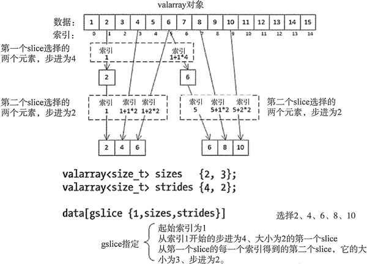
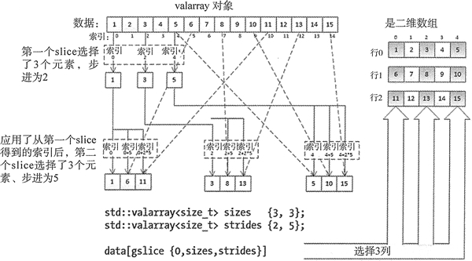

# C++ gslice 类用法详解

valarray 头文件中定义了 gslice 类，这是切片思想的泛化。gslice 对象从起始索引生成索引值，就像一个切片，但它能生成两个或两个以上的切片，具体实现方式有一点复杂。通常，gslice 会假定从表示多维数组的 valarray 对象中选择的元素会被用来作为元素的线性序列。

gslice 由 3 个参数值定义。第一个构造函数参数是起始索引，它是指定第一个分片的第一个元素的 size_t 类型的值，这和 slice 一样。第二个参数是一个 valarray<size_t> 对象，它的每个元素都指定了 size。对于第二个参数指定的每一个 size，都有一个相应的步进；这些步进由第三个参数定义，它是一个和第二个参数有相同元素个数的象。第二个参数中，每个 size 的步进都在第三个参数中有相应的元素。

当然，gslice 表示的每个 slice 都有一个起始索引、大小和步进。第一个 slice 的起始索引是 gslice 构造函数的第一个参数。第一个 slice 的 size 是 valarray (由 size 组成)的第一个元素，步进是另一个的 valarray (由 stride 组成)的第一个元素。这应该可以很容易发现，但现在它变得有些复杂。

第一个 slice 生成的索引值是第二个 slice 的起始索引。也就是说，第二个 slice 从来自于第一个 slice 的每个索引中定义了一套索引值。整个过程以此类推。

第一个 slice 之后的每一个 slice 的索引都是由前一个 slice 生成的，它们会产生一组索引值。例如，如果 glice 的第一个 slice 的大小是 3，它定义了 3 个索引值；如果第二个 slice 的大小是 2，它生成了 2 个索引值。第二个 slice 的大小和步进会被使用 3 次，且每一次都会用第一个 slice 的索引值作为起始索引。因此可以从这两个 slice 中得到 6 个索引值，它会从 valarray 中选择 6 个元素。

用 gslice 作为 valarray 的下标的结果是会包含一个给定元素的多个引用。当 gslice 的最后一个 slice 所生成的索引序列重叠时，会出现这种情况。图 1 展示了一个 gslice 从 valarray 中选择元素的简单示例。

图 1 gslice 对象如何从 valarray 中选择元素（[点此查看高清大图](http://c.biancheng.net/uploads/allimg/180926/2-1P926105029517.jpg)）
 图 1 中的 gslice 定义了两个 slice，显示了第一个 slice 如何生成应用于第二个 slice 的起始索引的索引值，第二个索引的大小为 3。因为最后两个索引序列是重叠的，结果中索引 5 处的元素 6 是重复的。通常，gslice 对象选择的元素的个数是由 valarray 对象的大小值定义的，它是构造函数的第二个参数（在这个示例中是 2x3）。

和 slice 对象一样，用 gslice 去索引 valarray<T> 会得到一个封装了 valarray 中元素的引用对象，但这个对象是不同的类型（gslice_array<T>类型）。后面会介绍如何使用它。首先将介绍 gslice 对象的一些作用。

## 选择多行或多列

可以通过用 gslice 对象作为下标运算符的参数来从 valarray 对象选择多行或多列，被选择的行或列必须是被均匀隔开的，这意味着连续行或列的第一个元素之间的增量是相同的。选择两行或两行以上相对来说要简单一些。gslice 的起始索引是被选择的第一行的第一个元素的索引值。它的第一个大小是行数，相应的步进是行之间的增量，是行的长度的倍数。第二个大小和步进的值会选择每行的元素，所以第二个大小是行的长度，第二个步进是 1。

假设按如下方式用 sizes 和 strides 定义 valarray 对象：

```
valarray<size_t> sizes {2, 5}; // Two size values
valarray<size_t> strides {10, 1}; // Stride values corresponding to the size values
```

选择图 1 中数组的第一行和第三行的表达式是：

data[gslice{0, sizes, strides}]

这两行分别从索引值 0 和 10 开始；这些索引值是从作为 gslice 的构造函数的第一个参数的起始索引 0 定义的第一个 slice 得到的，并且第一个 slice 的大小及对应的步进值在作为 gslice 构造函数的第二和第三个参数的 valarray 对象中。每行有 5 个连续的元素，第二个 slice 的所选行的大小是 5，对应的步进值是 1。注意，不必显式地定义 sizes 和 strides。

可以将选择这两行的表达式写为：

data[gslice{0, {2, 5}, {10, 1}}]

现在，让我们思考一下更困难的任务，选择两列或更多列。作为一个示例，让我们看看如何从图 1 所示的数组中选择第一列、第三列和最后一列。图 2 用在元素的二维表示中选择的置灰列来加以说明。

图 2 从二维数组中选择多列（[点此查看高清大图](http://c.biancheng.net/uploads/allimg/180926/2-1P926103300500.jpg)）
第一个大小和步进确定了每列被选择的第一个元素的索引值。第二个大小和步进选择的是每列的元素；一列中元素之间的增量是行的长度。因为第一个步进是固定的，所以只能用这种方式选择有相同间隔的两列或更多列；例如不能选择第 1，第 2，第 5 列。

定义了三列或更多列的 gslice 对象，能够以同样的方式应用到三维或更高维的数组中，但它变得更复杂了。需要注意 gslice 不会生成单独的索引值；如果生成了，结果是未定义的，而且效果肯定不好。大多时候，slice 和 gslice 对象会被应用到一维或二维数组上，所以重点会放在它们身上。

## 使用 gslice 对象

当用 gslice 对象索引 valarray<T> 对象时，得到的 gslice_array<T> 对象和 slice_array 有很多相同之处。它和 slice_array 有相同作用域的成员函数，因此同一作用域的运算符也可以被应用到它上面。有赋值运算符和相同作用域的 op= 运算符，也有接受 gslice_array 对象作为参数的 valarray 构造函数，它可以用来将 gslice_array<T> 类型隐式转换为 valarray<T>。让我们思考一下我们能用 gslice 做什么。假设我们定义了下面的 valarray 对象：

```
// 4 x 4 matrix
valarray<int> data {2, 4, 6, 8,
10, 12, 14, 16,
18, 20, 22, 24,
26, 28, 30, 32};
```

这里有 4 行，每行有 4 个元素。我们可以用前面看到的 print() 函数模板来输出第二行和第三行:

```
valarray<size_t> r23_sizes {2,4}; // 2 and 4 elements
valarray<size_t> r23_strides {4,1}; // strides: 4 between rows, 1 between elements in a row
gslice row23 {4, r23_sizes, r23_strides}; // Selects 2nd + 3rd rows - 2 rows of 4
print(valarray<int>(data[row23]),4); // Outputs 10 12 14 16/18 20 22 24
```

row23 对象定义的行索引序列从 4 到 7、从 8 到 11、步进为 1，这里会选择 data 的中间两行。当然，可以用一条语句来输出这两行：

```
print(valarray<int>(data[gslice{4, valarray<size_t> {2,4}, valarray<size_t> {4,1}}]), 4);
```

在执行这条语句之后，gslice 对象与包含大小和步进的对象会被舍弃。像这样很难看到从 data 中选择了什么，但它可以。另一条更短的同样可以做这件事的语句是：

```
print(valarray<int>(data[gslice{ 4, {2,4}, {4,1} }]), 4);
```

下面展示了如何输出 data 中的第二和第三列：

```
std::valarray<size_t> sizes2 {2,4}; // 2 and 4 elements
// strides: 1 between columns, 4 between elements in a column
std::valarray<size_t> strides2 {1,4};
gslice col23 {1, sizes2, strides2}; // Selects 2nd and 3rd columns - 2 columns of 4
print(valarray<int>(data[col23]), 4);
// Outputs 4 12 20 28/6 14 22 30
```

gslice 的起始索引是第二个元素，它也是第二列的第一个元素。现在应该可以清楚这是如何指定 data 中的两列的。

我们现在可以按如下方式添加第二和第三行的值到第二和第三列了 ：

```
data[col23] += data[row23];
print(data, 4);
```

执行这些语句之后会产生下面的输出：

2 14 24 8
10 24 34 16
18 34 44 24
26 44 54 32

如果用这些和用来初始化 data 的原始数据比较，你会发现已经得到了想要的结果。第二列是 4+10、12+12、20+14、28+16；第三列是 6+18、14+20、22+22、30+24。