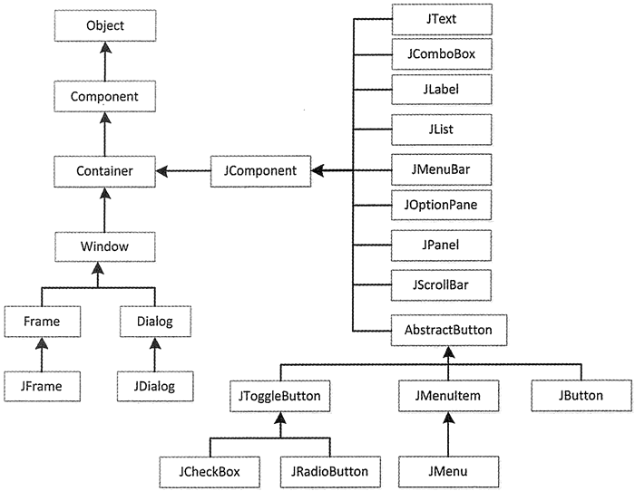
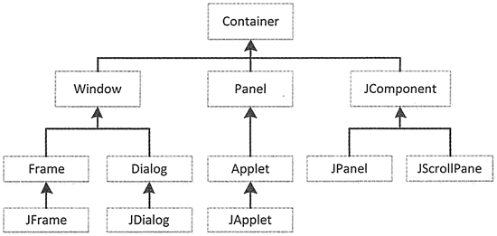

# Swing 简介：Swing 是什么？

Swing 是新一代的图形界面工具。使用 Swing 来开发图形界面比 AWT 更加优秀，因为 Swing 是一种轻量级组件，它采用纯 Java 实现，不再依赖于本地平台的图形界面，所以可以在所有平台上保持相同的运行效果，对跨平台支持比较出色。除此之外，Swing 提供了比 AWT 更多的图形界面组件，因此可以开发出美观的图形界面程序。

## Swing 类库结构

Swing 组件都采用 MVC（Model-View-Controller，即模型-视图-控制器）的设计，实现 GUI 组件的显示逻辑和数据逻辑的分离，从而允许程序员自定义 Render 来改变 GUI 组件的显示外观，以提供更多的灵活性。

Swing 围绕 JComponent 组件构建，JComponent 则由 AWT 的容器类扩展而来。Swing 组织结构如图 1 所示。

图 1 Swing 类库组织结构图
从图 1 可以看出，Swing 组件除了 AbstmctButton 类之外都以 J 开头。Swing 容器组件直接继承 AWT 类库中的容器组件类，其他大部分组件都是继承 JComponet 组件。组件可以划分为容器组件和非容器组件，容器组件包括 JFmme 和 JDialog。其中 JComponent 定义了非容器类的轻量级组件（JBntton、JPanel、JMenu 等）。

## Swing 包

Swing 类库由许多包组成，通过这些包中的类相互协作来完成 GUI 设计。其中，javax.swing 包是 Swing 提供的最大包，它包含将近 100 个类和 25 个接口。几乎所有 Swing 组件都在该包中。表 1 列出了常用的 Swing 包。

表 1 Swing 常用包

| 包名称 | 描述 |
| javax.swing | 提供一组“轻量级”组件，尽量让这些组件在所有平台上的工作方式都相同 |
| javax.swing.border | 提供围绕 Swing 组件绘制特殊边框的类和接口 |
| javax.swing.event | 提供 Swing 组件触发的事件 |
| javax.swing.filechooser | 提供 JFileChooser 组件使用的类和接口 |
| javax.swing.table | 提供用于处理 javax.swing.JTable 的类和接口 |
| javax.swing.text | 提供类 HTMLEditorKit 和创建 HTML 文本编辑器的支持类 |
| javax.swing.tree | 提供处理 javax.swingJTree 的类和接口 |

javax.swing.event 包中定义了事件和事件监听器类，javax.swing.event 包与 AWT 的 event 包类似。Java.awt.event 和 javax.swing.event 都包含事件类和监听器接口，它们分别响应由 AWT 组件和 Swing 组件触发的事件。

例如，当在树组件中需要节点扩展（或折叠）的通知时，则要实现 Swing 的 TreeExpansionListener 接口，并把一个 TreeExpansionEvent 实例传送给 TreeExpansionListener 接口中定义的方法，而 TreeExpansionListener 和 TreeExpansionEvent 都是在 swing.event 包中定义的。

虽然 Swing 的表格组件（JTable）在 javax.swing 包中，但它的支持类却在 javax.swing.table 包中。表格模型、图形绘制类和编辑器等也都在 javax.swing.table 包中。

与 JTable 类一样，Swing 中的树 JTree（用于按层次组织数据的结构组件）也在 javax.swing 包中，而它的支持类却在 javax.swing.tree 包中。javax.swing.tree 包提供树模型、树节点、树单元编辑类和树绘制类等支持类。

## Swing 容器

创建图形用户界面程序的第一步是创建一个容器类以容纳其他组件，常见的窗口就是一种容器。容器本身也是一种组件，它的作用就是用来组织、管理和显示其他组件。

Swing 中容器可以分为两类：顶层容器和中间容器。

顶层容器是进行图形编程的基础，一切图形化的东西都必须包括在顶层容器中。顶层容器是任何图形界面程序都要涉及的主窗口，是显示并承载组件的容器组件。在 Swing 中有三种可以使用的顶层容器，分别是 JFrame、JDialog 和 JApplet。

1.  JFrame：用于框架窗口的类，此窗口带有边框、标题、关闭和最小化窗口的图标。带 GUI 的应用程序至少使用一个框架窗口。
2.  JDialog：用于对话框的类。
3.  JApplet：用于使用 Swing 组件的 Java Applet 类。

中间容器是容器组件的一种，也可以承载其他组件，但中间容器不能独立显示，必须依附于其他的顶层容器。常见的中间容器有 JPanel、JScrollPane、JTabbedPane 和 JToolBar。

*   JPanel：表示一个普通面板，是最灵活、最常用的中间容器。
*   JScrollPane：与 JPanel 类似，但它可在大的组件或可扩展组件周围提供滚动条。
*   JTabbedPane：表示选项卡面板，可以包含多个组件，但一次只显示一个组件，用户可在组件之间方便地切换。
*   JToolBar：表示工具栏，按行或列排列一组组件（通常是按钮）。

在 Java 程序中容器类都是继承自 Container 类。中间容器和顶层容器在，AWT 包和 Swing 包中继承 Container 类的继承关系，如图 2 所示。

图 2 容器类组织结构图