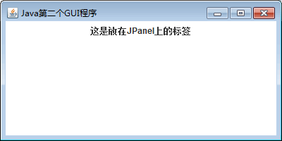

# Java Swing JFrame 和 JPanel：窗口容器和面板容器

在 Swing 中，任何其他组件都必须位于一个顶层容器中。JFrame 窗口和 JPanel 面板是常用的顶层容器，本节详细介绍这两个容器的使用方法。

## JFrame 窗口

JFrame 用来设计类似于 Windows 系统中窗口形式的界面。JFrame 是 Swing 组件的顶层容器，该类继承了 AWT 的 Frame 类，支持 Swing 体系结构的高级 GUI 属性。

JFrame 类的常用构造方法如下所示。

*   JFrame()：构造一个初始时不可见的新窗体。
*   JFrame(String title)：创建一个具有 title 指定标题的不可见新窗体。

当创建一个 JFrame 类的实例化对象后，其他组件并不能够直接放到容器上面，需要将组件添加至内容窗格，而不是直接添加至 JFrame 对象。示例代码如下：

```
frame.getContentPane().add(b);
```

使用 JFrame 类创建 GUI 界面时，其组件的布局组织示意如图 1 所示。


图 1 JFrame 窗口组件组织
在图 1 中显示有“大家好”的 Swing 组件需要放到内容窗格的上面，内容窗格再放到 JFrame 顶层容器的上面。菜单栏可以直接放到顶层容器 JFrame 上，而不通过内容窗格。内容窗格是一个透明的没有边框的中间容器。

JFrame 类中的常用方法如表 1 所示。

表 1 JFrame 类的常用方法

| 方法名称 | 概述 |
| getContentPane() | 返回此窗体的 contentPane 对象 |
| getDefaultCloseOperation() | 返回用户在此窗体上单击“关闭”按钮时执行的操作 |
| setContentPane(Container contentPane) | 设置 contentPane 属性 |
| setDefaultCloseOperation(int operation) | 设置用户在此窗体上单击“关闭”按钮时默认执行的操作 |
| setDefaultLookAndFeelDecorated (boolean defaultLookAndFeelDecorated) | 设置 JFrame 窗口使用的 Windows 外观（如边框、关 闭窗口的 小部件、标题等） |
| setIconImage(Image image) | 设置要作为此窗口图标显不的图像 |
| setJMenuBar( JMenuBar menubar) | 设置此窗体的菜单栏 |
| setLayout(LayoutManager manager) | 设置 LayoutManager 属性 |

#### 例 1

在了解窗口组件 JFrame 的语法之后，下面使用 JFrame 类创建一个窗口。要求设置窗口的标题为“Java 第一个 GUI 程序”，并向窗口内添加“这是使用 JFrame 类创建的窗口”文本。具体实现代码如下：

```
package ch17;
import javax.swing.JFrame;
import javax.swing.JLabel;
import java.awt.*;
public class JFrameDemo extends JFrame
{
    public JFrameDemo()
    {
        setTitle("Java 第一个 GUI 程序");    //设置显示窗口标题
        setSize(400,200);    //设置窗口显示尺寸
        setDefaultCloseOperation(JFrame.EXIT_ON_CLOSE);    //置窗口是否可以关闭
        JLabel jl=new JLabel("这是使用 JFrame 类创建的窗口");    //创建一个标签
        Container c=getContentPane();    //获取当前窗口的内容窗格
        c.add(jl);    //将标签组件添加到内容窗格上
        setVisible(true);    //设置窗口是否可见
    }
    public static void main(String[] agrs)
    {
        new JFrameDemo();    //创建一个实例化对象
    }
}
```

上述代码创建的 JFrameDemo 类继承了 JFrame 类，因此 JFrameDemo 类可以直接使用 JFrame 类的方法。setTitle() 方法用来设置窗口标题，setDefaultCloseOperation() 方法用来设置响应方式，即当单击“关闭”按钮时退出该程序。

在构造方法中使用 JLabel 类创建一个标签对象 jl，其参数是标签的文本提示信息。JFrame 框架的 getContentPane() 方法获取了内容窗格对象，并使用 add() 方法将标签添加到内容窗格上。最后的 setVisible() 方法是从父类中继承的方法。

程序运行的窗口结果如图 2 所示。


图 2 窗口运行结果

## JPanel 面板

JPanel 是一种中间层容器，它能容纳组件并将组件组合在一起，但它本身必须添加到其他容器中使用。JPanel 类的构造方法如下。

*   JPanel()：使用默认的布局管理器创建新面板，默认的布局管理器为 FlowLayout。
*   JPanel(LayoutManagerLayout layout)：创建指定布局管理器的 JPanel 对象。

JPanel 类的常用方法如表 2 所示。

表 2 JPanel 类的常用方法

| 方法名及返回值类型 | 说明 |
| Component add(Component comp) | 将指定的组件追加到此容器的尾部 |
| void remove(Component comp) | 从容器中移除指定的组件 |
| void setFont(Font f) | 设置容器的字体 |
| void setLayout(LayoutManager mgr) | 设置容器的布局管理器 |
| void setBackground(Color c) | 设置组件的背景色 |

#### 例 2

编写一个使用 JPanel 组件的窗口程序。要求设置标题为“Java 的第二个 GUI 程序”，然后向窗口中添加一个面板，并设置面板上显示的文本为“这是放在 JPanel 上的标签”，设置面板背景颜色为白色。具体实现代码如下：

```
package ch17;
import javax.swing.JFrame;
import javax.swing.JLabel;
import javax.swing.JPanel;
import java.awt.*;
public class JPanelDemo
{   
    public static void main(String[] agrs)
    {
        JFrame jf=new JFrame("Java 第二个 GUI 程序");    //创建一个 JFrame 对象
        jf.setBounds(300, 100, 400, 200);    //设置窗口大小和位置
        JPanel jp=new JPanel();    //创建一个 JPanel 对象
        JLabel jl=new JLabel("这是放在 JPanel 上的标签");    //创建一个标签
        jp.setBackground(Color.white);    //设置背景色
        jp.add(jl);    //将标签添加到面板
        jf.add(jp);    //将面板添加到窗口
        jf.setVisible(true);    //设置窗口可见
    }
}
```

如上述代码，首先创建了一个 JFrame 对象，并设置其大小和位置，然后创建了一个 JPanel 对象表示面板，调用 setBackground() 方法设置面板的背景色为白色，调用 add() 方法将标签添加到此面板。JFrame 类的 add() 方法将 JPanel 面板添加到 JFmme 窗口中。最后调用 setVisible() 方法将窗口设置为可见。

运行程序，显示的窗口如图 3 所示。


图 3 面板显示效果