# Java Swing 布局管理器（详解版）

在使用 Swing 向容器添加组件时，需要考虑组件的位置和大小。如果不使用布局管理器，则需要先在纸上画好各个组件的位置并计算组件间的距离，再向容器中添加。这样虽然能够灵活控制组件的位置，实现却非常麻烦。

为了加快开发速度，Java 提供了一些布局管理器，它们可以将组件进行统一管理，这样开发人员就不需要考虑组件是否会重叠等问题。本节介绍 Swing 提供的 6 种布局类型，所有布局都实现 LayoutManager 接口。

## 边框布局管理器

BorderLayout（边框布局管理器）是 Window、JFrame 和 JDialog 的默认布局管理器。边框布局管理器将窗口分为 5 个区域：North、South、East、West 和 Center。其中，North 表示北，将占据面板的上方；Soufe 表示南，将占据面板的下方；East 表示东，将占据面板的右侧；West 表示西，将占据面板的左侧；中间区域 Center 是在东、南、西、北都填满后剩下的区域，如图 1 所示。

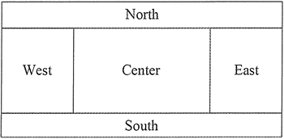
图 1 边框布局管理器区域划分示意图
提示：边框布局管理器并不要求所有区域都必须有组件，如果四周的区域（North、South、East 和 West 区域）没有组件，则由 Center 区域去补充。如果单个区域中添加的不只一个组件，那么后来添加的组件将覆盖原来的组件，所以，区域中只显示最后添加的一个组件。

BorderLayout 布局管理器的构造方法如下所示。

*   BorderLayout()：创建一个 Border 布局，组件之间没有间隙。
*   BorderLayout(int hgap,int vgap)：创建一个 Border 布局，其中 hgap 表示组件之间的横向间隔；vgap 表示组件之间的纵向间隔，单位是像素。

#### 例 1

使用 BorderLayout 将窗口分割为 5 个区域，并在每个区域添加一个标签按钮。实现代码如下：

```
package ch17;
import javax.swing.JButton;
import javax.swing.JFrame;
import javax.swing.JLabel;
import javax.swing.JPanel;
import java.awt.*;
public class BorderLayoutDemo
{
    public static void main(String[] agrs)
    {
        JFrame frame=new JFrame("Java 第三个 GUI 程序");    //创建 Frame 窗口
        frame.setSize(400,200);
        frame.setLayout(new BorderLayout());    //为 Frame 窗口设置布局为 BorderLayout
        JButton button1=new JButton ("上");
        JButton button2=new JButton("左");
        JButton button3=new JButton("中");
        JButton button4=new JButton("右");
        JButton button5=new JButton("下");
        frame.add(button1,BorderLayout.NORTH);
        frame.add(button2,BorderLayout.WEST);
        frame.add(button3,BorderLayout.CENTER);
        frame.add(button4,BorderLayout.EAST);
        frame.add(button5,BorderLayout.SOUTH);
        frame.setBounds(300,200,600,300);
        frame.setVisible(true);
        frame.setDefaultCloseOperation(JFrame.EXIT_ON_CLOSE);
    }
}
```

在该程序中分别指定了 BorderLayout 布局的东、南、西、北、中间区域中要填充的按钮。该程序的运行结果如图 2 所示。

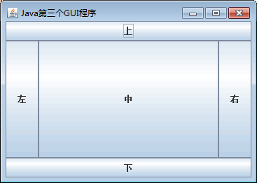
图 2 填充 5 个区域的效果
如果未指定布局管理器的 NORTH 区域，即将“frame.add(button1,BorderLayout.NORTH);”注释掉，则 WEST、CENTER 和 EAST 3 个区域将会填充 NORTH 区域，如图 3 所示。

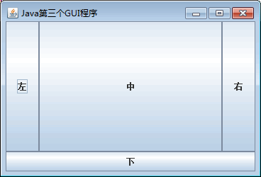
图 3 缺少 NORTH 区域
同理，如果未指定布局管理器的 WEST 区域，即将“frame.add(button2,BorderLayout.WEST);”注释掉，则 CENTER 区域将会自动拉伸填充 WEST 区域，如图 4 所示。

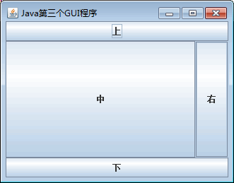
图 4 缺少 WEST 区域

## 流式布局管理器

FlowLayout（流式布局管理器）是 JPanel 和 JApplet 的默认布局管理器。FlowLayout 会将组件按照从上到下、从左到右的放置规律逐行进行定位。与其他布局管理器不同的是，FlowLayout 布局管理器不限制它所管理组件的大小，而是允许它们有自己的最佳大小。

FlowLayout 布局管理器的构造方法如下。

*   FlowLayout()：创建一个布局管理器，使用默认的居中对齐方式和默认 5 像素的水平和垂直间隔。
*   FlowLayout(int align)：创建一个布局管理器，使用默认 5 像素的水平和垂直间隔。其中，align 表示组件的对齐方式，对齐的值必须是 FlowLayoutLEFT、FlowLayout.RIGHT 和 FlowLayout.CENTER，指定组件在这一行的位置是居左对齐、居右对齐或居中对齐。
*   FlowLayout(int align, int hgap,int vgap)：创建一个布局管理器，其中 align 表示组件的对齐方式；hgap 表示组件之间的横向间隔；vgap 表示组件之间的纵向间隔，单位是像素。

#### 例 2

创建一个窗口，设置标题为“Java 第四个 GUI 程序”。使用 FlowLayout 类对窗口进行布局，向容器内添加 9 个按钮，并设置横向和纵向的间隔都为 20 像素。具体实现代码如下：

```
package ch17;
import javax.swing.JButton;
import javax.swing.JFrame;
import javax.swing.JLabel;
import javax.swing.JPanel;
import java.awt.*;
public class FlowLayoutDemo
{
    public static void main(String[] agrs)
    {
        JFrame jFrame=new JFrame("Java 第四个 GUI 程序");    //创建 Frame 窗口
        JPanel jPanel=new JPanel();    //创建面板
        JButton btn1=new JButton("1");    //创建按钮
        JButton btn2=new JButton("2");
        JButton btn3=new JButton("3");
        JButton btn4=new JButton("4");
        JButton btn5=new JButton("5");
        JButton btn6=new JButton("6");
        JButton btn7=new JButton("7");
        JButton btn8=new JButton("8");
        JButton btn9=new JButton("9");
        jPanel.add(btn1);    //面板中添加按钮
        jPanel.add(btn2);
        jPanel.add(btn3);
        jPanel.add(btn4);
        jPanel.add(btn5);
        jPanel.add(btn6);
        jPanel.add(btn7);
        jPanel.add(btn8);
        jPanel.add(btn9);
        //向 JPanel 添加 FlowLayout 布局管理器，将组件间的横向和纵向间隙都设置为 20 像素
        jPanel.setLayout(new FlowLayout(FlowLayout.LEADING,20,20));
        jPanel.setBackground(Color.gray);    //设置背景色
        jFrame.add(jPanel);    //添加面板到容器
        jFrame.setBounds(300,200,300,150);    //设置容器的大小
        jFrame.setVisible(true);
        jFrame.setDefaultCloseOperation(JFrame.EXIT_ON_CLOSE);
    }
}
```

上述程序向 JPanel 面板中添加了 9 个按钮，并使用 HowLayout 布局管理器使 9 个按钮间的横向和纵向间隙都为 20 像素。此时这些按钮将在容器上按照从上到下、从左到右的顺序排列，如果一行剩余空间不足容纳组件将会换行显示，最终运行结果如图 5 所示。

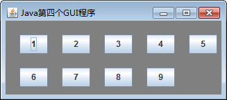

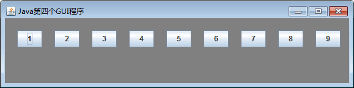
图 5 FlowLayout 布局按钮结果

## 卡片布局管理器

CardLayout（卡片布局管理器）能够帮助用户实现多个成员共享同一个显不空间，并且一次只显示一个容器组件的内容。

CardLayout 布局管理器将容器分成许多层，每层的显示空间占据整个容器的大小，但是每层只允许放置一个组件。CardLayout 的构造方法如下。

*   CardLayout()：构造一个新布局，默认间隔为 0。
*   CardLayout(int hgap, int vgap)：创建布局管理器，并指定组件间的水平间隔（hgap）和垂直间隔（vgap）。

#### 例 3

使用 CardLayout 类对容器内的两个面板进行布局。其中第一个面板上包括三个按钮，第二个面板上包括三个文本框。最后调用 CardLayout 类的 show() 方法显示指定面板的内容，代码如下：

```
package ch17;
import javax.swing.JButton;
import javax.swing.JFrame;
import javax.swing.JLabel;
import javax.swing.JPanel;
import javax.swing.JTextField;
import java.awt.*;
public class CardLayoutDemo
{   
    public static void main(String[] agrs)
    {
        JFrame frame=new JFrame("Java 第五个程序");    //创建 Frame 窗口
        JPanel p1=new JPanel();    //面板 1
        JPanel p2=new JPanel();    //面板 2
        JPanel cards=new JPanel(new CardLayout());    //卡片式布局的面板
        p1.add(new JButton("登录按钮"));
        p1.add(new JButton("注册按钮"));
        p1.add(new JButton("找回密码按钮"));
        p2.add(new JTextField("用户名文本框",20));
        p2.add(new JTextField("密码文本框",20));
        p2.add(new JTextField("验证码文本框",20));
        cards.add(p1,"card1");    //向卡片式布局面板中添加面板 1
        cards.add(p2,"card2");    //向卡片式布局面板中添加面板 2
        CardLayout cl=(CardLayout)(cards.getLayout());
        cl.show(cards,"card1");    //调用 show()方法显示面板 2
        frame.add(cards);
        frame.setBounds(300,200,400,200);
        frame.setVisible(true);
        frame.setDefaultCloseOperation(JFrame.EXIT_ON_CLOSE);
    }
}
```

上述代码创建了一个卡片式布局的面板 cards，该面板包含两个大小相同的子面板 p1 和 p2。需要注意的是，在将 p1 和 p2 添加到 cards 面板中时使用了含有两个参数的 add() 方法，该方法的第二个参数用来标识子面板。当需要显示某一个面板时，只需要调用卡片式布局管理器的 show() 方法，并在参数中指定子面板所对应的字符串即可，这里显示的是 p1 面板，运行效果如图 6 所示。

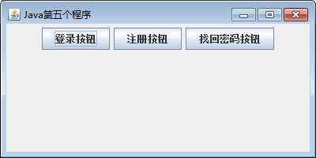
图 6 显示 p1 面板   
如果将“cl.show(cards,"card1")”语句中的 card1 换成 card2，将显示 p2 面板的内容，此时运行结果如图 7 所示。

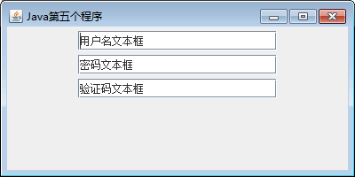
图 7 显示 p2 面板

## 网格布局管理器

GridLayout（网格布局管理器）为组件的放置位置提供了更大的灵活性。它将区域分割成行数（rows）和列数（columns）的网格状布局，组件按照由左至右、由上而下的次序排列填充到各个单元格中。

GridLayout 的构造方法如下。

*   GridLayout(int rows,int cols)：创建一个指定行（rows）和列（cols）的网格布局。布局中所有组件的大小一样，组件之间没有间隔。
*   GridLayout(int rows,int cols,int hgap,int vgap)：创建一个指定行（rows）和列（cols）的网格布局，并且可以指定组件之间横向（hgap）和纵向（vgap）的间隔，单位是像素。

提示：GridLayout 布局管理器总是忽略组件的最佳大小，而是根据提供的行和列进行平分。该布局管理的所有单元格的宽度和高度都是一样的。

#### 例 4

使用 GridLayout 类的网格布局设计一个简单计算器。代码的实现如下：

```
package ch17;
import javax.swing.JButton;
import javax.swing.JFrame;
import javax.swing.JLabel;
import javax.swing.JPanel;
import javax.swing.JTextField;
import java.awt.*;
public class GridLayoutDemo
{
    public static void main(String[] args)
    {
        JFrame frame=new JFrame("GridLayou 布局计算器");
        JPanel panel=new JPanel();    //创建面板
        //指定面板的布局为 GridLayout，4 行 4 列，间隙为 5
        panel.setLayout(new GridLayout(4,4,5,5));
        panel.add(new JButton("7"));    //添加按钮
        panel.add(new JButton("8"));
        panel.add(new JButton("9"));
        panel.add(new JButton("/"));
        panel.add(new JButton("4"));
        panel.add(new JButton("5"));
        panel.add(new JButton("6"));
        panel.add(new JButton("*"));
        panel.add(new JButton("1"));
        panel.add(new JButton("2"));
        panel.add(new JButton("3"));
        panel.add(new JButton("-"));
        panel.add(new JButton("0"));
        panel.add(new JButton("."));
        panel.add(new JButton("="));
        panel.add(new JButton("+"));
        frame.add(panel);    //添加面板到容器
        frame.setBounds(300,200,200,150);
        frame.setVisible(true);
        frame.setDefaultCloseOperation(JFrame.EXIT_ON_CLOSE);
    }
}
```

上述程序设置面板为 4 行 4 列、间隙都为 5 像素的网格布局，在该面板上包含 16 个按钮，其横向和纵向的间隙都为 5。该程序的运行结果如图 8 所示。

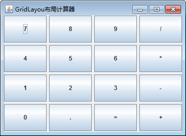
图 8 计算器

## 网格包布局管理器

GridBagLayout（网格包布局管理器）是在网格基础上提供复杂的布局，是最灵活、 最复杂的布局管理器。GridBagLayout 不需要组件的尺寸一致，允许组件扩展到多行多列。每个 GridBagLayout 对象都维护了一组动态的矩形网格单元，每个组件占一个或多个单元，所占有的网格单元称为组件的显示区域。

GridBagLayout 所管理的每个组件都与一个 GridBagConstraints 约束类的对象相关。这个约束类对象指定了组件的显示区域在网格中的位置，以及在其显示区域中应该如何摆放组件。除了组件的约束对象，GridBagLayout 还要考虑每个组件的最小和首选尺寸，以确定组件的大小。

为了有效地利用网格包布局管理器，在向容器中添加组件时，必须定制某些组件的相关约束对象。GridBagConstraints 对象的定制是通过下列变量实现的。

#### 1\. gridx 和 gridy

用来指定组件左上角在网格中的行和列。容器中最左边列的 gridx 为 0，最上边行的 gridy 为 0。这两个变量的默认值是 GridBagConstraints.RELATIVE，表示对应的组件将放在前一个组件的右边或下面。

#### 2\. gridwidth 和 gridheight

用来指定组件显示区域所占的列数和行数，以网格单元而不是像素为单位，默认值为 1。

#### 3\. fill

指定组件填充网格的方式，可以是如下值：GridBagConstraints.NONE（默认值）、GridBagConstraints.HORIZONTAL（组件横向充满显示区域，但是不改变组件高度）、GridBagConstraints.VERTICAL（组件纵向充满显示区域，但是不改变组件宽度）以及 GridBagConstraints.BOTH（组件横向、纵向充满其显示区域）。

#### 4\. ipadx 和 ipady

指定组件显示区域的内部填充，即在组件最小尺寸之外需要附加的像素数，默认值为 0。

#### 5\. insets

指定组件显示区域的外部填充，即组件与其显示区域边缘之间的空间，默认组件没有外部填充。

#### 6\. anchor

指定组件在显示区域中的摆放位置。可选值有 GridBagConstraints.CENTER（默认值）、GridBagConstraints.NORTH、GridBagConstraints.
NORTHEAST、GridBagConstraints.EAST、GridBagConstraints.SOUTH、GridBagConstraints.SOUTHEAST、GridBagConstraints.WEST、GridBagConstraints.SOUTHWEST 以及 GridBagConstraints.NORTHWEST。

#### 7\. weightx 和 weighty

用来指定在容器大小改变时，增加或减少的空间如何在组件间分配，默认值为 0，即所有的组件将聚拢在容器的中心，多余的空间将放在容器边缘与网格单元之间。weightx 和 weighty 的取值一般在 0.0 与 1.0 之间，数值大表明组件所在的行或者列将获得更多的空间。

#### 例 5

创建一个窗口，使用 GridBagLayout 进行布局，实现一个简易的手机拨号盘。这里要注意如何控制行内组件的显示方式以及使用 GridBagConstraints.REMAINDER 来控制一行的结束。代码的实现如下：

```
package ch17;
import javax.swing.JButton;
import javax.swing.JFrame;
import javax.swing.JLabel;
import javax.swing.JPanel;
import javax.swing.JTextField;
import java.awt.*;
public class GridBagLayoutDemo
{
    //向 JFrame 中添加 JButton 按钮
    public static void makeButton(String title,JFrame frame,GridBagLayout gridBagLayout,GridBagConstraints constraints)
    {   
        JButton button=new JButton(title);    //创建 Button 对象
        gridBagLayout.setConstraints(button,constraints);
        frame.add(button);
    }
    public static void main(String[] agrs)
    {
        JFrame frame=new JFrame("拨号盘");
        GridBagLayout gbaglayout=new GridBagLayout();    //创建 GridBagLayout 布局管理器
        GridBagConstraints constraints=new GridBagConstraints();
        frame.setLayout(gbaglayout);    //使用 GridBagLayout 布局管理器
        constraints.fill=GridBagConstraints.BOTH;    //组件填充显示区域
        constraints.weightx=0.0;    //恢复默认值
        constraints.gridwidth = GridBagConstraints.REMAINDER;    //结束行
        JTextField tf=new JTextField("13612345678");
        gbaglayout.setConstraints(tf, constraints);
        frame.add(tf);
        constraints.weightx=0.5;    // 指定组件的分配区域
        constraints.weighty=0.2;
        constraints.gridwidth=1;
        makeButton("7",frame,gbaglayout,constraints);    //调用方法，添加按钮组件
        makeButton("8",frame,gbaglayout,constraints);
        constraints.gridwidth=GridBagConstraints.REMAINDER;    //结束行
        makeButton("9",frame,gbaglayout,constraints);
        constraints.gridwidth=1;    //重新设置 gridwidth 的值

        makeButton("4",frame,gbaglayout,constraints);
        makeButton("5",frame,gbaglayout,constraints);
        constraints.gridwidth=GridBagConstraints.REMAINDER;
        makeButton("6",frame,gbaglayout,constraints);
        constraints.gridwidth=1;

        makeButton("1",frame,gbaglayout,constraints);
        makeButton("2",frame,gbaglayout,constraints);
        constraints.gridwidth=GridBagConstraints.REMAINDER;
        makeButton("3",frame,gbaglayout,constraints);
        constraints.gridwidth=1;

        makeButton("返回",frame,gbaglayout,constraints);
        constraints.gridwidth=GridBagConstraints.REMAINDER;
        makeButton("拨号",frame,gbaglayout,constraints);
        constraints.gridwidth=1;
        frame.setBounds(400,400,400,400);    //设置容器大小
        frame.setVisible(true);
        frame.setDefaultCloseOperation(JFrame.EXIT_ON_CLOSE);
    }
}
```

在上述程序中创建了一个 makeButton() 方法，用来将 JButton 组件添加到 JFrame 窗口中。在 main() 方法中分别创建了 GridBagLayout 对象和 GridBagConstraints 对象，然后设置 JFrame 窗口的布局为 GridBagLayout，并设置了 GridBagConstraints 的一些属性。接着将 JTextField 组件添加至窗口中，并通知布局管理器的 GridBagConstraints 信息。

在接下来的代码中，调用 makeButton() 方法向 JFrame 窗口填充按钮，并使用 GridBagConstraints. REMAINDER 来控制结束行。当一行结束后，重新设置 GridBagConstraints 对象的 gridwidth 为 1。最后设置 JFrame 窗口为可见状态，程序运行后的拨号盘效果如图 9 所示。

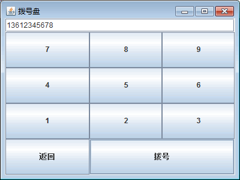
图 9 拨号盘运行效果

## 盒布局管理器

BoxLayout（盒布局管理器）通常和 Box 容器联合使用，Box 类有以下两个静态方法。

*   createHorizontalBox()：返回一个 Box 对象，它采用水平 BoxLayout，即 BoxLayout 沿着水平方向放置组件，让组件在容器内从左到右排列。
*   createVerticalBox()：返回一个 Box 对象，它采用垂直 BoxLayout，即 BoxLayout 沿着垂直方向放置组件，让组件在容器内从上到下进行排列。

Box 还提供了用于决定组件之间间隔的静态方法，如表 1 所示。

表 1 Box 类设置组件间隔的静态方法

| 网格包布局 | 说明 |
| static Component createHorizontalGlue() | 创建一个不可见的、可以被水平拉伸和收缩的组件 |
| static Component createVerticalGlue() | 创建一个不可见的、可以被垂直拉伸和收缩的组件 |
| static Component createHorizontalStrut(int width) | 创建一个不可见的、固定宽度的组件 |
| static Component createVerticalStrut(int height) | 创建一个不可见的、固定高度的组件 |
| static Component createRigidArea(Dimension d) | 创建一个不可见的、总是具有指定大小的组件 |

BoxLayout 类只有一个构造方法，如下所示。

```
BoxLayout(Container c,int axis)
```

其中，参数 Container 是一个容器对象，即该布局管理器在哪个容器中使用；第二个参数为 int 型，用来决定容器上的组件水平（X_AXIS）或垂直（Y_AXIS）放置，可以使用 BoxLayout 类访问这两个属性。

#### 例 6

使用 BoxLayout 类对容器内的 4  个按钮进行布局管理，使两个按钮为横向排列，另外两个按钮为纵向排列，代码如下：

```
package ch17;
import javax.swing.Box;
import javax.swing.JButton;
import javax.swing.JFrame;
import javax.swing.JLabel;
import javax.swing.JPanel;
import javax.swing.JTextField;
import java.awt.*;
public class BoxLayoutDemo
{
    public static void main(String[] agrs)
    {
        JFrame frame=new JFrame("Java 示例程序");
        Box b1=Box.createHorizontalBox();    //创建横向 Box 容器
        Box b2=Box.createVerticalBox();    //创建纵向 Box 容器
        frame.add(b1);    //将外层横向 Box 添加进窗体
        b1.add(Box.createVerticalStrut(200));    //添加高度为 200 的垂直框架
        b1.add(new JButton("西"));    //添加按钮 1
        b1.add(Box.createHorizontalStrut(140));    //添加长度为 140 的水平框架 
        b1.add(new JButton("东"));    //添加按钮 2
        b1.add(Box.createHorizontalGlue());    //添加水平胶水
        b1.add(b2);    //添加嵌套的纵向 Box 容器
        //添加宽度为 100，高度为 20 的固定区域  
        b2.add(Box.createRigidArea(new Dimension(100,20))); 
        b2.add(new JButton("北"));    //添加按钮 3
        b2.add(Box.createVerticalGlue());    //添加垂直组件
        b2.add(new JButton("南"));    //添加按钮 4
        b2.add(Box.createVerticalStrut(40));    //添加长度为 40 的垂直框架
        //设置窗口的关闭动作、标题、大小位置以及可见性等  
        frame.setDefaultCloseOperation(JFrame.EXIT_ON_CLOSE); 
        frame.setBounds(100,100,400,200); 
        frame.setVisible(true); 
    }
}
```

在程序中创建了 4 个 JButton 按钮和两个 Box 容器（横向 Box 容器和纵向 Box 容器），并将前两个 JButton 按钮添加到横向 Box 容器中，将后两个 JButton 容器添加到纵向 Box 容器中。程序的运行结果如图 10 所示。

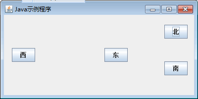
图 10 BoxLayout 运行结果
提示：使用盒式布局可以像使用流式布局一样简单地将组件安排在一个容器内。包含盒式布局的容器可以嵌套使用，最终达到类似于无序网格布局那样的效果，却不像使用无序网格布局那样麻烦。