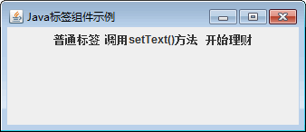

# Java Swing JLable：标签组件

在添加了容器并指定了布局管理方式之后，便可以向容器中添加各种展示类的组件，像标签、按钮、单选和多选框等。本节将介绍 Swing 中标签组件的用法。

标签是一种可以包含文本和图片的非交互组件，其文本可以是单行文本，也可以是 HTML 文本。对于只包含文本的标签可以使用 JLabel 类，该类的主要构造方法有如下几种形式。

*   JLabel()：创建无图像并且标题为空字符串的 JLabel。
*   JLabel(Icon image)：创建具有指定图像的 JLabel。
*   JLabel(String text)：创建具有指定文本的 JLabel。
*   JLabel(String textjcon image,int horizontalAlignment)：创建具有指定文本、图像和水平对齐方式的 JLabel，horizontalAlignment 的取值有 3 个，即 JLabel.LEFT、JLabel.RIGHT 和 JLabel.CENTER。

JLabel 的常用方法如表 1 所示。

表 1 JLabel 类的常用方法

| 方法名称 | 说明 |
| void setText(Stxing text) | 定义 JLabel 将要显示的单行文本 |
| void setIcon(Icon image) | 定义 JLabel 将要显示的图标 |
| void setIconTextGap(int iconTextGap) | 如果 JLabel 同时显示图标和文本，则此属性定义它们之间的间隔 |
| void setHorizontalTextPosition(int textPosition) | 设置 JLabel 的文本相对其图像的水平位置 |
| void setHorizontalAlignment(int alignment) | 设置标签内容沿 X 轴的对齐方式 |
| int getText() | 返回 JLabel 所显示的文本字符串 |
| Icon getIcon() | 返回 JLabel 显示的图形图像 |
| Component getLabelFor() | 获得将 JLabel 添加到的组件 |
| int getIconTextGap() | 返回此标签中显示的文本和图标之间的间隔量 |
| int getHorizontalTextPosition() | 返回 JLabel 的文本相对其图像的水平位置 |
| int getHorizontalAlignment() | 返回 JLabel 沿 X 轴的对齐方式 |

#### 例 1

使用 JFrame 组件创建一个窗口，然后向窗口中添加 3 个标签，这 3 个标签分别使用不同的创建方法。实现代码如下：

```
package ch17;
import javax.swing.ImageIcon;
import javax.swing.JFrame;
import javax.swing.JLabel;
import javax.swing.JPanel;
public class JLabelDemo
{
    public static void main(String[] agrs)
    {
        JFrame frame=new JFrame("Java 标签组件示例");    //创建 Frame 窗口
        JPanel jp=new JPanel();    //创建面板
        JLabel label1=new JLabel("普通标签");    //创建标签
        JLabel label2=new JLabel();
        label2.setText("调用 setText()方法");
        ImageIcon img=new ImageIcon("D:\\money.png");    //创建一个图标
        //创建既含有文本又含有图标的 JLabel 对象
        JLabel label3=new JLabel("开始理财",img,JLabel.CENTER);
        jp.add(label1);    //添加标签到面板
        jp.add(label2);
        jp.add(label3);
        frame.add(jp);
        frame.setBounds(300,200,400,100);
        frame.setVisible(true);
        frame.setDefaultCloseOperation(JFrame.EXIT_ON_CLOSE);
    }
}
```

程序运行后在窗口中将显示 3 个标签，效果如图 1 所示。


图 1 标签显示效果