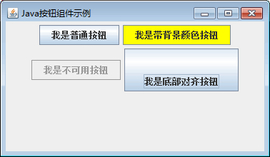

# Java Swing JButton：按钮组件

按钮是图形界面上常见的元素，在前面已经多次使用过它。在 Swing 中按钮是 JButton 类的对象，JButton 类的常用构造方法如下。

*   JButton()：创建一个无标签文本、无图标的按钮。
*   JButton(Icon icon)：创建一个无标签文本、有图标的按钮。
*   JButton(String text)：创建一个有标签文本、无图标的按钮。
*   JButton(String text,Icon icon)：创建一个有标签文本、有图标的按钮。

JButton 类的常用方法如表 1 所示。

表 1 JButton 类的常用方法

| 方法名称 | 说明 |
| addActionListener(ActionListener listener) | 为按担组件注册 ActionListener 监听 |
| void setIcon(Icon icon) | 设置按钮的默认图标 |
| void setText(String text) | 设置按鈕的文本 |
| void setMargin(Insets m) | 设置按钮边框和标签之间的空白 |
| void setMnemonic(int nmemonic) | 设置按钮的键盘快捷键，所设置的快捷键在实际操作时需要结合 Alt 键进行实现 |
| void setPressedIcon(Icon icon) | 设置按下按钮时的图标 |
| void setSelectedIcon(Icon icon) | 设置选择按鈕时的图标 |
| void setRolloveiicon(Icon icon) | 设置鼠标移动到按扭区域时的图标 |
| void setDisabledIcon(Icon icon) | 设置按钮无效状态下的图标 |
| void setVerticalAlignment(int alig) | 设置图标和文本的垂直对齐方式 |
| void setHorizontalAlignment(int alig) | 设置图标和文本的水平对齐方式 |
| void setEnable(boolean flag) | 启用或禁用按扭 |
| void setVerticalTextPosition(int textPosition) | 设置文本相对于图标的垂直位置 |
| void setHorizontalTextPosition(int textPosition) | 设置文本相对于图标的水平位置 |

#### 例 1

使用 JFrame 组件创建一个窗口，然后创建 4 个不同类型的按钮，再分别添加到窗口上显示。具体代码如下：

```
package ch17;
import java.awt.Color;
import java.awt.Dimension;
import javax.swing.JButton;
import javax.swing.JFrame;
import javax.swing.JPanel;
import javax.swing.SwingConstants;
public class JButtonDemo
{
    public static void main(String[] args)
    {
        JFrame frame=new JFrame("Java 按钮组件示例");    //创建 Frame 窗口
        frame.setSize(400, 200);
        JPanel jp=new JPanel();    //创建 JPanel 对象
        JButton btn1=new JButton("我是普通按钮");    //创建 JButton 对象
        JButton btn2=new JButton("我是带背景颜色按钮");
        JButton btn3=new JButton("我是不可用按钮");
        JButton btn4=new JButton("我是底部对齐按钮");
        jp.add(btn1);
        btn2.setBackground(Color.YELLOW);    //设置按钮背景色
        jp.add(btn2);
        btn3.setEnabled(false);    //设置按钮不可用
        jp.add(btn3);
        Dimension preferredSize=new Dimension(160, 60);    //设置尺寸
        btn4.setPreferredSize(preferredSize);    //设置按钮大小
        btn4.setVerticalAlignment(SwingConstants.BOTTOM);    //设置按钮垂直对齐方式
        jp.add(btn4);
        frame.add(jp);
        frame.setBounds(300, 200, 600, 300);
        frame.setVisible(true);
        frame.setDefaultCloseOperation(JFrame.EXIT_ON_CLOSE);
    }
}
```

上述代码创建了 1 个 JFrame 窗口对象、1 个 JPanel 面板对象和 4 个 JButton 按钮，然后调用 JButton 类的 setBackground() 方法、setEnabled() 方法、setPreferredSize() 方法和 setVerticalAlignment() 方法设置按钮的显示外观。程序运行后 4 个按钮显示效果如图 1 所示。


图 1 按钮显示