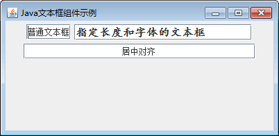

# Java Swing JTextField：单行文本框组件

Swing 中使用 JTextField 类实现一个单行文本框，它允许用户输入**单行**的文本信息。该类的常用构造方法如下。

*   JTextField()：创建一个默认的文本框。
*   JTextField(String text)：创建一个指定初始化文本信息的文本框。
*   JTextField(int columns)：创建一个指定列数的文本框。
*   JTextField(String text,int columns)：创建一个既指定初始化文本信息，又指定列数的文本框。

JTextField 类的常用方法如表 1 所示。

表 1 JTextField 类的常用方法

| 方法名称 | 说明 |
| Dimension getPreferredSize() | 获得文本框的首选大小 |
| void scrollRectToVisible(Rectangle r) | 向左或向右滚动文本框中的内容 |
| void setColumns(int columns) | 设置文本框最多可显示内容的列数 |
| void setFont(Font f) | 设置文本框的字体 |
| void setScrollOffset(int scrollOffset) | 设置文本框的滚动偏移量（以像素为单位） |
| void setHorizontalAlignment(int alignment) | 设置文本框内容的水平对齐方式 |

#### 例 1

使用 JPrame 组件创建一个窗口，然后向窗口中添加三个 JTextField 文本框。具体实现代码如下：

```
package ch17;
import java.awt.Font;
import javax.swing.JFrame;
import javax.swing.JPanel;
import javax.swing.JTextField;
public class JTextFieldDemo
{
    public static void main(String[] agrs)
    {
        JFrame frame=new JFrame("Java 文本框组件示例");    //创建 Frame 窗口
        JPanel jp=new JPanel();    //创建面板
        JTextField txtfield1=new JTextField();    //创建文本框
        txtfield1.setText("普通文本框");    //设置文本框的内容
        JTextField txtfield2=new JTextField(28);
        txtfield2.setFont(new Font("楷体",Font.BOLD,16));    //修改字体样式
        txtfield2.setText("指定长度和字体的文本框");
        JTextField txtfield3=new JTextField(30);
        txtfield3.setText("居中对齐");
        txtfield3.setHorizontalAlignment(JTextField.CENTER);    //居中对齐
        jp.add(txtfield1);
        jp.add(txtfield2);
        jp.add(txtfield3);
        frame.add(jp);
        frame.setBounds(300,200,400,100);
        frame.setVisible(true);
        frame.setDefaultCloseOperation(JFrame.EXIT_ON_CLOSE);
    }
}
```

上述程序中，第一个文本框 txtfield1 使用 JTextField 的默认构造方法创建；第二个文本框 txtfield2 在创建时指定了文本框的长度，同时还修改了文本的字体样式；第三个文本框 txtfield3 设置文本为居中对齐。

程序运行后在窗口中显示三个文本框，效果如图 1 所示。


图 1 文本框组件运行效果