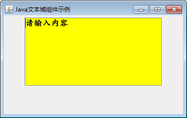
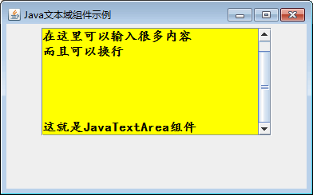

# Java Swing JTextArea：文本域组件

文本域与文本框的最大区别就是文本域允许用户输入多行文本信息。在 Swing 中使用 JTextArea 类实现一个文本域，其常用构造方法如下。

*   JTextArea()：创建一个默认的文本域。
*   JTextArea(int rows,int columns)：创建一个具有指定行数和列数的文本域。
*   JTextArea(String text)：创建一个包含指定文本的文本域。
*   JTextArea(String text,int rows,int columns)：创建一个既包含指定文本，又包含指定行数和列数的多行文本域。

JTextArea 类的常用方法如表 1 所示。

表 1 JTextArea 类的常用方法

| 方法名称 | 说明 |
| void append(String str) | 将字符串 str 添加到文本域的最后位置 |
| void setColumns(int columns) | 设置文本域的行数 |
| void setRows(int rows) | 设置文本域的列数 |
| int getColumns() | 获取文本域的行数 |
| void setLineWrap(boolean wrap) | 设置文本域的换行策略 |
| int getRows() | 获取文本域的列数 |
| void insert(String str,int position) | 插入指定的字符串到文本域的指定位置 |
| void replaceRange(String str,int start,int end) | 将指定的开始位 start 与结束位 end 之间的字符串用指定的字符串 str 取代 |

#### 例 1

使用 JFrame 组件创建一个窗口，再向窗口中添加一个文本域，并将文本域中的文本设置为自动换行，允许显示滚动条。具体代码如下：

```
package ch17;
import java.awt.Color;
import java.awt.Dimension;
import java.awt.Font;
import javax.swing.JFrame;
import javax.swing.JPanel;
import javax.swing.JScrollPane;
import javax.swing.JTextArea;
public class JTextAreaDemo
{
    public static void main(String[] agrs)
    {
        JFrame frame=new JFrame("Java 文本域组件示例");    //创建 Frame 窗口
        JPanel jp=new JPanel();    //创建一个 JPanel 对象
        JTextArea jta=new JTextArea("请输入内容",7,30);
        jta.setLineWrap(true);    //设置文本域中的文本为自动换行
        jta.setForeground(Color.BLACK);    //设置组件的背景色
        jta.setFont(new Font("楷体",Font.BOLD,16));    //修改字体样式
        jta.setBackground(Color.YELLOW);    //设置按钮背景色
        JScrollPane jsp=new JScrollPane(jta);    //将文本域放入滚动窗口
        Dimension size=jta.getPreferredSize();    //获得文本域的首选大小
        jsp.setBounds(110,90,size.width,size.height);
        jp.add(jsp);    //将 JScrollPane 添加到 JPanel 容器中
        frame.add(jp);    //将 JPanel 容器添加到 JFrame 容器中
        frame.setBackground(Color.LIGHT_GRAY);
        frame.setSize(400,200);    //设置 JFrame 容器的大小
        frame.setVisible(true);
    }
}
```

在上述代码中将 JTextArea 文本域放入滚动窗口中，并通过 getPreferredSize() 方法获得文本域的显示大小。将滚动窗口的大小设置成与文本域大小相同，再将滚动窗口添加到 JPanel 面板中。

运行程序，在文本域中可以输入多行内容，当内容超出文本域高度时会显示滚动条，如图 1 所示。




图 1 文本域运行效果