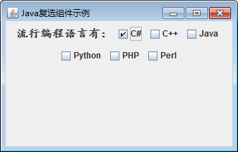

# Java Swing JCheckBox：复选框组件

一个复选框有选中和未选中两种状态，并且可以同时选定多个复选框。Swing 中使用 JCheckBox 类实现复选框，该类的常用构造方法如下。

*   JCheckBox()：创建一个默认的复选框，在默认情况下既未指定文本，也未指定图像，并且未被选择。
*   JCheckBox(String text)：创建一个指定文本的复选框。
*   JCheckBox(String text,boolean selected)：创建一个指定文本和选择状态的复选框。

#### 例 1

使用 JFmme 组件创建一个窗口，然后使用 JCheckBox 类创建一些复选框。具体实现代码如下：

```
package ch17;
import java.awt.Font;
import javax.swing.JCheckBox;
import javax.swing.JFrame;
import javax.swing.JLabel;
import javax.swing.JPanel;
public class JCheckBoxDemo
{
    public static void main(String[] agrs)
    {
        JFrame frame=new JFrame("Java 复选组件示例");    //创建 Frame 窗口
        JPanel jp=new JPanel();    //创建面板
        JLabel label=new JLabel("流行编程语言有：");
        label.setFont(new Font("楷体",Font.BOLD,16));    //修改字体样式
        JCheckBox chkbox1=new JCheckBox("C#", true);    //创建指定文本和状态的复选框
        JCheckBox chkbox2=new JCheckBox("C++");    //创建指定文本的复选框
        JCheckBox chkbox3=new JCheckBox("Java");    //创建指定文本的复选框
        JCheckBox chkbox4=new JCheckBox("Python");    //创建指定文本的复选框
        JCheckBox chkbox5=new JCheckBox("PHP");    //创建指定文本的复选框
        JCheckBox chkbox6=new JCheckBox("Perl");    //创建指定文本的复选框
        jp.add(label);
        jp.add(chkbox1);
        jp.add(chkbox2);
        jp.add(chkbox3);
        jp.add(chkbox4);
        jp.add(chkbox5);
        jp.add(chkbox6);
        frame.add(jp);
        frame.setBounds(300,200,400,100);
        frame.setVisible(true);
        frame.setDefaultCloseOperation(JFrame.EXIT_ON_CLOSE);
    }
}
```

上述程序一共创建了 6 个复选框，其中第一个调用 JCheckBox 构造方法时指定了复选框为选中状态。程序的执行结果如图 1 所示。


图 1 复选框组件文本内容