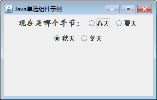

# Java Swing JRadioButton：单选按钮组件

单选按钮与复选框类似都有两种状态，不同的是一组单选按钮中只能有一个处于选中状态。Swing 中 JRadioButton 类实现单选按钮，它与 JCheckBox 一样都是从 JToggleButton 类派生出来的。JRadioButton 通常位于一个 ButtonGroup 按钮组中，不在按钮组中的 JRadioButton 也就失去了单选按钮的意义。

在同一个 ButtonGroup 按钮组中的单选按钮，只能有一个单选按钮被选中。因此，如果创建的多个单选按钮其初始状态都是选中状态，则最先加入 ButtonGroup 按钮组的单选按钮的选中状态被保留，其后加入到 ButtonGroup 按钮组中的其他单选按钮的选中状态被取消。

JRadioButton 类的常用构造方法如下。

*   JRadioButton()：创建一个初始化为未选择的单选按钮，其文本未设定。
*   JRadioButton(Icon icon)：创建一个初始化为未选择的单选按钮，其具有指定的图像但无文本。
*   JRadioButton(Icon icon,boolean selected)：创建一个具有指定图像和选择状态的单选按钮，但无文本。
*   JRadioButton(String text)：创建一个具有指定文本但未选择的单选按钮。
*   JRadioButton(String text,boolean selected)：创建一个具有指定文本和选择状态的单选按钮。
*   JRadioButton(String text,Icon icon)：创建一个具有指定的文本和图像并初始化为未选择的单选按钮。
*   JRadioButton(String text,Icon icon,boolean selected)：创建一个具有指定的文本、图像和选择状态的单选按钮。

#### 例 1

使用 JFrame 组件创建一个窗口，然后使用 JRadioButton 类创建一个选择季节的单选按钮组。实现代码如下：

```
package ch17;
import java.awt.Font;
import javax.swing.ButtonGroup;
import javax.swing.JFrame;
import javax.swing.JLabel;
import javax.swing.JPanel;
import javax.swing.JRadioButton;
public class JRadioButtonDemo 
{
    public static void main(String[] agrs)
    {
        JFrame frame=new JFrame("Java 单选组件示例");    //创建 Frame 窗口
        JPanel panel=new JPanel();    //创建面板
        JLabel label1=new JLabel("现在是哪个季节：");
        JRadioButton rb1=new JRadioButton("春天");    //创建 JRadioButton 对象
        JRadioButton rb2=new JRadioButton("夏天");    //创建 JRadioButton 对象
        JRadioButton rb3=new JRadioButton("秋天",true);    //创建 JRadioButton 对象
        JRadioButton rb4=new JRadioButton("冬天");    //创建 JRadioButton 对象
        label1.setFont(new Font("楷体",Font.BOLD,16));    //修改字体样式
        ButtonGroup group=new ButtonGroup();
        //添加 JRadioButton 到 ButtonGroup 中
        group.add(rb1);
        group.add(rb2);
        panel.add(label1);
        panel.add(rb1);
        panel.add(rb2);
        panel.add(rb3);
        panel.add(rb4);
        frame.add(panel);
        frame.setBounds(300, 200, 400, 100);
        frame.setVisible(true);
        frame.setDefaultCloseOperation(JFrame.EXIT_ON_CLOSE);
    }
}
```

在上述程序中创建了 4 个 JRadioButton 单选按钮，并将这 4 个单选按钮添加到 ButtonGroup 组件中。该程序的运行结果如图 1 所示。


图 1 JRadioButton 单选按钮