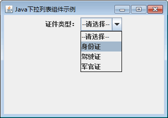

# Java Swing JComboBox：下拉列表组件

下拉列表的特点是将多个选项折叠在一起，只显示最前面的或被选中的一个。选择时需要单击下拉列表右边的下三角按钮，这时候会弹出包含所有选项的列表。用户可以在列表中进行选择，也可以根据需要直接输入所要的选项，还可以输入选项中没有的内容。

下拉列表由 JComboBox 类实现，常用构造方法如下。

*   JComboBox()：创建一个空的 JComboBox 对象。
*   JComboBox(ComboBoxModel aModel)：创建一个 JComboBox，其选项取自现有的 ComboBoxModel。
*   JComboBox(Object[] items)：创建包含指定数组中元素的 JComboBox。

JComboBox 类提供了多个成员方法用于操作下拉列表框中的项，如表 1 所示。

表 1 JComboBox 类的常用方法

| 方法名称 | 说明 |
| void addItem(Object anObject) | 将指定的对象作为选项添加到下拉列表框中 |
| void insertItemAt(Object anObject,int index) | 在下拉列表框中的指定索引处插入项 |
| void removeltem(0bject anObject) | 在下拉列表框中删除指定的对象项 |
| void removeItemAt(int anlndex) | 在下拉列表框中删除指定位置的对象项 |
| void removeAllItems() | 从下拉列表框中删除所有项 |
| int getItemCount() | 返回下拉列表框中的项数 |
| Object getItemAt(int index) | 获取指定索引的列表项，索引从 0 开始 |
| int getSelectedIndex() | 获取当前选择的索引 |
| Object getSelectedltem() | 获取当前选择的项 |

JComboBox 能够响应 ItemEvent 事件和 ActionEvent 事件，其中 ItemEvent 触发的时机是当下拉列表框中的所选项更改时，ActionEvent 触发的时机是当用户在 JComboBox 上直接输入选择项并回车时。要处理这两个事件，需要创建相应的事件类并实现 ItemListener 接口和 ActionListener 接口。

#### 例 1

使用 JFrame 组件创建一个窗口，然后使用 JComboBox 类创建一个包含 4 个选项的下拉列表框。具体实现代码如下：

```
package ch17;
import javax.swing.JComboBox;
import javax.swing.JFrame;
import javax.swing.JLabel;
import javax.swing.JPanel;
public class JComboBoxDemo
{
    public static void main(String[] args)
    {
        JFrame frame=new JFrame("Java 下拉列表组件示例");
        JPanel jp=new JPanel();    //创建面板
        JLabel label1=new JLabel("证件类型：");    //创建标签
        JComboBox cmb=new JComboBox();    //创建 JComboBox
        cmb.addItem("--请选择--");    //向下拉列表中添加一项
        cmb.addItem("身份证");
        cmb.addItem("驾驶证");
        cmb.addItem("军官证");
        jp.add(label1);
        jp.add(cmb);
        frame.add(jp);
        frame.setBounds(300,200,400,100);
        frame.setVisible(true);
        frame.setDefaultCloseOperation(JFrame.EXIT_ON_CLOSE);
    }
}
```

上述代码创建了一个下拉列表组件 cmb，然后调用 addItem() 方法向下拉列表中添加 4 个选项。运行后下拉列表的效果如图 1 所示。


图 1 下拉列表运行效果